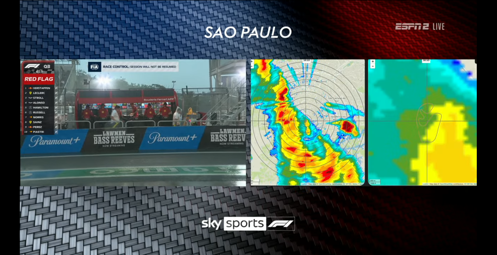

#+TITLE: 2023 Formula 1 Season
#+OPTIONS: toc:1
#+OPTIONS: H:6

* 2023-03-05 Bahrain Grand Prix

** Track info
- Bahrain International Circuit
- 3.363 miles

** Tire info
- C3, C2, C1 → middle of the range
- /C1 is no longer the hardest tire, as there is an even harder C0 compound now/

** Qualifying

*** Q1
- Alpha Tauri go out first
- Ferrari go out on medium tires for their first qualifying laps
- LeClerc loses a piece of his front wing under braking, which causes him to lock up
- Session is red-flagged due to the debris
- When the red flag lifts, there is a large queue of cars which go out immediately, in order to ensure that they have time for at least two laps
- Red Bull looks like it's a handful to drive
- Aston Martin look fast
- George Russell looks fast in the Mercedes
- Oscar Piastri looks as fast in the McLaren as Lando Norris --- potential good news for McLaren's driver line-up?
- Eliminated in Q1
  - Logan Sargeant --- Williams
  - Pierre Gasly --- Alpine
  - Kevin Magnussen --- Haas
  - Oscar Piastri --- McLaren
  - Nyck DeVries --- Alpha Tauri
- /Lando Norris made it into Q2 by the skin of his teeth/
  - /Set the exact same lap time, down to the thousandth of a second, as Logan Sargeant/
  - /However, because Lando Norris set the lap time first, he gets priority/

*** Q2
- Pierre Gasly will start last, because his fastest lap time was deleted for track limits violations
- Ferrari go out on used tires to try to conserve a pair for Q3
- Fernando Alonso looks very fast
- The Red Bull car seems to have improved considerably from Q1
- 2023's Q2 times are faster than 2022's Q3 times, a sign of how much the cars have improved, despite the increase in ride height
- Williams are struggling with understeer --- Alex Albon goes wide on several corners and has to limp back to the pits
  - Seems like he had front wing damage
- Verstappen and Perez set fast laps and decline to go out for second attempts because they're confident the times they've set will get them into Q3
- Eliminated in Q2
  - Lando Norris --- McLaren
  - Valteri Bottas --- Alfa Romeo
  - Zhou Guanyu --- Alfa Romeo
  - Yuki Tsunoda --- Alpha Tauri
  - Alex Albon --- Williams
- /George Russell and Lewis Hamilton look closely matched in the Mercedes/
- /Nico Hulkenberg made it into the top-10 for Haas/

*** Q3
- Only Ferrari and Red Bull have two new sets of soft tires
- Ferrari choose not to send Charles LeClerc out for a second qualifying lap in order to conserve tires
- Top 10 qualifying result
  1. Max Verstappen --- Red Bull
  2. Sergio Perez --- Red Bull
  3. Charles LeClerc --- Ferrari
  4. Carlos Sainz --- Ferrari
  5. Fernando Alonso --- Aston Martin
  6. George Russell --- Mercedes
  7. Lewis Hamilton --- Mercedes
  8. Lance Stroll --- Aston Martin
  9. Esteban Ocon --- Alpine
  10. Nico Hulkenberg --- Haas
- /George Russell qualifies higher than Lewis Hamilton, interesting/
- /I was hoping that Mercedes, in general, would qualify higher/
- /Sergio Perez seems like he's figured out how to drive the Red Bull fast/

** Race

*** Starting Grid
1. Max Verstappen --- Red Bull
2. Sergio Perez --- Red Bull
3. Charles LeClerc --- Ferrari
4. Carlos Sainz --- Ferrari
5. Fernando Alonso --- Aston Martin
6. George Russell --- Mercedes
7. Lewis Hamilton --- Mercedes
8. Lance Stroll --- Aston Martin
9. Esteban Ocon --- Alpine
10. Nico Hulkenberg --- Haas
11. Lando Norris --- McLaren
12. Valteri Bottas --- Alfa Romeo
13. Zhou Guanyu --- Alfa Romeo
14. Yuki Tsunoda --- Alpha Tauri
15. Alex Albon --- Williams
16. Logan Sargeant --- Williams
17. Kevin Magnussen --- Haas
18. Oscar Piastri --- McLaren
19. Nyck DeVries --- Alpha Tauri
20. Pierre Gasly --- Alpha Tauri

- 57 laps
- Most cars will be using a two-stop strategy
- Lap 1
  - LeClerc jumps Perez right at the beginning
  - Perez fends off Sainz to hold onto 3rd
  - Contact between Fernando Alonso and Lance Stroll --- both cars are undamaged
  - Hamilton passes Russell and Alonso to get 5th
  - Verstappen goes well clear --- more than 2s ahead of LeClerc
- Cars don't seem to be porpoising that much
- Kevin Magnussen started on the hard tires and is struggling --- has dropped back into last place
- Lap 8 --- Perez told by Red Bull that LeClerc's tires should fall off towards the end of the first stint
- Lap 10
  - Fernando Alonso has caught up to DRS range of George Russell
  - Pierre Gasly goes out on hard tires
- Lap 11
  - Pneumatic issue for Lando Norris
  - Had to take a long pit stop to refill the air in the pneumatic system
- Lap 12
  - Lots of cars in the midfield pit
  - George Russell complaining about tires as Fernando Alonso closes in
- Lap 13
  - Lewis Hamilton pits
  - Great fight between Fernando Alonso and George Russell
  - Alonso passes Russell for 5th
- Lap 14
  - Both Ferraris pit
  - George Russell pits
  - Oscar Piastri complains of gearbox issues, team tells him that the issue might be with the steering wheel itself rather than with the gearbox
- Lap 15
  - Oscar Piastri comes into the pits and has to shut the engine off to replace the steering wheel
  - However, the engine doesn't restart and Piastri has to retire
  - Max Verstappen pits and goes onto soft tires
  - Fernando Alonso pits and goes out on hard tires
- Lap 16 --- Esteban Ocon has to serve a 5 second time penalty for being too far forward in his grid box at the start of the race
- Lap 17 --- Sergio Perez pits and goes out on soft tires
- Max Verstappen complaining about rear-wheel lockups with downshifts
- Lap 22 --- Sergio Perez catching up to Charles LeClerc
- Lap 26 --- Perez passes LeClerc for 2nd
- Esteban Ocon has a lot of penalties
  - 5 sec time penalty for being too far forward in his grid box at the start of the race
  - Then, when he came into the pits, the crew started working on the car without waiting the full 5 seconds, which earned him a further 10 sec penalty
  - 5 sec time penalty for speeding in the pit lane
- Lap 31
  - Hamilton pits again to cover off an undercut threat from Alonso
  - Lance Stroll pits
- Lap 32
  - Carlos Sainz pits
  - George Russell pits
- Lap 33 --- Lance Stroll passes George Russell
- Lap 34 --- LeClerc pits
- Lap 35
  - Perez pits again
  - Alonso pits again
- Lap 36 
  - Verstappen pits again
  - Verstappen had nearly a 40 sec. lead when he came in
- Lap 37 --- Good battle between Fernando Alonso and Lewis Hamilton
- Lap 38 --- Alonso passes Hamilton for 5th
- Lap 41
  - LeClerc has pulled over with mechanical trouble --- "no power"
  - Virtual Safety Car declared
- Lap 42 --- VSC ends
- Lap 43 --- Esteban Ocon retires
- Lap 44 --- Great battle between Alonso and Sainz for 3rd
- Lap 46 --- Alonso passes Sainz for 3rd (/Alonso on the podium!/)
- Lap 47 --- Hamilton attacking Sainz for 4th
- Lap 49 --- Sainz complaining about bouncing

** Results
1. Max Verstappen --- Red Bull
2. Sergio Perez --- Red Bull
3. Fernando Alonso --- Aston Martin
4. Carlos Sainz --- Ferrari
5. Lewis Hamilton --- Mercedes
6. Lance Stroll --- Aston Martin
7. George Russell --- Mercedes
8. Valteri Bottas --- Alfa Romeo
9. Pierre Gasly --- Alpine
10. Alex Albon --- Williams
11. Yuki Tsunoda --- Alpha Tauri
12. Logan Sargeant --- Williams
13. Kevin Magnussen --- Haas
14. Nyck DeVries --- Alpha Tauri
15. Nico Hulkenberg --- Haas
16. Zhou Guanyu --- Alfa Romeo
17. Lando Norris --- McLaren
18. Esteban Ocon --- Alpine (DNF)
19. Charles LeClerc --- Ferrari (DNF)
20. Oscar Piastri --- McLaren (DNF)

- /Albon scores points for Williams/
- /Points for Bottas as well/
- /Pierre Gasly does well to finish 9th after starting last/
- /Mercedes in shambles/

* 2023-03-19 Saudi Arabian Grand Prix

** Track Info
- Jeddah Corniche
- 3.84 miles

** Tire Info
- C4, C3, C2
- Softer tires than in Bahrain

** Qualifying

*** Q1
- Charles LeClerc will have a 10-place grid penalty for taking a third control electronics unit
- Strong tailwind into the final corner
- /This track always looks so scary/
- Nyck DeVries spins, with a big rear-tire lock-up
- Verstappen and Perez are very fast
- Haas are also fast
- Ferrari are oddly slow and have to go for additional laps
- Lando Norris clipped the wall and has to go back to the pits
- Fernando Alonso also spins
- Drivers are complaining about the track having less grip than expected
- At the end of Q1 Fernando Alonso and Lance Stroll put in two very fast laps to get to 3rd and 4th respectively
- /Bahrain may not have been a fluke for Aston Martin/
- Eliminated in Q1
  - Logan Sargeant --- Williams
  - Lando Norris --- McLaren
  - Nyck DeVries --- Alpha Tauri
  - Alex Albon --- Williams
  - Yuki Tsunoda --- Alpha Tauri

*** Q2
- Max Verstappen reports engine issues
  - Sounds like something let go during his lap
  - Car limps back to the pits, Verstappen is out of qualifying
  - Red Bull initially think that it is a driveshaft issue
- Perez goes fast, but is still behind Alonso
- Eliminated in Q2
  - Nico Hulkenberg --- Haas
  - Zhou Guanyu --- Alfa Romeo
  - Kevin Magnussen --- Haas
  - Valteri Bottas --- Alfa Romeo
  - Max Verstappen --- Red Bull
- /Oscar Piastri makes it into Q3 --- good for him/
- /Fernando Alonso looks really fast/
- /Verstappen will be starting from 15th/

*** Q3
- Russell is consistently faster than Hamilton during all three qualifying sessions
- Final Q3 qualifying order
  1. Sergio Perez --- Red Bull
  2. Charles LeClerc --- Ferrari
  3. Fernando Alonso --- Aston Martin
  4. George Russell --- Mercedes
  5. Carlos Sainz --- Ferrari
  6. Lance Stroll --- Aston Martin
  7. Esteban Ocon --- Alpine
  8. Lewis Hamilton --- Mercedes
  9. Oscar Piastri --- McLaren
  10. Pierre Gasly --- Alpine
- Note that Charles LeClerc will have a penalty, and thus will be starting 12th
- This means that everyone else is going to move up a place
- /Hamilton is uncharacteristically slow/
- /Happy for Perez to get a second pole in a row here/

** Race

*** Starting Grid
1. Sergio Perez --- Red Bull
2. Fernando Alonso --- Aston Martin
3. George Russell --- Mercedes
4. Carlos Sainz --- Ferrari
5. Lance Stroll --- Aston Martin
6. Esteban Ocon --- Alpine
7. Lewis Hamilton --- Mercedes
8. Oscar Piastri --- McLaren
9. Pierre Gasly --- Alpine
10. Nico Hulkenberg --- Haas
11. Zhou Guanyu --- Alfa Romeo
12. Charles LeClerc --- Ferrari
13. Kevin Magnussen --- Haas
14. Valteri Bottas --- Alfa Romeo
15. Max Verstappen --- Red Bull
16. Yuki Tsunoda --- Alpha Tauri
17. Alex Albon --- Williams
18. Nyck DeVries --- Alpha Tauri
19. Lando Norris --- McLaren
20. Logan Sargeant --- Williams

- 50 laps
- Most cars are on medium (C3) tires, but Charles LeClerc, notably is on the soft (C4)
- A few cars are also starting on hard (C2), notably Lewis Hamilton
- Lap 1
  - Fernando Alonso takes the lead into turn 1
  - Clean start, but one of the McLarens might have lost some bodywork
  - Lance Stroll passes Carlos Sainz for 4th
  - Alonso has been noted for being possibly too far forward in his starting grid box
- Lap 2 --- Oscar Piastri comes in for a front wing change
- Alonso gets a 5 second penalty for being too far forward in his starting grid spot
- Lap 3
  - Max Verstappen up to 13th
  - Lando Norris comes in for a front wing change as well
- Lap 4 --- Perez passes Alonso for the lead
- Lap 7
  - Alonso is still within DRS range of Perez
  - LeClerc is up into 8th, just behind Lewis Hamilton
- Lap 8 --- Max Verstappen passes Zhou Guanyu for 10th
- Lap 9 --- LeClerc passes Hamilton for 7th
- Lap 10 --- Verstappen passes Gasly for 9th
- Lap 12 --- Verstappen passes Hamilton for 8th (/the speed difference between Lewis on hard tires and Max on medium tires is hilarious/)
- Lap 13 --- LeClerc passes Ocon for 6th
- Lap 14
  - Verstappen passes Ocon for 7th
  - Lance Stroll comes into the pits and goes out on hard tires
  - Verstappen is catching up to LeClerc
- Lots of teams going out on hard tires despite the fact that drivers are complaining about it
- Lap 16 --- Carlos Sainz pits and goes onto hard tires
- Lap 17 --- LeClerc pits and allows Max Verstappen up into 4th
- Lap 18
  - Lance Stroll told to stop the car
  - Yellow flags in sector 2
  - Safety car deployed
  - Sergio Perez pits
- Lap 19
  - Fernando Alonso pits and serves his 5 second penalty
  - George Russell also pits
  - Alonso manages to retain his lead over Russell despite the 5 second penalty
  - Hamilton pits as well and goes out on medium tires
- Lap 20 --- Safety car ends
- Lap 21
  - Racing resumes
  - Clean restart
- Lap 22 --- Hamilton passes Sainz for 5th
- Lap 23 --- Verstappen passes Russell for 3rd (/the speed difference between Verstappen and Russell is, if anything, even more pronounced than the speed difference between Verstappen and Hamilton, even though the two cars are on the same tires this time/)
- Lap 25 --- Verstappen passes Alonso for 2nd
- Lap 29 --- Alex Albon retires with brake issues
- Lap 37 --- Max Verstappen saying he's hearing a weird noise at high speed
- Lap 38 --- Zhou Guanyu does a neat pass on Logan Sargeant for 13th
- /Verstappen is paranoid about his car/
- Lap 46 --- Kevin Magnussen passes Yuki Tsunoda for 10th
- /Great team radio between Max and the Red Bull pit wall --- "What's the fastest lap?" "We're not concerned about that" "Yeah, but I am"/
- Verstappen takes the fastest lap at the very end, keeping the lead of the world championship

** Results
1. Sergio Perez --- Red Bull
2. Max Verstappen --- Red Bull
3. Fernando Alonso --- Aston Martin
4. George Russell --- Mercedes
5. Lewis Hamilton --- Mercedes
6. Carlos Sainz --- Ferrari
7. Charles LeClerc --- Ferrari
8. Esteban Ocon --- Alpine
9. Pierre Gasly --- Alpine
10. Kevin Magnussen --- Haas
11. Yuki Tsunoda --- Alpha Tauri
12. Nico Hulkenberg --- Haas
13. Zhou Guanyu --- Alfa Romeo
14. Nyck DeVries --- Alpha Tauri
15. Oscar Piastri --- McLaren
16. Logan Sargeant --- Williams
17. Lando Norris --- McLaren
18. Valteri Bottas --- Alfa Romeo
19. Alex Albon --- Williams (DNF)
20. Lance Stroll --- Aston Martin (DNF)

* 2023-04-02 Australian Grand Prix

** Track Info
- Albert Park
- 3.28 miles

** Tire Info
- C4, C3, C2
- Same tires as in Saudi Arabia

** Qualifying

*** Q1
- Track is damp
- Drivers were having trouble warming up the tires in free practice
- Wind is gusting and changing directions
- Yellow flags and red flags could be a factor, given the precarious conditions
- Cars are going out on soft slicks --- track is dry enough for slick tires at the moment
- Drivers are having to take additional laps to warm up the tires
- Track is evolving rapidly --- each fastest time seems to be at least .5 sec better than the previous
- Sergio Perez skids into the gravel and causes a red flag
  - /This screws over Max Verstappen somewhat, because he was at the end of his fast lap when the red flag was shown, and he had to abort/
  - Possibly an issue with the car --- Perez's car had issues in free practice, and it was being worked on right up until the start of qualifying
  - /Another sign of the odd mechanical gremlins that have been hounding Red Bull so far this season?/
- After the red flag is cleared, Red Bulls and Ferraris go out on scrubbed tires, while Williams go out for their second runs with new tires
- Alex Albon looks quick --- puts up a 2nd place time in Q1
- Fernando Alonso is also quick in these conditions --- his first flying lap is fastest overall
- Mercedes can't get higher than 4th in Q1
- Verstappen regains first place on his second lap
- /Verstappen keeps doing additional laps and improving his time, and I'm not sure why/
- Lewis Hamilton goes 2nd fastest on his third flying lap
- Eliminated in Q1
  - Oscar Piastri --- McLaren
  - Zhou Guanyu --- Alfa Romeo
  - Logan Sargeant --- Williams
  - Valteri Bottas --- Alfa Romeo
  - Sergio Perez --- Red Bull

*** Q2
- Q2 appears to be windier than Q1
- LeClerc comes out and has the fastest first lap in Q2
- Alex Albon looks really fast again, especially in the middle sector
- Eliminated in Q2
  - Esteban Ocon --- Alpine
  - Yuki Tsunoda --- Alpha Tauri
  - Lando Norris --- McLaren
  - Kevin Magnussen --- Haas
  - Nyck DeVries --- Alpha Tauri
- /Alex Albon makes it into Q3/

*** Q3
- Nico Hulkenberg is quite quick in the Haas
- Alonso gets provisional pole with his first fast lap in Q3
- However, on his first fast lap, Hamilton pips Alonso
- Verstappen regains pole position on his 2nd flying lap, though, only by a small margin
- Verstappen concerned about his battery and gearbox
- Verstappen gets pole position
- Russell out-qualifies Hamilton for 2nd
- Final Q3 qualifying order
  1. Max Verstappen
  2. George Russell
  3. Lewis Hamilton
  4. Fernando Alonso
  5. Carlos Sainz
  6. Lance Stroll
  7. Charles LeClerc
  8. Alex Albon
  9. Pierre Gasly
  10. Nico Hulkenberg
- /Alex Albon is going to start 8th, which is very impressive for that Williams/

** Race

*** Starting Grid
1. Max Verstappen --- Red Bull
2. George Russell --- Mercedes
3. Lewis Hamilton --- Mercedes
4. Fernando Alonso --- Aston Martin
5. Carlos Sainz --- Ferrari
6. Lance Stroll --- Aston Martin
7. Charles LeClerc --- Ferrari
8. Alex Albon --- Williams
9. Pierre Gasly --- Alpine
10. Nico Hulkenberg --- Haas
11. Esteban Ocon --- Alpine
12. Yuki Tsunoda --- Alpha Tauri
13. Lando Norris --- McLaren
14. Kevin Magnussen --- Haas
15. Nyck DeVries --- Alpha Tauri
16. Oscar Piastri --- McLaren
17. Zhou Guanyu --- Alfa Romeo
18. Logan Sargeant --- Williams
19. Valteri Bottas --- Alfa Romeo (pit lane start)
20. Sergio Perez --- Red Bull (pit lane start)

- 58 laps
- Weather today is much warmer than it was in qualifying --- teams will have to adapt
- Lap 1
  - Russell jumps Verstappen into the first corner
  - LeClerc goes into the gravel --- yellow flag in Sector 1
  - Lewis Hamilton also passes Max Verstappen
  - Alex Albon is up into 6th
  - Alonso has dropped back into 5th after he was passed by Carlos Sainz
  - Safety car declared so that LeClerc's car can be removed
- Lap 2
  - Esteban Ocon comes into the pits and switches from soft to hard tires
  - Sergio Perez comes into the pits and switches hard to medium tires
- Lap 3
  - Safety car ending
  - Sergio Perez pits again and goes onto hard tires
- Lap 4
  - Racing resumes
  - No real action on the restart
    - George and Lewis get away well and hold the 1-2 for Mercedes
    - Max Verstappen retains 3rd
- Lap 6
  - DRS is re-enabled
  - George Russell tells his race engineer that managing is not an option as he's being attacked by Lewis Hamilton, who, in turn is being attacked by Max Verstappen
- Lap 7
  - Alex Albon has crashed --- just skidded wide in turn 4
  - Lost his front wing and is in the gravel
  - /Weird crash --- that's not normally a spot where cars crash out/
  - Safety car deployed again
- Lap 8
  - George Russell pits and switches from medium tires to hard tires
  - Carlos Sainz pits and also switches from medium tires to hard tires
  - Race is red-flagged to allow a recovery vehicle onto the track to retrieve Albon's car and clean up the gravel on the racing line
  - /This works out really well for Hamilton and Verstappen, who were asked to stay out during the yellow-flag period/
  - /They both get free pit stops under the red flag/
- Lap 9
  - Race will resume from a standing start
  - Restart procedure under investigation as some cars were going very slowly as they came up to the grid
- Lap 10
  - Lewis Hamilton holds his lead from the start
  - George Russell has moved up two places on the restart, from 7th into 5th
- Lap 12
  - DRS reactivated
  - Verstappen gaining hard on Hamilton with the help of DRS
  - Verstappen passes Hamilton (/and makes it look easy/)
- Lap 13 --- Russell passes Gasly for 4th
- Lap 15 --- Carlos Sainz passes Lance Stroll for 6th
- Lap 16 --- Perez has been carving his way up the field from last place --- is up to 13th after passing Zhou Guanyu
- Lap 18
  - George Russell's car is on fire!
  - Pulls over by the pit lane exit
  - VSC deployed
- Lap 19
  - Racing resumes
  - Lewis says that Alonso is very fast and that he might not be able to make his current tires last 'til the end of the race
- Lap 22 --- Perez passes Ocon for 11th
- Lap 23
  - Perez passes Piastri for 10th
  - Perez passes Tsunoda for 9th
- Lap 25 --- Carlos Sainz passes Pierre Gasly for 4th
- Lap 26 --- Great pass by Esteban Ocon on Oscar Piastri for 11th
- Lap 27 --- Esteban Ocon passes Yuki Tsunoda for 10th
- Lap 29 --- Oscar Piastri passes Yuki Tsunoda for 11th
- Lap 36 --- Zhou Guanyu and Kevin Magnussen pass Yuki Tsunoda for 12th and 13th respectively
- Lap 37 --- Kevin Magnussen passes Zhou Guanyu for 12th
- Lap 43 --- Sergio Perez passes Lando Norris for 8th
- Lap 45 --- Perez passes Nico Hulkenberg for 7th
- Lap 48 --- Verstappen has a big lockup going into turn 3, but it doesn't matter, he's 10 seconds ahead
- Lap 52 --- Great pass by Lando Norris on Nico Hulkenberg for 8th
- Lap 54
  - Kevin Magnussen has lost a wheel
  - Just went a bit wide and clipped the wall
  - Safety car declared
- Lap 55 --- Race is red-flagged
- Lap 56
  - Standing start
  - No DRS available for the remainder of the race
- Lap 57
  - Racing resumes
  - Verstappen gets a good start and covers off Hamilton
  - Contact between Carlos Sainz and Fernando Alonso --- Alonso spins!
  - Pierre Gasly and Esteban Ocon crashed into each other
  - Lance Stroll goes wide into the gravel
  - /This restart has been *pure chaos*/
  - Race is red-flagged again
  - Nico Hulkenberg is up to 4th somehow
  - Similarly, Yuki Tsunoda is up to 5th
- The final finishing order will be determined by whether the all the cars managed to clear one sector
  - If one sector was cleared, then the current order is used
  - If one sector was not cleared, then they'll count back to the last lap prior to the red flag
  - This matters because this determines whether the last step of the podium is Carlos Sainz or Fernando Alonso
- Stewards decide that the race will be restarted in the original order as of lap 56
- /Great news for Alonso --- means he gets his third place back/
- Carlos Sainz gets a 5 second penalty for the collision with Fernando Alonso, which drops him into 12th
- /This is a disaster for Ferrari, because both cars finish out of the points/
- /This is the second DNF of the season for Charles LeClerc/

** Results
1. Max Verstappen --- Red Bull
2. Lewis Hamilton --- Mercedes
3. Fernando Alonso --- Aston Martin
4. Lance Stroll --- Aston Martin
5. Sergio Perez --- Red Bull
6. Lando Norris --- McLaren
7. Nico Hulkenberg --- Haas
8. Oscar Piastri --- McLaren
9. Zhou Guanyu --- Alfa Romeo
10. Yuki Tsunoda --- Alpha Tauri
11. Valteri Bottas --- Alfa Romeo
12. Carlos Sainz --- Ferrari (+5s penalty)
13. Pierre Gasly --- Alpine (DNF)
14. Esteban Ocon --- Alpine (DNF)
15. Nyck DeVries --- Alpha Tauri (DNF)
16. Logan Sargeant --- Williams (DNF)
17. Kevin Magnussen --- Haas (DNF)
18. George Russell --- Mercedes (DNF)
19. Alex Albon --- Williams (DNF)
20. Charles LeClerc --- Ferrari (DNF)

* 2023-04-30 Azerbaijan Grand Prix

** Track Info
- Baku Street Circuit
- 3.73 miles

** Tire Info
- C5, C4, C3
- Softest compounds in the range

** Qualifying

*** Q1
- McLaren look fast early in Q1
- Red Bull is looking fast as usual
- Nyck DeVries has a big crash --- session is red flagged so that his car can be cleared
- Kevin Magnussen complaining about an engine issue
- Session resumes
- Carlos Sainz has a big spin, but is able to continue
- Pierre Gasly clips the barrier on the same turn where Nyck DeVries crashed earlier and sustains significant damage to his car
- Another red flag to allow debris to be cleared from the track and for the barriers to be repaired
- Kevin Magnussen has to limp back to the pits as his engine issue recurs
- Eliminated in Q1
  - Zhou Guanyu --- Alfa Romeo
  - Nico Hulkenberg --- Haas
  - Kevin Magnussen --- Haas
  - Pierre Gasly --- Alpine
  - Nyck DeVries --- Alpha Tauri
- /Williams get both cars out of Q1/
- /Haas haven't done well this time around/

*** Q2
- LeClerc looks very fast
- Alonso looks fast as well
- Mercedes don't look that fast in this segment
- Carlos Sainz has gone off into one of the run-off areas as he misses turn 3
- Eliminated in Q2
  - George Russell --- Mercedes
  - Esteban Ocon --- Alpine
  - Alex Albon --- Williams
  - Valteri Bottas --- Alfa Romeo
  - Logan Sargeant --- Williams
- /So weird to see a Mercedes eliminated in Q2 on pure pace/
- /Alpha Tauri are very happy to have Yuki Tsunoda in Q3/

*** Q3
- Verstappen and LeClerc set /identical/ times, to the thousandth of a second on their first laps
- Lance Stroll's DRS isn't working
- Final top 10 qualifying order
  1. Charles LeClerc --- Ferrari
  2. Max Verstappen --- Red Bull
  3. Sergio Perez --- Red Bull
  4. Carlos Sainz --- Ferrari
  5. Lewis Hamilton --- Mercedes
  6. Fernando Alonso --- Aston Martin
  7. Lando Norris --- McLaren
  8. Yuki Tsunoda --- Alpha Tauri
  9. Lance Stroll --- Aston Martin
  10. Oscar Piastri --- McLaren
- /Looks like McLaren's upgrades have helped, given that both of their cars got comfortably into Q3/

** Sprint

*** Sprint Shootout
- Teams have to use medium tires for SQ1 and SQ2
- Have to use soft tires in SQ3
- All tires have to be new; if the team doesn't have a new set available (e.g. if they used all their soft tires during qualifying for the grand prix) they cannot participate in SQ3

**** SQ1
- All cars are going out for multiple laps in order to build up heat in the medium tires
- Multiple fast lap attempts
- Perez saying there's low grip
- Pierre Gasly has returned to his garage, might be retiring from qualifying
- Logan Sargeant hits the wall on turn 15
- Session is red-flagged and ends early
- Eliminated in SQ1
  - Zhou Guanyu --- Alfa Romeo
  - Valteri Bottas --- Alfa Romeo
  - Yuki Tsunoda --- Alpha Tauri
  - Pierre Gasly --- Alpine
  - Nyck DeVries --- Alpha Tauri

**** SQ2
- Aston Martin are continuing to have trouble with their DRS
- Eliminated in SQ2
  - Oscar Piastri --- McLaren
  - Nico Hulkenberg --- Haas
  - Esteban Ocon --- Alpine
  - Kevin Magnussen --- Haas
  - Logan Sargeant --- Williams
- /Alex Albon makes it into SQ3/

**** SQ3
- In the first lap, Perez sets a faster time than Verstappen
- LeClerc beats both Red Bulls
- Aston Martin's DRS issues persist, now affecting both Lance Stroll and Fernando Alonso
- Charles LeClerc crashes on his second lap, causing a yellow flag
- SQ3 top 10 qualifying order
  1. Charles LeClerc --- Ferrari
  2. Sergio Perez --- Red Bull
  3. Max Verstappen --- Red Bull
  4. George Russell --- Mercedes
  5. Carlos Sainz --- Ferrari
  6. Lewis Hamilton --- Mercedes
  7. Alex Albon --- Williams
  8. Fernando Alonso --- Aston Martin
  9. Lance Stroll --- Aston Martin
  10. Lando Norris --- McLaren

*** Sprint Race

**** Starting Grid
1. Charles LeClerc --- Ferrari
2. Sergio Perez --- Red Bull
3. Max Verstappen --- Red Bull
4. George Russell --- Mercedes
5. Carlos Sainz --- Ferrari
6. Lewis Hamilton --- Mercedes
7. Alex Albon --- Williams
8. Fernando Alonso --- Aston Martin
9. Lance Stroll --- Aston Martin
10. Lando Norris --- McLaren
11. Oscar Piastri --- McLaren
12. Nico Hulkenberg --- Haas
13. Kevin Magnussen --- Haas
14. Zhou Guanyu --- Alfa Romeo
15. Valteri Bottas --- Alfa Romeo
16. Yuki Tsunoda --- Alpha Tauri
17. Pierre Gasly --- Alpine
18. Nyck DeVries --- Alpha Tauri
19. Logan Sargeant --- Williams (not starting)
20. Esteban Ocon --- Alpine (pit lane start

- 17 laps
- Lap 1
  - Charles LeClerc protects his lead into the opening turns
  - Sergio Perez holds on to second
  - Max Verstappen is pressured by George Russell, allowing Carlos Sainz to close up behind the pair
  - Russell passes Verstappen into turn 3
  - Verstappen claims that Russell only got the position by tapping his car
- Lap 2
  - Yuki Tsunoda crashed at the end of Lap 1, and his car has lost a tire
  - Yellow flags in sector 2 and 3 as Tsunoda limps back to the pits
  - Virtual safety car declared to allow the marshals to clear debris and the tire
- Lap 3
  - Tsunoda limps back to the pits, changes the nose and the puts on a new set of tires and goes out again, in last place
  - However Tsunoda's car appears to have suspension damage and it doesn't look like he's able to continue
- Lap 4
  - Full safety car declared
  - Yuki Tsunoda comes back into the pits
- Lap 5
  - Safety car comes in
  - On the restart Carlos Sainz and Fernando Alonso pass Lewis Hamilton
  - Max Verstappen passes George Russell
- Lap 7 --- Lance Stroll's DRS issues continue --- doesn't have DRS even though he's within DRS range of Alex Albon
- Lap 8 --- Beautiful pass by Sergio Perez on Charles LeClerc for the lead
- Lap 10
  - Lando Norris' soft tires are worn down and he's struggling
  - Got passed by Oscar Piastri on lap 9
  - Got passed by Nico Hulkenberg and Kevin Magnussen
  - /Looks like starting on used soft tires was not a great move/
- Lap 11
  - Lando Norris pits and goes out on medium tires
  - Slow pit stop
  - Lance Stroll's DRS appears to be working again
- Lap 12 --- Lance Stroll passes Alex Albon for 8th
- Lap 13 --- Esteban Ocon comes into the pits
  - /Ocon also started on soft tires/
  - /It really looks like the soft tires don't work very well at all over any kind of distance/
- Lap 14 --- Nyck DeVries passes Valteri Bottas for 15th
  - /Bottas also started on soft tires, and so his tires are also probably gone/
- Lap 17 --- Sprint ends
  - Perez wins
  - LeClerc 2nd
  - Verstappen 3rd
- /Sprint was pretty boring towards the end as Perez, LeClerc, and Verstappen all pulled away from George Russell in 4th/
- /Verstappen is really not happy with George Russell over that contact on lap 1/

**** Sprint Results
1. Sergio Perez --- Red Bull
2. Charles LeClerc --- Ferrari
3. Max Verstappen --- Red Bull
4. George Russell --- Mercedes
5. Carlos Sainz --- Ferrari
6. Fernando Alonso --- Aston Martin
7. Lewis Hamilton --- Mercedes
8. Lance Stroll --- Aston Martin
9. Alex Albon --- Williams
10. Oscar Piastri --- McLaren
11. Kevin Magnussen --- Haas
12. Zhou Guanyu --- Alfa Romeo
13. Pierre Gasly --- Alpine
14. Nyck DeVries --- Alpha Tauri
15. Nico Hulkenberg --- Haas
16. Valteri Bottas --- Alfa Romeo
17. Lando Norris --- McLaren
18. Esteban Ocon --- Alpine
19. Yuki Tsunoda --- Alpha Tauri (DNF)

** Race

*** Starting Grid
1. Charles LeClerc --- Ferrari
2. Max Verstappen --- Red Bull
3. Sergio Perez --- Red Bull
4. Carlos Sainz --- Ferrari
5. Lewis Hamilton --- Mercedes
6. Fernando Alonso --- Aston Martin
7. Lando Norris --- McLaren
8. Yuki Tsunoda --- Alpha Tauri
9. Lance Stroll --- Aston Martin
10. Oscar Piastri --- McLaren
11. George Russell --- Mercedes
12. Alex Albon --- Williams
13. Valteri Bottas --- Alfa Romeo
14. Logan Sargeant --- Williams
15. Zhou Guanyu --- Alfa Romeo
16. Kevin Magnussen --- Haas
17. Pierre Gasly --- Alpine
18. Nyck DeVries --- Alpha Tauri
19. Nico Hulkenberg --- Haas (pit lane start)
20. Esteban Ocon --- Alpine (pit lane start)

- 51 laps
- Most cars are starting on medium tires, except for the backmarkers who are starting on hard tires
- Lap 1
  - Clean start
  - LeClerc holds his lead
  - Oscar Piastri drops two places
  - Lance Stroll passes Yuki Tsunoda and Lando Norris
- Lap 4
  - Verstappen blows past Charles LeClerc for the lead
  - /The Red Bull is just so fast with DRS enabled/
- Lap 6 --- Sergio Perez also has an easy pass on Charles LeClerc for 2nd
- Lap 7 --- Valteri Bottas comes in for a very early pit stop
- Lap 8 --- Alex Albon pits
- /Lots of cars further back changing onto the hard tires early in the race/
- Lap 10
  - Lewis Hamilton pits, as Fernando Alonso starts to threaten him on track
  - Nyck DeVries clips the wall and breaks his left front suspension, forcing him to retire
  - Max Verstappen pits
- Lap 11
  - Safety car declared so that DeVries' car can be cleared
  - /Does this help or hurt Perez?/
  - Seems like this helps Perez because he gets a "cheaper" stop than Verstappen
  - Lots of pit stops
  - /The one who got really screwed by this safety car was Lewis Hamilton/
- Lap 13 --- Safety car ends
- Lap 14
  - Racing resumes
  - Clean restart
  - Max Verstappen passes LeClerc for 2nd
  - Fernando Alonso passes Carlos Sainz for 4th
- Lap 15 --- Hamilton passes Russell for 7th
- Lap 20 --- Lance Stroll has a big slide into turn 16, which allows Lewis Hamilton to pass him on the following straight
- Lap 33 --- Pierre Gasly pulls a neat pass over Valteri Bottas for 18th
- Lap 37 --- Zhou Guanyu pits with a mechanical problem and retires
- Lap 46 --- Lando Norris, after many attempts gets past Nico Hulkenberg for 10th
- Lap 50 --- George Russell pits to go for fastest lap

** Results
1. Sergio Perez --- Red Bull
2. Max Verstappen --- Red Bull
3. Charles LeClerc --- Ferrari
4. Fernando Alonso --- Aston Martin
5. Carlos Sainz --- Ferrari
6. Lewis Hamilton --- Mercedes
7. Lance Stroll --- Aston Martin
8. George Russell --- Mercedes
9. Lando Norris --- McLaren
10. Yuki Tsunoda --- Alpha Tauri
11. Oscar Piastri --- McLaren
12. Alex Albon --- Williams
13. Kevin Magnussen --- Haas
14. Pierre Gasly --- Alpine
15. Esteban Ocon --- Alpine
16. Logan Sargeant --- Williams
17. Nico Hulkenberg --- Haas
18. Valteri Bottas --- Alfa Romeo
19. Zhou Guanyu --- Alfa Romeo (DNF)
20. Nyck DeVries --- Alpha Tauri (DNF)

* 2023-05-07 Miami Grand Prix

** Track Info
- Miami International Autodrome
- 3.36 miles

** Tire Info
- C4, C3, C2
- Middle of the range, same as in Australia

** Qualifying

*** Q1
- Nico Hulkenberg has a big slide and taps the wall, but is able to continue
- Red Bull and Ferrari look fast as usual
- Lewis Hamilton taps the wall with his front wing as he tries to avoid Kevin Magnussen on his out lap, doesn't look like there's any damage, but he has to come into the pits
- Mercedes look quite slow
- Mercedes are in the bottom 5
- Haas look really fast, with both of their cars in the top 5 towards the end of Q1
- Eliminated in Q1
  - Lando Norris --- McLaren
  - Yuki Tsunoda --- Alpha Tauri
  - Lance Stroll --- Aston Martin
  - Oscar Piastri --- McLaren
  - Logan Sargeant --- Williams
- /Both Haas cars make it into Q2/
- /Mercedes look to be in real trouble --- might be seeing Mercedes cars out in Q2 as well/

*** Q2
- Ferrari look fast, even though their cars have more drag that Red Bull
- Carlos Sainz goes faster than Charles LeClerc
- Eliminated in Q2
  - Alex Albon --- Williams
  - Nico Hulkenberg --- Haas
  - Lewis Hamilton --- Mercedes
  - Zhou Guanyu --- Alfa Romeo
  - Nyck DeVries --- Alpha Tauri
- /Lewis Hamilton out in Q2 --- Mercedes don't look fast at all around here/

*** Q3
- Both Verstappen and LeClerc make mistakes and have to bail out on their first flying laps
- LeClerc spins out in his final flying lap
- Red flag declared, session ends early
- Final top 10 qualifying order
  1. Sergio Perez --- Red Bull
  2. Fernando Alonso --- Aston Martin
  3. Carlos Sainz --- Ferrari
  4. Kevin Magnussen --- Haas
  5. Pierre Gasly --- Alpine
  6. George Russell --- Mercedes
  7. Charles LeClerc --- Ferrari
  8. Esteban Ocon --- Alpine
  9. Max Verstappen --- Red Bull
  10. Valteri Bottas --- Alfa Romeo
- /Verstappen didn't really get to do a fast lap, because he abandoned his first one after making mistakes/
- /This is a golden opportunity for Perez to take the lead in the championship/
- /Also, this might be a chance for Alonso to win a race/

** Race

*** Starting Grid
1. Sergio Perez --- Red Bull
2. Fernando Alonso --- Aston Martin
3. Carlos Sainz --- Ferrari
4. Kevin Magnussen --- Haas
5. Pierre Gasly --- Alpine
6. George Russell --- Mercedes
7. Charles LeClerc --- Ferrari
8. Esteban Ocon --- Alpine
9. Max Verstappen --- Red Bull
10. Valteri Bottas --- Alfa Romeo
11. Alex Albon --- Williams
12. Nico Hulkenberg --- Haas
13. Lewis Hamilton --- Mercedes
14. Zhou Guanyu --- Alfa Romeo
15. Nyck DeVries --- Alpha Tauri
16. Lando Norris --- McLaren
17. Yuki Tsunoda --- Alpha Tauri
18. Lance Stroll --- Aston Martin
19. Oscar Piastri --- McLaren
20. Logan Sargeant --- Williams

- 57 laps
- Lap 1
  - Perez has a good start and opens up a substantial gap even after the first two corners
  - Alonso maintains second place under pressure from Sainz
  - LeClerc moves up a place into 6th
  - Nyck DeVries makes contact with Lando Norris, and they drop into 20th and 19th respectively
- Lap 2 --- Verstappen passes Bottas for 8th
- Lap 3 --- Logan Sargeant makes a very early pit stop to replace his front wing
- Lap 4 --- Great pass by Max Verstappen on both LeClerc and Magnussen, who were battling each other --- moves up from 8th to 6th
- Lap 8 --- Verstappen passes Russell for 5th
- Lap 10
  - Verstappen passes Gasly for 4th
  - George Russell passes Gasly for 5th
- Lap 13 --- Good battle between LeClerc and Magnussen for 7th
- Lap 14 --- Verstappen passes Sainz for 3rd
- Lap 15 --- Verstappen passes Alonso for 2nd
- Lap 16 --- Hamilton passes Albon for 9th
- Lap 18 --- George Russell pits
- Lap 19 --- Carlos Sainz pits and comes out behind Lewis Hamilton, in 7th
- Lap 20 --- Sainz passes Hamilton for 6th
- Lap 21 --- Perez pits and comes out in 4th, behind Ocon
- Lap 22 --- Perez passes Ocon for 3rd
- Lap 24
  - Hamilton passes Hulkenberg for 6th
  - Russell passes Stroll for 9th
  - Sainz is given a 5s penalty for speeding in the pit lane
- Lap 25 --- Alonso pits
- Lap 27
  - Alonso passes Sainz for 4th --- this is important, because it means that with Sainz's penalty, there's no way that Sainz will be able to get back in front
  - Russell passes Hulkenberg for 7th
- Lap 36 --- Russell passes Ocon for 5th
- Lap 37 --- Charles LeClerc passes Magnussen for 11th, but Magnussen comes back at him and passes him around the next corner
- /What is up with LeClerc? He started 7th and has been going backwards/
- Lap 38 --- Lewis Hamilton pits
- Lap 43 --- Lance Stroll finally pits
- Lap 45 --- Verstappen pits
- Lap 48 --- Verstappen passes Perez for the lead
- /Now Verstappen is going to drive off into the distance; he has faster tires, the cars are light, and the track has gotten faster/
- Lap 55 --- Good pass by Lewis Hamilton on Charles LeClerc for 6th
- /Verstappen is so fast/
- /This was another kind of boring race, if you look at the results, but there was some interesting action farther down the field, especially for the 5th, 6th, and 7th places/

** Results
1. Max Verstappen --- Red Bull
2. Sergio Perez --- Red Bull
3. Fernando Alonso --- Aston Martin
4. George Russell --- Mercedes
5. Carlos Sainz --- Ferrari
6. Lewis Hamilton --- Mercedes
7. Charles LeClerc --- Ferrari
8. Pierre Gasly --- Alpine
9. Esteban Ocon --- Alpine
10. Kevin Magnussen --- Haas
11. Yuki Tsunoda --- Alpha Tauri
12. Lance Stroll --- Aston Martin
13. Valteri Bottas --- Alfa Romeo
14. Alex Albon --- Williams
15. Nico Hulkenberg --- Haas
16. Zhou Guanyu --- Alfa Romeo
17. Lando Norris --- McLaren
18. Nyck DeVries --- Alpha Tauri
19. Oscar Piastri --- McLaren
20. Logan Sargeant --- Williams

* 2023-05-28 Monaco Grand Prix

** Track Info
- Circuit de Monaco
- 2.074 miles (the shortest track in the season)

** Tire Info
- C5, C4, C3
- Softest in the range

** Qualifying

*** Q1
- Track is quite hot, which means that tire degradation could be an issue, even in qualifying
- Alonso looks quite fast, only .1s behind the Red Bulls
- Sergio Perez crashes and the session is red-flagged to allow for barrier repairs
- That means that Perez won't be participating in the remainder of qualifying
- Session will resume, because the red flag occurred with plenty of time remaining in the session
- Track is evolving rapidly, with many backmarker teams going into the top 5 as grip levels improve
- With Perez out, Alonso could make the front row, which would give him a shot at winning
- Hamilton skids through the Nouvelle Chicane on his second flying lap, putting him in jeopardy for not advancing into Q2
- Eliminated in Q1
  - Logan Sargeant --- Williams
  - Kevin Magnussen --- Haas
  - Nico Hulkenberg --- Haas
  - Zhou Guanyu --- Alfa Romeo
  - Sergio Perez --- Red Bull
- /Alex Albon pulls a killer lap at the end of Q1 to be ranked #3 at the end of the first qualifying session/

*** Q2
- Fernando Alonso goes second fastest, with Verstappen continuing to be #1
- Pierre Gasly also puts up a very fast lap and takes #2 from Alonso
- Alonso retakes #2 from Gasly during his second lap in Q2
- Lando Norris hits the barrier hard at Tabac but is able to return to the pits
- Eliminated in Q2
  - Oscar Piastri --- McLaren
  - Nyck DeVries --- Alpha Tauri
  - Alex Albon --- Williams
  - Lance Stroll --- Aston Martin
  - Valteri Bottas --- Alpha Romeo

*** Q3
- Fernando Alonso takes provisional pole with his first lap
- Esteban Ocon manages to beat that time, and goes fastest overall, with three minutes remaining
- However, at the very end Verstappen takes pole position by 0.08 s
- Final top 10 qualifying order
  1. Max Verstappen --- Red Bull
  2. Fernando Alonso --- Aston Martin
  3. Charles LeClerc --- Ferrari
  4. Esteban Ocon --- Alpine
  5. Carlos Sainz --- Ferrari
  6. Lewis Hamilton --- Mercedes
  7. Pierre Gasly --- Alpine
  8. George Russell --- Mercedes
  9. Yuki Tsunoda --- Alpha Tauri
  10. Lando Norris --- McLaren

** Race

*** Starting Grid
1. Max Verstappen --- Red Bull
2. Fernando Alonso --- Aston Martin
3. Esteban Ocon --- Alpine
4. Carlos Sainz --- Ferrari
5. Lewis Hamilton --- Mercedes
6. Charles LeClerc --- Ferrari (3-place grid penalty for impeding Lando Norris in qualifying)
7. Pierre Gasly --- Alpine
8. George Russell --- Mercedes
9. Yuki Tsunoda --- Alpha Tauri
10. Lando Norris --- McLaren
11. Oscar Piastri --- McLaren
12. Nyck DeVries --- Alpha Tauri
13. Alex Albon --- Williams
14. Lance Stroll --- Aston Martin
15. Valteri Bottas --- Alfa Romeo
16. Logan Sargeant --- Williams
17. Kevin Magnussen --- Haas
18. Nico Hulkenberg --- Haas
19. Zhou Guanyu --- Alfa Romeo
20. Sergio Perez --- Red Bull

- 78 laps
- Lap 1
  - Verstappen and Alonso get away well, maintaining their positions
  - Contact between Lance Stroll, Nico Hulkenberg and Logan Sargeant --- possible car damage for Stroll?
- Lap 2
  - Hulkenberg and Stroll both pit, presumably to fix issues caused by their contact on the opening lap
  - Sergio Perez pits too --- puts on hard tires so that the can run to the end
- Lap 5 --- Nico Hulkenberg is assessed a 5 second penalty for his contact with Logan Sargeant
- Lap 11 --- Carlos Sainz hits the back of Esteban Ocon; damages his front wing, but is able to carry on
- Lap 13 --- Fernando Alonso asking about a puncture on the left rear
- Lap 32 --- Lewis Hamilton comes in to the pits to undercut the cars in front of him
- Lap 33 --- Esteban Ocon pits from 3rd --- slow pit stop
- Lap 35 --- Perez hits the back of Kevin Magnussen and picks up some wing damage
  - Perez pits for a front wing change
- Lap 45 --- LeClerc pits
- Lap 48 --- Pierre Gasly pits
- Lap 51 --- Rain being reported by some drivers
- Lap 53
  - Definite rain, track starting to appear damp in places
  - Lance Stroll and Valteri Bottas both switch to intermediate tires, in anticipation of the rain becoming heavier
- Lap 54 --- Alonso pits and goes back out on dry tires
- Lap 55 --- Verstappen pits and goes onto intermediate tires
- /Looks like Alonso was betting that the rain wouldn't get much worse, but that might have been a bad bet/
- Lap 56 --- Alonso pits for intermediates
- Lap 58 --- Kevin Magnussen crashes
- /Magnussen had made the extremely questionable decision to stay out on slick tires/
- Lap 59 --- Logan Sargeant also hits the barrier
- /While the results seem a bit boring, the end of the race was interesting because of the chaos caused by the rain/
- /That said, the race overall was a pretty typical Monaco procession/
- /Qualifying this year was fun, though/

** Results
1. Max Verstappen --- Red Bull
2. Fernando Alonso --- Aston Martin
3. Esteban Ocon --- Alpine
4. Lewis Hamilton --- Mercedes
5. George Russell --- Mercedes
6. Charles LeClerc --- Ferrari
7. Pierre Gasly --- Alpine
8. Carlos Sainz --- Ferrari
9. Lando Norris --- McLaren
10. Oscar Piastri --- McLaren
11. Valteri Bottas --- Alfa Romeo
12. Nyck DeVries --- Alpha Tauri
13. Zhou Guanyu --- Alfa Romeo
14. Alex Albon --- Williams
15. Yuki Tsunoda --- Alpha Tauri
16. Sergio Perez --- Red Bull
17. Nico Hulkenberg --- Haas
18. Logan Sargeant --- Williams
19. Kevin Magnussen --- Haas (DNF)
20. Lance Stroll --- Aston Martin

* 2023-06-04 Spanish Grand Prix

** Track Info
- Circuit de Catalunya, Barcelona
- 2.894 miles

** Tire Info
- C3, C2, C1
- On the harder end of the range
- /The soft tire here was the hard tire in Monaco/

** Qualifying

*** Q1
- There was rain earlier, and more rain is possible during qualifying
- /The fans are out for Carlos Sainz and Fernando Alonso/
- George Russell reports some sprinkles in the pit lane
- Track evolution is expected to be a factor because the track will have been washed clean by the previous rain
- Yuki Tsunoda skids out on his first preparatory lap
- Ferrari have chosen to wait to bring their cars out until the end of Q1
  - This could be a costly mistake if it does end up starting to rain
  - However, it does ensure that they're best placed to take advantage of track evolution without wasting tires
- Valteri Bottas skids out where Yuki Tsunoda skidded out
- Session is red-flagged
- /Why? Bottas' car was undamaged, and he was able to return to the race track and proceed back to the pits/
- Lots of drivers encountering damp patches on the racing line in various places and skidding off as a result
- /That's part of the challenge, though --- they shouldn't red flag the session just because the track isn't perfectly dry in all places/
- Red flag is due to the gravel on the track that was kicked up by all those cars going off
- Pierre Gasly investigated for impeding Carlos Sainz, and later Max Verstappen
- Lots of cars setting fastest laps at the end, with Hamilton setting the fastest overall time in Q1
- Eliminated in Q1
  - Valteri Bottas --- Alfa Romeo
  - Kevin Magnussen --- Haas
  - Alex Albon --- Williams
  - Charles LeClerc --- Ferrari
  - Logan Sargeant --- Williams
- /Very surprising to see LeClerc out in Q1/
- /Perez just barely makes it into Q2/

*** Q2
- Verstappen and Hamilton both look fast
- /Maybe those Mercedes upgrades are paying off?/
- Sergio Perez skids wide on his second push lap and goes into the gravel
- /What happened to Perez? He's been looking shaky over the past couple races/
- Lando Norris is putting in some very fast laps
- There was contact between Hamilton and Russell as Russell moved out of the way of a Ferrari and inadvertently got in the way of Hamilton who was coming up behind him
- Eliminated in Q2
  - Sergio Perez --- Red Bull
  - George Russell --- Mercedes
  - Zhou Guanyu --- Alfa Romeo
  - Nyck DeVries --- Alpha Tauri
  - Yuki Tsunoda --- Alpha Tauri
- /Surprising to see Perez out in Q2, but he didn't look very confident with the car either in Q2 or Q1/
- /Also surprising to see Russell out/

*** Q3
- Verstappen sets a very fast first lap
- /Verstappen makes it look so easy/
- Final top 10 qualifying order
  1. Max Verstappen --- Red Bull
  2. Carlos Sainz --- Ferrari
  3. Lando Norris --- McLaren
  4. Pierre Gasly --- Alpine
  5. Lewis Hamilton --- Mercedes
  6. Lance Stroll --- Aston Martin
  7. Esteban Ocon --- Alpine
  8. Nico Hulkenberg --- Haas
  9. Fernando Alonso --- Aston Martin
  10. Oscar Piastri --- McLaren
- /McLaren have also improved, it seems like/
- /Alonso was struggling with car damage he picked up by going into the gravel in Q1, which is why he was so much slower than Stroll/
- /Verstappen looks untouchable/

** Race

*** Starting Grid
1. Max Verstappen --- Red Bull
2. Carlos Sainz --- Ferrari
3. Lando Norris --- McLaren
4. Lewis Hamilton --- Mercedes
5. Lance Stroll --- Aston Martin
6. Esteban Ocon --- Alpine
7. Nico Hulkenberg --- Haas
8. Fernando Alonso --- Aston Martin
9. Oscar Piastri --- McLaren
10. Pierre Gasly --- Alpine (2 × 3-place grid penalties for impeding during qualifying)
11. Sergio Perez --- Red Bull
12. George Russell --- Mercedes
13. Zhou Guanyu --- Alfa Romeo
14. Nyck DeVries --- Alpha Tauri
15. Yuki Tsunoda --- Alpha Tauri
16. Valteri Bottas --- Alfa Romeo
17. Kevin Magnussen --- Haas
18. Alex Albon --- Williams
19. Logan Sargeant --- Williams (pit lane start)
20. Charles LeClerc --- Ferrari (pit lane start)

- 66 laps
- /Having George Russell, Sergio Perez, and Fernando Alonso all relatively out of position could make for a spicy race/
- /Will be interesting to se how well Lando Norris does with his 3rd-place start/
- Lap 1
  - Verstappen, starting on medium tires, makes a slower getaway than Carlos Sainz, but is able to defend into the first corner
  - Hamilton and Norris make contact going into the first corner, and there appears to be damage to both cars
  - Lance Stroll makes up two places to go into 3rd
  - Norris has to pit for a front wing change
  - /That great start lasted for all of one corner for Norris/
- Lap 2 --- Perez passes Piastri for 10th
- Lap 5 --- Perez passes Hulkenberg for 9th
- /George Russell has somehow got up into 7th without it being shown on TV/
- Lap 7 --- Russell passes Alonso for 6th
- Lap 8 --- Hamilton has a great pass on Lance Stroll for 3rd
- Lap 9 --- Sergio Perez passes Zhou Guanyu for 8th
- Lap 11 --- Russell passes Ocon for 5th
- Lap 14 --- Esteban Ocon pits
- Lap 15 --- Hamilton is within DRS range of Carlos Sainz
- Lap 16 --- Sainz pits
- Lap 17 --- LeClerc pits (/that's a really early pit stop given that he started on hard tires/)
- Lap 20 --- Fernando Alonso pits
- Lap 21 --- Russell is asking about the possibility of doing a one-stop race
- Lap 25
  - LeClerc seems stuck in 16th --- hasn't made as much progress up the field as would be expected with soft tires
  - Lewis Hamilton pits from 2nd and comes out behind Sainz
  - /Looks like the undercut worked for Sainz/
- Lap 26
  - George Russell pits and comes out ahead of Ocon
  - Max Verstappen pits
- Lap 28
  - George Russell reporting rain on turn 5
  - Sergio Perez pits
  - Lewis Hamilton catches up to Carlos Sainz and re-passes him for 2nd
- Lap 31 --- Sergio Perez passes Fernando Alonso
- /Fernando Alonso isn't having a great race/
- Lap 32 --- George Russell reports that his previous report of rain might have been a false alarm
- Lap 33 --- Perez passes Tsunoda for 7th
- Lap 34 --- Perez passes Ocon for 6th
- Lap 35
  - Russell passes Sainz for 3rd
  - Stroll pits
- Lap 42
  - Sainz pits a 2nd time
  - Sainz is getting the undercut on Perez
  - LeClerc also pits
- Lap 46 --- Russell pits for a 2nd time
- Lap 50 --- Alonso passes Tsunoda for 8th
- Lap 51
  - Hamilton pits for a 2nd time
  - /Trying to get the undercut on Perez?/
  - Perez also pits
- Lap 52
  - Fernando Alonso passes Esteban Ocon for 7th
  - Very aggressive defense by Ocon
- Lap 53
  - Verstappen pits for a 2nd time
  - Perez passes Sainz for Sainz for 4th
- Lap 59 --- Verstappen shown a black and white flag for his third track limits violation
- Lap 66
  - Verstappen wins with over 24 second lead over Hamilton
  - Russell takes 3rd

** Results
1. Max Verstappen --- Red Bull
2. Lewis Hamilton --- Mercedes
3. George Russell --- Mercedes
4. Sergio Perez --- Red Bull
5. Carlos Sainz --- Ferrari
6. Lance Stroll --- Aston Martin
7. Fernando Alonso --- Aston Martin
8. Esteban Ocon --- Alpine
9. Zhou Guanyu --- Alfa Romeo
10. Pierre Gasly --- Alpine
11. Charles LeClerc --- Ferrari
12. Yuki Tsunoda --- Alpha Tauri
13. Oscar Piastri --- McLaren
14. Nyck DeVries --- Alpha Tauri
15. Nico Hulkenberg --- Haas
16. Alex Albon --- Williams
17. Lando Norris --- McLaren
18. Kevin Magnussen --- Haas
19. Valteri Bottas --- Alfa Romeo
20. Logan Sargeant --- Williams

* 2023-06-18 Canadian Grand Prix

** Track Info
- Circuit de Gilles Villeneuve
- 2.7 miles

** Tire Info
- C5, C4, C3
- Softest in the range

** Qualifying

*** Q1
- Damp track, with more rain possible later
- Most cars are out on intermediate tires
- Zhou Guanyu has lost power --- stuck in first gear
  - Parks on the side of the track in Sector 2
  - Out of qualifying
  - Session is red-flagged to allow service personnel to clear Zhou's car
  - Zhou does manage to restart the car and is returning to the pits
  - Unclear whether he'll be able to come back
- Max Verstappen sets the fastest time after the session resumes
- Alex Albon goes 2nd fastest in the opening laps
- Lots of cars are going off track as they struggle to warm up their tires in the wet conditions
- Track is evolving rapidly as cars create a dry line
- Ferraris are bouncing a lot, but LeClerc manages to go 2nd
- Tsunoda noted for obstructing Charles LeClerc
- Alonso is managing to get back into 2nd place pretty consistently
- Eliminated in Q1
  - Yuki Tsunoda --- Alpha Tauri
  - Pierre Gasly --- Alpine
  - Nyck DeVries --- Alpha Tauri
  - Logan Sargeant --- Williams
  - Zhou Guanyu --- Alfa Romeo
- Carlos Sainz appears to have impeded Pierre Gasly at the end of Q1, compromising his lap

*** Q2
- Lando Norris thinks that slick tires could be an option
- Alex Albon is the first to go out on soft tires
- Lance Stroll has a big slide, but doesn't hit the wall --- possibly because his intermediate tires overheated
- Max Verstappen stops and switches to slick tires as well
- Albon sets the fastest overall time in Q2, with warmed up slick tires
- Verstappen reports rain
- Rain resumes, ending the window in which cars could set fast lap times with slick tires
- Eliminated in Q2
  - Charles LeClerc --- Ferrari
  - Sergio Perez --- Red Bull
  - Lance Stroll --- Aston Martin
  - Kevin Magnussen --- Haas
  - Valteri Bottas --- Alfa Romeo
- /Alex Albon did such a good job to go out on slick tires at just the right time/
- /McLaren made good strategic calls with their cars too/

*** Q3
- Verstappen is very fast, as usual
  - /Even so the Red Bull looks squirrely/
- Rain looks to be getting heavier
- Lando Norris also looks fast in wet conditions
- Oscar Piastri hits the barrier --- session is red flagged, but will resume
- Nico Hulkenberg puts in the second fastest lap, just before the red flag hits
- As the rain is getting heavier, future lap times might be slower, enabling Nico Hulkenberg to keep his 2nd place
- Rain has intensified to the point where cars are requiring full-wet tires
- With just over a minute to go, all cars come back into the pits, as the intensifying rain makes it pointless to try to continue to do qualifying laps
- Final top 10 qualifying order
  1. Max Verstappen --- Red Bull
  2. Nico Hulkenberg --- Haas
  3. Fernando Alonso --- Aston Martin
  4. Lewis Hamilton --- Mercedes
  5. George Russell --- Mercedes
  6. Esteban Ocon --- Alpine
  7. Lando Norris --- McLaren
  8. Carlos Sainz --- Ferrari
  9. Oscar Piastri --- McLaren
  10. Alex Albon --- Williams
- /Looks like between the red flag and the intensifying rain, Alex Albon didn't get to set a time/
- /Really cool to see Haas on the front row/

** Race

*** Starting Grid
1. Max Verstappen --- Red Bull
2. Fernando Alonso --- Aston Martin
3. Lewis Hamilton --- Mercedes
4. George Russell --- Mercedes
5. Nico Hulkenberg --- Haas (3-place penalty for red-flag infringement during qualifying)
6. Esteban Ocon --- Alpine
7. Lando Norris --- McLaren
8. Oscar Piastri --- McLaren
9. Alex Albon --- Williams
10. Charles LeClerc --- Ferrari
11. Carlos Sainz --- Ferrari (3-place penalty for impeding another driver during qualifying)
12. Sergio Perez --- Red Bull
13. Kevin Magnussen --- Haas
14. Valteri Bottas --- Alfa Romeo
15. Pierre Gasly --- Alpine
16. Lance Stroll --- Aston Martin (3-place penalty for impeding another driver during qualifying)
17. Nyck DeVries --- Alpha Tauri
18. Logan Sargeant --- Williams
19. Yuki Tsunoda --- Alpha Tauri (3-place penalty for impeding another driver during qualifying)
20. Zhou Guanyu --- Alfa Romeo

- 70 laps
- Most cars starting on medium tires, with some farther at the back (like Sergio Perez) choosing to start on the hard tires in order to have a longer first stint
- Pierre Gasly is starting on the soft tires, for some reason
- Weather is sunny, unlike during qualifying when it was cloudy and rainy
- Lap 1
  - Verstappen gets a good start and retains the lead
  - Lewis Hamilton jumps Fernando Alonso for second going into the first corner
  - Good fight between Sergio Perez and Carlos Sainz for 11th
    - Perez passes Sainz ahead of the hairpin
    - Sainz re-passes Perez immediately before the end of the lap
  - LeClerc passes Albon for 9th
- Lap 2 --- LeClerc closing on Lando Norris for 8th
- Lap 5 --- Alonso has closed to within DRS range of Hamilton
- Lap 7 
  - Logan Sargeant has to stop with mechanical trouble
  - VSC declared
- Lap 8 --- VSC ends
- Lap 10
  - Oscar Piastri has a good pass on Nico Hulkenberg for 6th
  - George Russell has closed up within DRS range of Fernando Alonso
- Lap 11 
  - Pierre Gasly pits and gets rid of his soft tires
  - Max Verstappen reports a possible bird strike
- Lap 12
  - George Russell has hit the wall
  - Severe damage to the car, but it appears to be still running, and Russell is trying to limp back to the pits
  - Full safety car declared because of debris on track
  - Lots of cars pit, including Max Verstappen, Fernando Alonso, Lewis Hamilton, Esteban Ocon, and most of the top 10
  - Possible unsafe release of Lewis Hamilton in front of Fernando Alonso
  - Possible unsafe release of Lando Norris in front of Alex Albon
  - Russell comes into the pits, gets a tire change, and goes back out after the mechanics satisfy themselves that the suspension isn't broken
  - Russell says the car is "a bit bent" but says it's driveable
  - Notably, neither Ferrari pits
- Lap 16 --- Safety car comes in
- Lap 17 --- Racing resumes
- Lap 21 --- Nice pass by Valteri Bottas on Kevin Magnussen for 8th
- Lap 22 --- Alonso passes Hamilton for 2nd
- Stewards decide no further action is necessary with regards to the unsafe release investigations
- Lap 25 --- Piastri passes Magnussen for 10th, putting both McLarens into the points
- /Haas are really struggling with tire life --- they're good in qualifying, but in the race, they have to drive slow to preserve the tires/
- Lap 28 --- Lance Stroll pits a second time
- Lap 31 --- Verstappen complains about losing grip with the tire, is told to stay out by the Red Bull pit wall
- Lap 33 --- Verstappen reports that grip has returned from the tires
- Lap 34 --- Pierre Gasly pits a second time
- Lap 35
  - Battle between Kevin Magnussen and Nyck DeVries
  - Make contact and allow George Russell to pass the pair of them
  - Then both go down the escape road area after braking too deep into a corner
  - Have to gingerly do a three-point turn to get back onto the track
- Lap 37 --- Esteban Ocon pits a second time
- Lap 38 --- Sergio Perez makes his first pit stop
- Lando Norris gets a 5 second penalty for driving too slowly behind the safety car
  - Was trying to create distance behind Piastri so that McLaren could pit both cars on the same lap
- Lap 39 --- Carlos Sainz pits for the first time and manages to come out ahead of Perez
- Lap 40
  - LeClerc pits for the first time, and manages to come out ahead of Perez
  - Perez passes Albon for 6th
- Lap 41 --- Hamilton pits a second time
- Lap 42
  - After Hamilton pits, Alonso pits at the beginning of the lap to cover him off
  - Verstappen pits at the end of the lap, as Hamilton and Alonso's pit stops have ensured that he has enough of a lead to take a pit stop of his own and still retain the lead
- Lap 50 --- Neat little cat and mouse battle between Alonso and Hamilton for 2nd
- Lap 51 --- Perez looks stuck behind the two Ferraris of LeClerc and Sainz
- Lap 55 --- Russell pulls into the pits and retires
  - Seems like the car had excess brake wear
  - Might have been as a result of him hitting the wall earlier
- Lap 58 --- /Albon is defending heroically against Esteban Ocon for 7th place/
- Fernando Alonso been told to lift and coast, even though Hamilton is closing in on him
- Seems like he has a rear brake issue
- Lap 64 --- Lando Norris passes Valteri Bottas for 9th
  - This was an important pass because of Norris' penalty
- Lap 67 --- Alonso's team seem more confident that the rear brakes will survive until the end of the race, and as a result, Alonso has been able to drive faster and pull the gap out to 3 seconds over Hamilton
- Lap 69 --- Sergio Perez pits, probably for soft tires so he can at least try to get the point for fastest lap
- Lap 70
  - Verstappen wins
  - Alonso takes 2nd
  - Lewis Hamilton takes 3rd
  - Lando Norris has a good fight with Esteban Ocon all the way 'til the end
  - Albon holds 7th, with a huge amount of defending at the end
- /Alonso's problem actually turned out to be an issue with a fuel flow sensor/

** Results
1. Max Verstappen --- Red Bull
2. Fernando Alonso --- Aston Martin
3. Lewis Hamilton --- Mercedes
4. Charles LeClerc --- Ferrari
5. Charles LeClerc --- Ferrari
6. Sergio Perez --- Red Bull
7. Alex Albon --- Williams
8. Esteban Ocon --- Alpine
9. Lance Stroll --- Aston Martin
10. Valteri Bottas --- Alfa Romeo
11. Oscar Piastri --- McLaren
12. Pierre Gasly --- Alpine
13. Lando Norris --- McLaren (5 sec. penalty for driving too slowly under the safety car)
14. Yuki Tsunoda --- Alpha Tauri
15. Nico Hulkenberg --- Haas
16. Zhou Guanyu --- Alfa Romeo
17. Kevin Magnussen --- Haas
18. Nyck DeVries --- Alpha Tauri
19. George Russell --- Mercedes (DNF)
20. Logan Sargeant --- Williams (DNF)

* 2023-07-02 Austrian Grand Prix

** Track Info
- Red Bull Ring
- 2.683 miles
- /In my opinion, the Red Bull Ring is tied for the most scenic circuit, with Spa/

** Tire Info
- C5, C4, C3
- Softest in the range

** Qualifying

*** Q1
- Pretty much everyone is going out immediately at the start of qualifying
- /This is surprising, because in dry conditions usually you have some teams choosing to wait and try to conserve tires/
- Ferrari go out with scrubbed tires on LeClerc's car
- /So many Max Verstappen fans in orange shirts here/
- Lots of cars are having lap times deleted for running wide on the final corner
- Valteri Bottas spins
  - Can't restart the car
  - Session is red flagged
  - Bottas eventually manages to get the car restarted and goes back to the pits
- Verstappen has his initial lap time deleted for exceeding track limits
- Eliminated in Q1
  - Yuki Tsunoda --- Alpha Tauri
  - Zhou Guanyu --- Alfa Romeo
  - Logan Sargeant --- Williams
  - Kevin Magnussen --- Haas
  - Nyck DeVries --- Alpha Tauri

*** Q2
- Verstappen has his first lap deleted again, as does Perez
- Lando Norris looks to be going quite well
- Fernando Alonso had a fast lap, but it was deleted for track limits
- Perez has his second lap time deleted as well for exceeding track limits
- Perez has a /third/ lap time deleted for exceeding track limits, putting him out of qualifying
- Eliminated in Q2
  - George Russell --- Mercedes
  - Esteban Ocon --- Alpine
  - Oscar Piastri --- McLaren
  - Valteri Bottas --- Alfa Romeo
  - Sergio Perez --- Red Bull

*** Q3
- More lap times deleted for track limits
- Final top 10 qualifying order
  1. Max Verstappen --- Red Bull
  2. Charles LeClerc --- Ferrari
  3. Carlos Sainz --- Ferrari
  4. Lando Norris --- McLaren
  5. Lewis Hamilton --- Mercedes
  6. Lance Stroll --- Aston Martin
  7. Fernando Alonso --- Aston Martin
  8. Nico Hulkenberg --- Haas
  9. Pierre Gasly --- Alpine
  10. Alex Albon --- Williams
- /Lance Stroll beat Alonso, which is surprising/
- /Ferrari look fast in qualifying again, but let's see how they do in the race/

** Sprint

*** Sprint Shootout

**** SQ1
- Dry track, but rain from the previous night washed it clean, leading to lower grip levels
- Track is expected to evolve significantly as cars put rubber down on the racing line
- Cars going out on dry tires, except for the Williams, who are going out on intermediates
- Williams come in and switch to slick tires
- Carlos Sainz comes in with a rear brake issue
- More lap times being deleted for exceeding track limits
- Eliminated in SQ1
  - Zhou Guanyu --- Alfa Romeo
  - Oscar Piastri --- McLaren
  - Lewis Hamilton --- Mercedes
  - Valteri Bottas --- Alfa Romeo
  - Logan Sargeant --- Williams

**** SQ2
- George Russell is out with a hydraulic issue
- Eliminated in SQ2
  - Alex Albon --- Williams
  - Pierre Gasly --- Alpine
  - Yuki Tsunoda --- Alpha Tauri
  - Nyck DeVries --- Alpha Tauri
  - George Russell --- Mercedes
- /Haas has both of their cars into SQ3/

**** SQ3
- Final top 10 qualifying order
  1. Max Verstappen --- Red Bull
  2. Sergio Perez --- Red Bull
  3. Lando Norris --- McLaren
  4. Nico Hulkenberg --- Haas
  5. Carlos Sainz --- Ferrari
  6. Charles LeClerc --- Ferrari
  7. Fernando Alonso --- Aston Martin
  8. Lance Stroll --- Aston Martin
  9. Esteban Ocon --- Alpine
  10. Kevin Magnussen --- Haas
- /This is a really good qualifying result for Haas/
- /Nico Hulkenberg might pick up some championship points from the sprint race/

*** Sprint Race

**** Starting Grid
1. Max Verstappen --- Red Bull
2. Sergio Perez --- Red Bull
3. Lando Norris --- McLaren
4. Nico Hulkenberg --- Haas
5. Carlos Sainz --- Ferrari
6. Fernando Alonso --- Aston Martin
7. Lance Stroll --- Aston Martin
8. Esteban Ocon --- Alpine
9. Charles LeClerc --- Ferrari (3-place penalty for impeding during qualifying)
10. Kevin Magnussen --- Haas
11. Alex Albon --- Williams
12. Pierre Gasly --- Alpine
13. Yuki Tsunoda --- Alpha Tauri
14. Nyck DeVries --- Alpha Tauri
15. George Russell --- Mercedes
16. Zhou Guanyu --- Alfa Romeo
17. Oscar Piastri --- McLaren
18. Lewis Hamilton --- Mercedes
19. Valteri Bottas --- Alfa Romeo
20. Logan Sargeant --- Williams

- 24 laps
- Light rain
- Track was dry this morning
- Valteri Bottas starts on medium tires, everyone else starts on intermediates
  - /That tire choice is very optimistic/
  - /The track looks pretty damp/
- /This could be a great race for Haas/
  - /Haas normally overheat their tires and slide backwards through the order after qualifying well/
  - /However, in wet conditions, there's a much reduced danger of overheating/
  - /Nico Hulkenberg also seems to thrive in wet or changeable conditions/
- Lap 1
  - Sergio Perez has a better get-away from the line than Max Verstappen and takes the lead
  - However Max drives Sergio wide through turn 4, which allows Hulkenberg up into 2nd
  - Lando Norris drops into 10th after having to dodge out of the way of the Verstappen/Perez/Hulkenberg fight
  - Lewis Hamilton makes up 5 places and goes into 13th
- Lap 9 --- Good fight between Kevin Magnussen and George Russell for 11th
- Lap 10 --- Good fight between Kevin Magnussen and Lewis Hamilton for 12th
- Lap 12 --- Good fight between Nico Hulkenberg and Sergio Perez for 2nd
- Lap 13 --- Sainz passes Hulkenberg for 3rd
  - /Same old story for Haas --- they qualify great, but through the race, they overheat their tires and slide backwards relative to the other cars/
  - /That said, Nico Hulkenberg is driving excellently and doing the best he can to hold on to a points finish/
- Lap 14 --- Rain stopped a few laps ago, track is rapidly drying out
- Lap 15 --- Esteban Ocon is trying to hold off Charles LeClerc and hold onto 8th
- Lap 16 --- LeClerc skids wide in the final corner, which allows Lando Norris to pass him for 9th
- Lap 17
  - George Russell pits and goes onto soft tires
  - Race control enables DRS, as the track is now judged to be in a dry state
  - Lance Stroll passes Nico Hulkenberg for 4th, and Fernando Alonso isn't far behind
- Lap 18
  - Hulkenberg pits and goes onto medium tires
  - Hamilton pits and goes onto soft tires
- Lap 19 --- LeClerc pits and goes onto medium tires
- Lap 23 --- Nico Hulkenberg is charging back up through the order after switching to slick tires, passes Lando Norris for 7th
- Lap 24
  - Hulkenberg passes Esteban Ocon for 6th
  - Russell passes Lando Norris for 8th
- /Good result for Haas --- they judged the timing for when to go back onto dry tires really well/

**** Results
1. Max Verstappen --- Red Bull
2. Sergio Perez --- Red Bull
3. Carlos Sainz --- Ferrari
4. Lance Stroll --- Aston Martin
5. Fernando Alonso --- Aston Martin
6. Nico Hulkenberg --- Haas
7. Esteban Ocon --- Alpine
8. George Russell --- Mercedes
9. Lando Norris --- McLaren
10. Lewis Hamilton --- Mercedes
11. Oscar Piastri --- McLaren
12. Charles LeClerc --- Ferrari
13. Alex Albon --- Williams
14. Kevin Magnussen --- Haas
15. Pierre Gasly --- Alpine
16. Yuki Tsunoda --- Alpha Tauri
17. Nyck DeVries --- Alpha Tauri
18. Logan Sargeant --- Williams
19. Zhou Guanyu --- Alfa Romeo
20. Valteri Bottas --- Alfa Romeo

** Race

*** Starting Grid
1. Max Verstappen --- Red Bull
2. Charles LeClerc --- Ferrari
3. Carlos Sainz --- Ferrari
4. Lando Norris --- McLaren
5. Lewis Hamilton --- Mercedes
6. Lance Stroll --- Aston Martin
7. Fernando Alonso --- Aston Martin
8. Nico Hulkenberg --- Haas
9. Pierre Gasly --- Alpine
10. Alex Albon --- Williams
11. George Russell --- Mercedes
12. Esteban Ocon --- Alpine
13. Oscar Piastri --- McLaren
14. Valteri Bottas --- Alfa Romeo
15. Sergio Perez --- Red Bull
16. Yuki Tsunoda --- Alpha Tauri
17. Zhou Guanyu --- Alfa Romeo
18. Logan Sargeant --- Williams
19. Kevin Magnussen --- Haas (pit lane start)
20. Nyck DeVries --- Alpha Tauri (pit lane start)

- 71 laps
- Lap 1
  - Lewis Hamilton passes Norris at the start to take 4th
  - Fernando Alonso, who started on hard tires, is being pressured by Nico Hulkenberg, who started on mediums
  - Yuki Tsunoda goes into the gravel
  - Safety car declared
  - Kevin Magnussen has a potential issue with his energy recovery system
- Lap 3 --- Safety car ends
- Lap 4 --- Racing resumes
- Lap 5 --- Sergio Perez passes Esteban Ocon for 12th
- Lap 6
  - Carlos Sainz is catching up to Charles LeClerc
  - Ferrari are not using team orders thus far --- drivers are free to race each other
- Lap 9 --- Hamilton told that he might have some issues with his brakes; told to alter settings for turns 3 and 4
- Lap 10 --- Sergio Perez and George Russell fight for 11th, and Perez eventually passes Russell
- Lap 12 --- Perez passes Albon for 9th
- Lap 13 --- Lewis Hamilton receives a warning flag for exceeding track limits three times
- Lap 14
  - Nico Hulkenberg pulls off the track
  - Smoke coming out of his engine
  - Says he lost power
- Lap 15
  - Virtual Safety Car declared
  - Norris pits and switches from medium to hard tires
  - Hamilton pits and switches from mediums to hard tires
  - George Russell pits as well for the same tire
  - Verstappen, Sainz, LeClerc and Alonso don't stop
  - /This makes sense for Alonso, who was on the hard tires at the start, but why didn't Ferrari pit?/
- Lap 16
  - Charles LeClerc and Carlos Sainz both pit and remain on medium tires
  - The reason they didn't pit on lap 15 is because by the time the VSC was declared, the Ferraris had already crossed the entrance to the pit lane
  - VSC ends
- Because of everyone else's pit stops, Sergio Perez is now up into 3rd place
- Lap 17 --- Lewis Hamilton picks up a 5 second time penalty for exceeding track limits
- Lap 19 --- Carlos Sainz passes Lewis Hamilton for 4th
- /There is definitely something wrong with the Mercedes --- it shouldn't be getting passed this easily by the Ferrari/
- Lap 20
  - Sainz passes Perez for 3rd
  - /The difference in tire age is starting to show/
- Lap 22 --- Carlos Sainz receives a warning flag for track limits
- Lap 25
  - Red Bull pits Max Verstappen and switch from medium to hard tires
  - Verstappen comes out in 3rd, behind both Ferraris
- Lap 26
  - Sergio Perez pits
  - Verstappen passes Sainz for 2nd
- Lap 28 --- Lando Norris passes Lewis Hamilton for 4th
- Lap 29 --- Carlos Sainz gets a 5 sec. penalty for exceeding track limits
- Lap 37 --- Lance Stroll pits
- Lap 42
  - Lando Norris pits for a second time and remains on hard tires
  - Sergio Perez passes Fernando Alonso for 5th
  - George Russell also pits for a second time and remains on hard tires
- Lap 43 --- Hamilton's 2nd pit stop --- goes onto medium tires
- Lap 44 --- Lando Norris passes Pierre Gasly for 6th
- Lap 45 --- Fernando Alonso pits and goes onto medium tires
- Lap 46
  - Carlos Sainz pits and goes onto hard tires
  - The 5 second penalty allows Lando Norris to overtake Sainz as he's coming out of the pits
- Lap 47 --- Sainz re-passes Norris for 4th
- Lap 48 --- LeClerc pits and remains on hard tires
- Lap 49 --- Verstappen pits and switches to medium tires
- Lap 50 --- Perez pits and switches to hard tires
- Lap 56 --- Lance Stroll pits for a third time and goes onto medium tires
- Lap 58 --- Great fight between Sergio Perez and Carlos Sainz for 3rd
- Lap 62 --- Perez passes Sainz for 3rd
- Lap 69
  - Max Verstappen pits for fresh tires to go for the fastest lap
  - /Verstappen has a 24 second lead/
  - /A pit stop costs 20 seconds, if nothing goes wrong, so this should, in theory, be a "free" pit stop/
- /Really good result for McLaren/
- /Really poor result for Mercedes, who now see two of their customer teams, McLaren and Aston Martin, exceeding their own performance/

** Results
1. Max Verstappen --- Red Bull
2. Charles LeClerc --- Ferrari
3. Sergio Perez --- Red Bull
4. Lando Norris --- McLaren
5. Fernando Alonso --- Aston Martin
6. Carlos Sainz --- Ferrari
7. George Russell --- Mercedes
8. Lewis Hamilton --- Mercedes
9. Lance Stroll --- Aston Martin
10. Pierre Gasly --- Alpine
11. Alex Albon --- Williams
12. Zhou Guanyu --- Alfa Romeo
13. Logan Sargeant --- Williams
14. Esteban Ocon --- Alpine
15. Valteri Bottas --- Alfa Romeo
16. Oscar Piastri --- McLaren
17. Nyck DeVries --- Alpha Tauri
18. Kevin Magnussen --- Haas
19. Yuki Tsunoda --- Alpha Tauri
20. Nico Hulkenberg --- Haas (DNF)

* 2023-07-09 British Grand Prix

** Track Info
- Silverstone
- 3.66 miles

** Tire Info
- C3, C2, C1
- On the hard end of the range

** Qualifying

*** Q1
- Rain likely
- Track appears damp
- Cars are going out on a mix of intermediate and soft slick tires
- Race control has disabled DRS, because the track is judged to be wet
- Lewis Hamilton spins on his first fast lap, but recovers and is able to continue
- Logan Sargeant reports rain
- Lots of cars struggling through Stowe corner
- The Williams cars are really struggling
- Mercedes look quick
- Aston Martin also look fast
- Lots of cars struggling through Stowe corner
- Kevin Magnussen has stopped with some kind of mechanical issue
- Session is red-flagged, and will resume after Magnussen's car is cleared
- Track is really ramping up as it dries, lots of fast times coming in at the end of Q1
- Valteri Bottas stops at the end of Q1 with a mechanical failure
- Yellow flags mean that those behind him don't get to finish their final lap
- Eliminated in Q1
  - Sergio Perez --- Red Bull
  - Yuki Tsunoda --- Alpha Tauri
  - Zhou Guanyu --- Alfa Romeo
  - Nyck DeVries --- Alpha Tauri
  - Kevin Magnussen --- Haas
- /Note: Valteri Bottas' fast lap was sufficient to ensure he got into Q2; his car lost power on the subsequent lap as he was coming back into the pits/
- /However, Valteri Bottas won't be participating in Q2, because his car was recovered/
- /Both cars that stopped in Q1 were Ferrari powered/
- /Fernando Alonso just barely squeaks into Q2/

*** Q2
- Sun is out, so track should be drying
- McLaren look very fast
- Eliminated in Q2
  - Nico Hulkenberg --- Haas
  - Lance Stroll --- Aston Martin
  - Esteban Ocon --- Alpine
  - Logan Sargeant --- Williams
  - Valteri Bottas --- Alfa Romeo

*** Q3
- DRS enabled as the track has dried sufficiently
- Mercedes look faster than Ferrari, however, Verstappen still looks fastest overall
- Piastri puts in an excellent lap to go to 3rd
- Lando Norris puts in an even better lap to take 2nd
- Final top 10 qualifying order
  1. Max Verstappen --- Red Bull
  2. Lando Norris --- McLaren
  3. Oscar Piastri --- McLaren
  4. Charles LeClerc --- Ferrari
  5. Carlos Sainz --- Ferrari
  6. George Russell --- Mercedes
  7. Lewis Hamilton --- Mercedes
  8. Alex Albon --- Williams
  9. Fernando Alonso --- Aston Martin
  10. Pierre Gasly --- Alpine
- /Amazing to see both McLarens near the top of the grid/
- /Surprised to see that Mercedes are behind Ferrari here/

** Race

*** Starting Grid
1. Max Verstappen --- Red Bull
2. Lando Norris --- McLaren
3. Oscar Piastri --- McLaren
4. Charles LeClerc --- Ferrari
5. Carlos Sainz --- Ferrari
6. George Russell --- Mercedes
7. Lewis Hamilton --- Mercedes
8. Alex Albon --- Williams
9. Fernando Alonso --- Aston Martin
10. Pierre Gasly --- Alpine
11. Nico Hulkenberg --- Haas
12. Lance Stroll --- Aston Martin
13. Esteban Ocon --- Alpine
14. Logan Sargeant --- Williams
15. Sergio Perez --- Red Bull
16. Yuki Tsunoda --- Alpha Tauri
17. Zhou Guanyu --- Alfa Romeo
18. Nyck DeVries --- Alpha Tauri
19. Kevin Magnussen --- Haas
20. Valteri Bottas --- Alfa Romeo (disqualified from qualifying for not having enough fuel)

- 52 laps
- Potential rain in the forecast
- Lap 1
  - Lando Norris takes the lead, cutting off Max Verstappen at the start
  - Hamilton runs wide into Brooklands, and drops to 9th
  - George Russell is up to 5th, having passed Carlos Sainz
- Lap 2 --- Norris has pulled more than 1s clear of Max Verstappen --- out of DRS range
- Lap 3 --- Verstappen has pulled back into DRS range of Norris
- Lap 5
  - Verstappen passes Norris for the lead (/it was bound to happen/)
  - Good fight between Carlos Sainz and George Russell for 5th
  - Sergio Perez makes contact with Nico Hulkenberg's front wing as he passes, damaging it
- Lap 7
  - Good fight between Lewis Hamilton and Fernando Alonso for 7th
  - Hamilton passes Alonso for 7th
- Lap 10 --- Esteban Ocon pulls into the pits and retires with a hydraulic leak
- /Alonso is having issues with race pace as well as qualifying --- very strange/
- Lap 12 --- Perez is up into 12th, making his way up through the field
- Lap 13 --- Perez passes Stroll for 11th
- Lap 14 --- Verstappen saying the wind is making it difficult
- Lap 15 --- Verstappen reports "light drizzle"
- /Ferrari looks like they're fading --- seems like they still have the issue with tire degradation/
- Lap 16 --- Perez passes Albon for 10th
- Lap 19 
  - Charles LeClerc pits and switches from medium to hard tires
  - /This keeps Ferrari's options open for whether to do a 1-stop strategy or 2-stop strategy/
- Lap 21
  - Max Verstappen has increased his lead to try to prevent a potential undercut from Lando Norris
  - /If you're less than 5 seconds behind Max Verstappen, it's only because he's allowing you to be that close/
- Lap 23 --- /George Russell has gone almost half distance with soft tires/
- Lap 25 --- /LeClerc is having trouble warming up the hard tires --- it's taken him 6 laps to get back into good lap times/
- Lap 26 --- LeClerc passes Lance Stroll for 11th
- Lap 27 --- Carlos Sainz pits and switches from medium to hard tires
- Lap 29
  - George Russell pits, switches from soft to medium tires, and has a slightly slow pit stop as compared to Charles LeClerc (3.9s vs 2.4s)
  - This means that Russell comes out behind LeClerc after the pit stop
  - Sergio Perez and switches from medium to soft tires (/??/)
- Lap 30
  - Oscar Piastri pits and switches from medium to hard tires
  - Carlos Sainz passes Lance Stroll for 10th
- Lap 31 --- George Russell passes LeClerc for 8th
- Lap 32
  - Oscar Piastri passes Pierre Gasly for 5th
  - Pierre Gasly pits and switches from medium to soft tires
- Lap 33
  - Kevin Magnussen stops with his engine on fire!
  - VSC declared
  - Alex Albon, Charles LeClerc, Lando Norris, Lewis Hamilton, Max Verstappen all told to pit
  - However, not all of them can pit on this lap, depending on where they are on track
  - LeClerc switches from hard back to medium tires
- Lap 34
  - Full safety car deployed, as marshals were not able to clear away Kevin Magnussen's car under the VSC
  - Verstappen switches from medium to soft (used soft tires)
  - Lando Norris, however, gets hard tires
  - Hamilton switches from medium to softs (used soft tires)
  - Hamilton comes out ahead of Oscar Piastri
    - Hamilton has the lead and softer tires
    - However, Piastri has new tires, whereas Hamilton's tires are used
- /Huge mixture of tire strategies/
- /Cars with hard tires will be under a lot of pressure at the safety car restart/
- Lap 38 --- Safety car ends
- Lap 39
  - Racing resumes
  - Hamilton is immediately on the tail of Norris
  - Norris is defending hard and Hamilton can't pass
- Lap 40 --- Great fight between Lando Norris and Lewis Hamilton for 2nd
- Lap 41
  - DRS enabled
- Lap 44
  - Sergio Perez passes Carlos Sainz for 7th
  - This enables Alex Albon to pass Sainz for 8th
  - In turn this this enables LeClerc to pass Sainz for 9th
  - Lando Norris has pulled out of DRS range of Lewis Hamilton
  - /The hard compound tire wasn't such a bad bet after all/
- Lap 45 --- Good fight between Carlos Sainz and Pierre Gasly for 10th
- Lap 46
  - Pierre Gasly is going very slow, possible broken suspension
  - Sergio Perez passes Fernando Alonso for 7th
- Lap 47 --- Lewis is told that he's overheated his tires, and needs to back off to cool them down
- Lap 48 --- Norris gets a black and white warning flag for track limits
- Lap 52
  - LeClerc battles Albon for 8th
  - Verstappen wins, Norris 2nd, Hamilton 3rd
- /McLaren has a great day/
- /Double DNF for Alpine/
- /Also not a great day for Ferrari/

** Results
1. Max Verstappen --- Red Bull
2. Lando Norris --- McLaren
3. Lewis Hamilton --- Mercedes
4. Oscar Piastri --- McLaren
5. George Russell --- Mercedes
6. Sergio Perez --- Red Bull
7. Fernando Alonso --- Aston Martin
8. Alex Albon --- Williams
9. Charles LeClerc --- Ferrari
10. Carlos Sainz --- Ferrari
11. Logan Sargeant --- Williams
12. Valteri Bottas --- Alfa Romeo
13. Nico Hulkenberg --- Haas
14. Lance Stroll --- Aston Martin
15. Zhou Guanyu --- Alfa Romeo
16. Yuki Tsunoda --- Alpha Tauri
17. Nyck DeVries --- Alpha Tauri
18. Pierre Gasly --- Alpine (DNF)
19. Kevin Magnussen --- Haas (DNF)
20. Esteban Ocon --- Alpine (DNF)

* 2023-07-23 Hungarian Grand Prix

** Track Info
- Hungaroring
- 2.7 miles

** Tire Info
- C5, C4, C3
- Softest in the range

** Qualifying
- Tire allocation is different
- Hard tires in Q1, medium tires in Q2, soft tires in Q3

*** Q1
- Hard tires
- Lots of traffic as cars are taking multiple laps to warm up the hard tires
- Lots of times getting deleted for track limits
- Track evolution is significant as drivers' second fast laps are much faster than their first
- Eliminated in Q1
  - Alex Albon --- Williams
  - Yuki Tsunoda --- Alpha Tauri
  - George Russell --- Mercedes
  - Kevin Magnussen --- Haas
  - Logan Sargeant --- Williams
- /Nice to see Daniel Ricciardo get into Q2/
- /Really surprising to see George Russell eliminated in Q1/
- /Interesting to see both Valteri Bottas and Zhou Guanyu get into Q2/

*** Q2
- Medium tires
- Eliminated in Q2
  - Carlos Sainz --- Ferrari
  - Esteban Ocon --- Alpine
  - Daniel Ricciardo --- Alpha Tauri
  - Lance Stroll --- Aston Martin
  - Pierre Gasly --- Alpine
- /Surprised to see Carlos Sainz out in Q2/
- /Aston Martin are doing less well than expected/
- /Nico Hulkenberg makes it into Q3, again/

*** Q3
- Soft tires
- McLaren look very fast
- Hamilton goes into P2, only a tenth of a second behind Verstappen
- Hamilton takes pole on his final lap, as Verstappen fails to improve
- Final top 10 qualifying order
  1. Lewis Hamilton --- Mercedes
  2. Max Verstappen --- Red Bull
  3. Lando Norris --- McLaren
  4. Oscar Piastri --- McLaren
  5. Zhou Guanyu --- Alfa Romeo
  6. Charles LeClerc --- Ferrari
  7. Valteri Bottas --- Alfa Romeo
  8. Fernando Alonso --- Aston Martin
  9. Sergio Perez --- Red Bull
  10. Nico Hulkenberg --- Haas
- /McLaren have done extremely well, on a track that was theoretically supposed to be against them/
- /Surprising to see Aston Martin do as poorly as they have done, given that their car is supposed to be well suited to low-speed tracks/

** Race

*** Starting Grid
1. Lewis Hamilton --- Mercedes
2. Max Verstappen --- Red Bull
3. Lando Norris --- McLaren
4. Oscar Piastri --- McLaren
5. Zhou Guanyu --- Alfa Romeo
6. Charles LeClerc --- Ferrari
7. Valteri Bottas --- Alfa Romeo
8. Fernando Alonso --- Aston Martin
9. Sergio Perez --- Red Bull
10. Nico Hulkenberg --- Haas
11. Carlos Sainz --- Ferrari
12. Esteban Ocon --- Alpine
13. Daniel Ricciardo --- Alpha Tauri
14. Lance Stroll --- Aston Martin
15. Pierre Gasly --- Alpine
16. Alex Albon --- Williams
17. Yuki Tsunoda --- Alpha Tauri
18. George Russell --- Mercedes
19. Kevin Magnussen --- Haas 
20. Logan Sargeant --- Williams

- 70 laps
- Wide variety of tire compounds represented
- Some cars are choosing soft tires to try to get overtakes done early, whereas others have fitted hard tires to try to go long
- Lap 1
  - Hamilton gets away, but Verstappen is right on his tail
  - Verstappen passes Hamilton into turn 3, and in the process, Oscar Piastri passes Hamilton as well and takes 2nd
  - Lando Norris passes Hamilton as well, and Hamilton drops to 4th
  - Zhou Guanyu makes contact with Yuki Tsunoda and loses places
  - Yuki Tsunoda makes contact with the two Alpines
  - Carlos Sainz has a great start and is already up into 6th
- Lap 2 --- Pierre Gasly comes into the pits with extensive damage and retires
- Lap 3 --- Ocon told to retire the car as well
- /Second consecutive double DNF for Alpine/
- Lap 6 --- good fight between Sergio Perez and Fernando Alonso for 7th
- Lap 8 --- Perez passes Alonso for 7th
- Lap 15 --- Perez is attacking Carlos Sainz for 6th
- Lap 16 --- Sainz pits
- Lap 17 --- Hamilton pits
- Lap 18
  - Lando Norris pits, in response to Hamilton, and switches from 
  - LeClerc pits and has a slow pit stop --- 9.4s
- Lap 19 --- Piastri pits, and is passed by Lando Norris coming out of the pits
- Lap 21 --- Alonso pits
- Lap 23 --- Verstappen pits
- Lap 25 --- Perez pits and comes out ahead of LeClerc
- Lap 27 --- Good passes by Sergio Perez on Carlos Sainz and George Russell
- Lap 29 --- George Russell pits
- Lap 35 --- Good pass by George Russell on Valteri Bottas for 9th
- Lap 37 --- Hamilton is told to lift-and-coast in order to cool his car
- Lap 40 --- Perez is in DRS range of Hamilton
- Lap 42 --- Good fight between Perez and Hamilton for 4th
- Lap 43
  - Perez pits again to undercut Hamilton and Red Bull have a brilliant pit stop --- 1.9s
  - Piastri pits again as well to cover off the undercut
- Lap 44
  - LeClerc pits again
  - Alonso pits again
- Lap 45
  - Lando Norris pits again
  - Carlos Sainz pits again
- LeClerc passes Sainz in the pit stops
- Lap 47 --- Perez passes Piastri for 4th
- Lap 48 --- LeClerc gets a 5 second penalty for speeding in the pit lane
- Lap 50 --- Hamilton pits for a second time
- Lap 51 --- Verstappen pits for a second time
- Lap 57 --- Lewis Hamilton passes Oscar Piastri for 4th
- Lap 64 --- George Russell passes Carlos Sainz for 7th
- Lap 68 --- /Lewis is catching Perez for 3rd/
- Lap 70
  - Max Verstappen wins with an over 30 second lead
  - McLaren gets a podium for the second race in a row
  - Sergio Perez is back into the podium places

** Results
1. Max Verstappen --- Red Bull
2. Lando Norris --- McLaren
3. Sergio Perez --- Red Bull
4. Lewis Hamilton --- Mercedes
5. Oscar Piastri --- McLaren
6. George Russell --- Mercedes
7. Charles LeClerc --- Ferrari
8. Carlos Sainz --- Ferrari
9. Fernando Alonso --- Aston Martin
10. Lance Stroll --- Aston Martin
11. Alex Albon --- Williams
12. Valteri Bottas --- Alfa Romeo
13. Daniel Ricciardo --- Alpha Tauri
14. Nico Hulkenberg --- Haas
15. Yuki Tsunoda --- Alpha Tauri
16. Zhou Guanyu --- Alfa Romeo
17. Kevin Magnussen --- Haas
18. Logan Sargeant --- Williams (DNF)
19. Esteban Ocon --- Alpine (DNF)
20. Pierre Gasly --- Alpine (DNF)

* 2023-07-30 Belgium Grand Prix

** Track Info
- Spa Francorchamps
- 4.352 miles

** Tire Info
- C4, C3, C2
- Middle of the range

** Qualifying

*** Q1
- Damp track, DRS disabled
- Cars out on intermediate tires
- Nico Hulkenberg doesn't manage to make it out onto the track in time after his mechanics fix a hydraulic issue
- Lando Norris just barely makes it out of Q1, after a slide into the gravel screws up his second fast lap
- Oscar Piastri looks 
- Eliminated in Q1
  - Alex Albon --- Williams
  - Zhou Guanyu --- Alfa Romeo
  - Logan Sargeant --- Williams
  - Daniel Ricciardo --- Alpha Tauri
  - Nico Hulkenberg --- Haas

*** Q2
- Times are dropping rapidly as the track dries out --- even if a driver sets a time that's fastest overall, they can't be assured that they'll go through into Q3
- /It will be important for drivers and teams to judge the switch to slick tires just right/
  - /If you go onto slicks too early, you risk skidding into the gravel, or wearing out your tires by the time the track really gets fast/
  - /If you go onto slicks too late, you don't have time to do a prep lap and put in a fast lap before the session ends/
- McLaren and Alfa Romeo are the first to switch to slicks with 7 minutes left in the session
- Ferrari switch to slick tires as well
- Verstappen just barely makes it into Q3
- The McLarens look very fast after they switch to slick tires
- Eliminated in Q2
  - Yuki Tsunoda --- Alpha Tauri
  - Pierre Gasly --- Alpine
  - Kevin Magnussen --- Haas
  - Valteri Bottas --- Alfa Romeo
  - Esteban Ocon --- Alpine

*** Q3
- DRS enabled as the track has dried out
- Mercedes are struggling --- can't get higher than 6th after their first fast laps
- Ferrari are fast, with LeClerc having the fastest overall lap after the first set of fast laps
- McLaren also look pretty quick
- It's unclear whether the Mercedes is slow and Lewis is out-driving the car, or whether it's fast, and George Russell is underperforming
- Final top 10 qualifying order
  1. Max Verstappen --- Red Bull
  2. Charles LeClerc --- Ferrari
  3. Sergio Perez --- Red Bull
  4. Lewis Hamilton --- Mercedes
  5. Carlos Sainz --- Ferrari
  6. Oscar Piastri --- McLaren
  7. Lando Norris --- McLaren
  8. George Russell --- Mercedes
  9. Fernando Alonso --- Aston Martin
  10. Lance Stroll --- Aston Martin

** Sprint

*** Sprint Shootout

**** SQ1
- Rainy conditions; DRS disabled
- Start of qualifying delayed in order to give track vehicles some extra time to clear standing water off the track
- Cars out in intermediate tires
- Eliminated in SQ1
  - Yuki Tsunoda --- Alpha Tauri
  - Valteri Bottas --- Alfa Romeo
  - Kevin Magnussen --- Haas
  - Zhou Guanyu --- Alfa Romeo
  - Nico Hulkenberg --- Haas

**** SQ2
- The sun is out now --- could we see slick tires?
- Lance Stroll goes out on medium slick tires and crashes hard
- Session is red-flagged and ends early
- Eliminated in SQ2
  - Daniel Ricciardo --- Alpha Tauri
  - Alex Albon --- Williams
  - Logan Sargeant --- Williams
  - Lance Stroll --- Aston Martin
  - Fernando Alonso --- Aston Martin

**** SQ3
- Cars are coming out on slick tires
- Oscar Piastri puts down a mega lap to be only 0.011s slower than Max Verstappen
- Top 10 sprint qualifying order
  1. Max Verstappen --- Red Bull
  2. Oscar Piastri --- McLaren
  3. Carlos Sainz --- Ferrari
  4. Charles LeClerc --- Ferrari
  5. Lando Norris --- McLaren
  6. Pierre Gasly --- Alpine
  7. Lewis Hamilton --- Mercedes
  8. Sergio Perez --- Red Bull
  9. Esteban Ocon --- Alpine
  10. George Russell --- Mercedes

*** Sprint Race

**** Starting Grid
1. Max Verstappen --- Red Bull
2. Oscar Piastri --- McLaren
3. Carlos Sainz --- Ferrari
4. Charles LeClerc --- Ferrari
5. Lando Norris --- McLaren
6. Pierre Gasly --- Alpine
7. Lewis Hamilton --- Mercedes
8. Sergio Perez --- Red Bull
9. Esteban Ocon --- Alpine
10. George Russell --- Mercedes
11. Daniel Ricciardo --- Alpha Tauri
12. Alexander Albon --- Williams
13. Logan Sargeant --- Williams
14. Lance Stroll --- Aston Martin
15. Fernando Alonso --- Aston Martin
16. Yuki Tsunoda --- Alpha Tauri
17. Valteri Bottas --- Alfa Romeo
18. Kevin Magnussen --- Haas
19. Zhou Guanyu --- Alfa Romeo
20. Nico Hulkenberg --- Haas

- 15 laps
- Start delayed for rain
- Pouring rain at the scheduled start of the race, however, shortly thereafter the sun came out
- Start will take place behind the safety car, and, as a result, all cars are mandated to use full-wet tires
- Carlos Sainz has stated that he'll come in at the end of the last safety car lap in order to swap his full-wets for intermediate tires
- 5 formation laps behind the safety car, then a rolling start behind the safety cars
- Sprint reduced to 11 laps
- Lap 1
  - Lots of cars pit for intermediate tires, including Oscar Piastri, but Verstappen stays out
  - Red Bull judge that if Verstappen had come in, he would have had to wait for other cars before being released, losing track position in the process
  - LeClerc doesn't pit either, nor does Russell
- Lap 2
  - Those who didn't pit on lap 1 pit for intermediate tires, including Max Verstappen
  - This allows Oscar Piastri to take the lead
- Lap 3
  - Fernando Alonso crashes!
  - Safety car declared
- Lap 5 --- Safety car ends
- Lap 6
  - Racing resumes
  - Max Verstappen passes Oscar Piastri for the lead on the restart
- Lap 7
  - Great three-way fight for 4th between Sergio Perez, Lewis Hamilton and Carlos Sainz
  - Hamilton and Sainz both pass Perez, who drops two positions into 6th
  - Perez complaining about lack of rear grip
  - Perez goes off into the gravel later in the lap, and drops into 15th
- Lap 9
  - Perez comes into the pits and retires
  - Russell passes Esteban Ocon for 9th
  - Lewis Hamilton picks up a 5 sec. time penalty for causing a collision with Sergio Perez during that battle for 4th
- Lap 10 --- George Russell passes Daniel Ricciardo for 8th

*** Sprint Results
1. Max Verstappen --- Red Bull
2. Oscar Piastri --- McLaren
3. Pierre Gasly --- Alpine
4. Carlos Sainz --- Ferrari
5. Charles LeClerc --- Ferrari
6. Lando Norris --- McLaren
7. Lewis Hamilton --- Mercedes
8. George Russell --- Mercedes
9. Esteban Ocon --- Alpine
10. Daniel Ricciardo --- Alpha Tauri
11. Lance Stroll --- Aston Martin
12. Alex Albon --- Williams
13. Valteri Bottas --- Alfa Romeo
14. Kevin Magnussen --- Haas
15. Zhou Guanyu --- Alfa Romeo
16. Logan Sargeant --- Williams
17. Nico Hulkenberg --- Haas
18. Yuki Tsunoda --- Alpha Tauri
19. Sergio Perez --- Red Bull (DNF)
20. Fernando Alonso --- Aston Martin (DNF)

** Race

*** Starting Grid
1. Charles LeClerc --- Ferrari
2. Sergio Perez --- Red Bull
3. Lewis Hamilton --- Mercedes
4. Carlos Sainz --- Ferrari
5. Oscar Piastri --- McLaren
6. Max Verstappen --- Red Bull (5-place grid penalty for new gearbox)
7. Lando Norris --- McLaren
8. George Russell --- Mercedes
9. Fernando Alonso --- Aston Martin
10. Lance Stroll --- Aston Martin
11. Yuki Tsunoda --- Alpha Tauri
12. Pierre Gasly --- Alpine
13. Valteri Bottas --- Alfa Romeo
14. Esteban Ocon --- Alpine
15. Alex Albon --- Williams
16. Kevin Magnussen --- Haas (3-place grid penalty for impeding during qualifying)
17. Zhou Guanyu --- Alfa Romeo
18. Logan Sargeant --- Williams
19. Daniel Ricciardo --- Alpha Tauri
20. Nico Hulkenberg --- Haas (pit lane start for new power unit)

- 44 laps
- Dry track
- Most cars starting on soft tires, but some are starting on medium
- Lap 1
  - Piastri gets tangled up with Carlos Sainz at the start and loses a lot of places
  - LeClerc holds onto the lead and Perez remains in 2nd place at the start
  - Perez passes LeClerc for the lead
  - Verstappen passes Carlos Sainz for 4th
- Lap 2
  - Alex Albon passes Lance Stroll for 9th
  - Oscar Piastri has stopped, and yellow flags have been waved
- Lap 3
  - Oscar Piastri's car has been cleared without needing a safety car or virtual safety car
  - Green flag racing resumes
  - Alonso passes Sainz for 5th; Sainz has significant damage from the contact with Piastri
- Lap 6
  - Lando Norris pits
  - Carlos Sainz continues to drop back through the order --- gets passed by Alex Albon for 7th
  - Verstappen passes Hamilton for 3rd
- Lap 8 --- Carlos Sainz comes into the pits and swaps soft tires for mediums (/surprised Ferrari chose not to retire the car, given the damage that it's suffered/)
- Lap 9 --- Max Verstappen passes Charles LeClerc for 2nd (/and makes it look like a freeway pass/)
- Lap 11 --- Fernando Alonso pits and goes onto medium tires
- Lap 13 --- Hamilton pits and goes onto medium tires
- Lap 14
  - Perez pits and goes onto medium tires
  - LeClerc pits and goes onto medium tires
- Lap 15 --- Verstappen pits and comes out in 2nd
- Lap 16
  - Fernando Alonso passes George Russell for 6th
  - Verstappen has caught up to Perez on equal tires
- Lap 17
  - Verstappen passes Perez for the lead
  - Russell passes Lance Stroll for 6th
- Lap 18
  - Lando Norris pits again and swaps hard tires for softs
  - Some cars are reporting rain
- Lap 19 --- Pierre Gasly overtakes Lance Stroll for 7th
- Lap 20 --- Yuki Tsunoda passes Lance Stroll for 8th
- Lap 21
  - Verstappen reports it's raining quite a lot; cars are slowing down
  - Lance Stroll pits and puts on soft tires
- Lap 23 --- George Russell pits swaps medium for soft tires
- Lap 24
  - Russell is working his way back up through the field, passing Logan Sargeant and Zhou Guanyu for 12th
  - Hamilton is catching up to LeClerc
- Lap 25
  - Carlos Sainz comes into the pits and retires
  - Looks like the rain is pretty much over
- Norris had made up some places during the rain, but is once again sliding backwards through the order
- Lap 28 --- Hamilton pits for a second time and goes onto soft tires
- Lap 29 --- LeClerc pits for a second time in reaction to Hamilton's pit stop, and swaps medium for soft tires
- Lap 30
  - Sergio Perez pits a second time and goes onto soft tires
  - Fernando Alonso pits and goes onto soft tires
  - Verstappen pits, goes onto soft tires and retains the lead
- Lap 39 --- Good pass by Esteban Ocon on Yuki Tsunoda for 9th
- Lap 42 --- Esteban Ocon passes Lance Stroll for 8th
- Lap 43 --- Lewis Hamilton pits, goes onto medium tires, and tries for the fastest lap
- Lap 44 --- Hamilton succeeds in taking fastest lap on the last lap

** Results
1. Max Verstappen --- Red Bull
2. Sergio Perez --- Red Bull
3. Charles LeClerc --- Ferrari
4. Lewis Hamilton --- Mercedes
5. Fernando Alonso --- Aston Martin
6. George Russell --- Mercedes
7. Lando Norris --- McLaren
8. Esteban Ocon --- Alpine
9. Lance Stroll --- Aston Martin
10. Yuki Tsunoda --- Alpha Tauri
11. Pierre Gasly --- Alpine
12. Valteri Bottas --- Alfa Romeo
13. Zhou Guanyu --- Alfa Romeo
14. Alex Albon --- Williams
15. Kevin Magnussen --- Haas
16. Daniel Ricciardo --- Alpha Tauri
17. Logan Sargeant --- Williams
18. Nico Hulkenberg --- Haas
19. Carlos Sainz --- Ferrari (DNF)
20. Oscar Piastri --- McLaren (DNF)

* 2023-08-27 Netherlands Grand Prix

** Track Info
- Zandvoort
- 2.64 miles

** Tire Info
- C1, C2, C3
- On the hard end of the range, same tires as the British Grand Prix

** Qualifying

*** Q1
- DRS disabled due to the track being wet
- Damp track from previous rain
- Cars are going out on intermediate tires
- Track evolution will be key, as the intermediate tires dry out the track and make it easier for subsequent cars to go faster
- Daniel Ricciardo has broken his hand, and won't be participating --- Liam Lawson will be substituting for him in this race
- /Verstappen is mad on the radio/
- A tailwind into turn 1 is pushing many of the cars off the track
- Lando Norris is going quite quickly (/although that's partially because the McLaren heats up its tires faster than the others/)
- With three minutes left in Q1, it's starting to rain again
- Eliminated in Q1
  - Zhou Guanyu --- Alfa Romeo
  - Esteban Ocon --- Alpine
  - Kevin Magnussen --- Haas
  - Valteri Bottas --- Alfa Romeo
  - Liam Lawson --- Alpha Tauri
- /Alex Albon is fastest in Q1, which is quite surprising/
- /However, that might just be down to good timing with the tires, just as in Canada/

*** Q2
- Track is drying rapidly, but drivers are still mostly sticking with intermediate tires
- McLaren are fast, as is Alex Albon
- Lots of fast laps coming in at the very end of Q2, and the grid is getting reshuffled as cars that waited until the end are benefiting from a drier track
- Eliminated in Q2
  - Lance Stroll --- Aston Martin
  - Pierre Gasly --- Alpine
  - Lewis Hamilton --- Mercedes
  - Yuki Tsunoda --- Alpha Tauri
  - Nico Hulkenberg --- Haas
- /Williams get both their cars into Q3 for the first time/
- /McLaren look really fast, and Oscar Piastri looked really impressive in these changing conditions/
- /Ferrari look slower than usual/
- /Lewis Hamilton is eliminated because he got the timing wrong on his fast lap, and others were able to use a drier track to go faster/

*** Q3
- DRS enabled, as the track is judged to have dried sufficiently
- Some cars are coming out on soft tires
- Logan Sargeant crashes, causing a red flag
- Session will resume with 8:13 left on the clock
- Track looks much drier after racing resumes
- All cars out on soft tires
- After racing resumes, LeClerc crashes and causes another red flag
- Session will resume with 4:05 left on the clock
- Lots of fast times coming in at the very end, as the track has dried even more after the second red-flag delay
- Final top-10 qualifying order
  1. Max Verstappen --- Red Bull
  2. Lando Norris --- McLaren
  3. George Russell --- Mercedes
  4. Alex Albon --- Williams
  5. Fernando Alonso --- Aston Martin
  6. Carlos Sainz --- Ferrari
  7. Sergio Perez --- Red Bull
  8. Oscar Piastri --- McLaren
  9. Charles LeClerc --- Ferrari
  10. Logan Sargeant --- Williams
- /Very good performance from Alex Albon/
- /Yet another disappointing qualifying for Ferrari/
- /George Russell shows that Mercedes could potentially have had a second-row lockout if the timing had been better on Lewis' fast lap in Q2/
- /Verstappen is still like 0.6 seconds ahead, which is incredible/
- /Not a great qualifying for Sergio Perez, even though he was right behind Lando Norris at one point/

** Race

*** Starting Grid
1. Max Verstappen --- Red Bull
2. Lando Norris --- McLaren
3. George Russell --- Mercedes
4. Alex Albon --- Williams
5. Fernando Alonso --- Aston Martin
6. Carlos Sainz --- Ferrari
7. Sergio Perez --- Red Bull
8. Oscar Piastri --- McLaren
9. Charles LeClerc --- Ferrari
10. Logan Sargeant --- Williams
11. Lance Stroll --- Aston Martin
12. Pierre Gasly --- Alpine
13. Lewis Hamilton --- Mercedes
14. Nico Hulkenberg --- Haas
15. Zhou Guanyu --- Alfa Romeo
16. Esteban Ocon --- Alpine
17. Yuki Tsunoda --- Alpha Tauri (3-place grid penalty)
18. Valteri Bottas --- Alfa Romeo
19. Liam Lawson --- Alpha Tauri
20. Kevin Magnussen --- Haas (pit lane start)

- 72 laps
- Unsettled conditions, with possible rain later on
- Most cars starting on the soft tires, because rain might force early pit stops
- Drivers reporting spots of rain even on the formation lap
- Lap 1
  - Verstappen gets away very well, comfortably retaining the lead
  - Norris holds onto 2nd
  - Alonso jumps Albon and Russell to take 3rd
  - Rain suddenly intensifies at the end of lap 1
- Lap 2
  - Sergio Perez pits for intermediate tires
  - Charles LeClerc also pits for inters
  - Ferrari are scrambling to get the tires out for LeClerc's pit stop
  - /Another major operational mistake from Ferrari, compounding LeClerc's mistake in qualifying/
  - Alonso has passed Norris for 2nd
- Lap 3
  - Verstappen pits
  - Alonso pits
  - This puts Norris in the lead, with Russell in 2nd
  - Russell passes Norris for the lead
  - /Russell and Norris have taken a huge gamble, betting that the rain will be intense but short, and the track will dry out quickly again, forcing e.g. Verstappen to stop again soon to switch back to slick tires/
  - /However, Sergio Perez is going much faster, lapping multiple seconds per lap faster than the leaders/
  - At the end of lap 3, Perez has already taken the lead
  - /The decision to come in immediately for intermediate tires has paid of handsomely for Perez/
  - Hamilton asks to pit, and is told to "brave" it out by his pit wall
- Lap 4
  - Rain has stopped
  - The cars still on slick tires are struggling massively and are getting passed by the cars that have switched to intermediate tires
  - Norris stops for intermediate tires
  - /The problem with stopping now is that it might be the worst of both worlds/
    - /Doesn't get the time savings of having to avoid switching from dry tires to intermediates and back again/
    - /Doesn't get the benefit of being one of the first onto intermediates, and thus being able to pull out a big lead while others are struggling with slick tires/
  - Hamilton also pits for intermediate tires and comes out in last place
  - /As bad as this strategy was for Norris, it was even worse for Hamilton/
    - /Unlike the rest of the field, he started on medium tires, hoping for a long first stint/
    - /However, this meant that when the rain arrived, he had even less grip than those on the soft slick tires, to say nothing of those on intermediate wet tires/
    - /As a result, he's going to come out in last place, having to do least one more pit stop to switch back to dry tires at some point/
- Lap 6
  - Perez has a 12 second lead, thanks to his decision to switch to intermediate tires immediately
  - Fernando Alonso passes Charles LeClerc for 5th
- Lap 7 --- Verstappen passes Zhou Guanyu for 2nd
- Lap 8
  - There are still some cars, such as Alex Albon, Oscar Piastri, and Valteri Bottas on slick tires
  - However, none of them is higher than 15th
  - /At this point, I think the slick tire cars are more than a pit stop behind --- the decision to try to tough it out on slick tires has not worked/
  - /The rain was too intense in the brief period that it fell, and they lost too much time trying to stay out on slicks/
- Lap 9
  - Verstappen is pushing hard to catch up to Perez, going over 2s per lap faster
  - /Perez is trying to conserve his tires, but Verstappen doesn't seem to care?/
  - Carlos Sainz passes Charles LeClerc on team orders, as LeClerc has front wing damage
- Lap 10
  - Mercedes thinks that there will be more rain in 2-3 laps
  - Oscar Piastri is setting fast laps on his soft slick tires
  - Lewis Hamilton pits for soft slicks
  - /So clearly Mercedes think that any additional rain won't wet the track enough to make intermediates necessary?/
- Lap 11
  - Zhou Guanyu pits for soft tires
  - Fernando Alonso pits for soft tires
  - The soft tire runners are now lapping almost 5s a lap faster than those on intermediates
  - /The problem is that those who stayed out on soft tires are now almost 60s behind those who switched, leaving plenty of time for those on intermediates to switch back to soft tires and retain their advantage/
- Lap 12
  - Verstappen pits for soft tires
  - LeClerc pits and changes his front wing
  - Perez pits at the end of lap, and is passed while he's in the pits by Verstappen
  - /Verstappen got the undercut on Perez, and Perez doesn't seem happy about that/
- Lap 15
  - More rain, but it's very light and ends before the lap is done
  - Good battle between Carlos Sainz and Pierre Gasly for 4th
- Lap 16
  - Oscar Piastri stops for a new set of soft tires
  - Logan Sargeant has crashed!
  - Safety car declared
- Lap 17
  - George Russell comes in under the safety car and goes onto hard tires
  - Pierre Gasly is given a 5 second penalty for speeding in the pit lane
  - Lance Stroll pits and goes onto medium tires
- Lap 21 --- Safety car ends
- Lap 22
  - Racing resumes
  - Alonso challenges Perez for 2nd, but Perez holds him off
- Lap 23 --- Alex Albon passes Kevin Magnussen for 7th
- Lap 24 --- Kevin Magnussen continues to fall back through the order, this time getting passed by Esteban Ocon for 8th
- /The Haas always starts really well, and does well in the rain, but in normal dry running, it falls backward pretty fast/
- Lap 26 --- LeClerc drops two places into 14th, as Hamilton and Piastri both pass him
- Lap 27 --- Alonso is within DRS range of Sergio Perez, in 2nd
- Lap 29 --- Kevin Magnussen keeps slipping backwards, losing three positions in two laps, first to Yuki Tsunoda, then Lando Norris, and finally Lewis Hamilton
  - Magnussen in 12th
  - Hamilton in 11th
  - Norris in 10th
  - Tsunoda in 9th
- Lap 30 --- Piastri has an easy overtake on Kevin Magnussen for 12th
- /Piastri is already over 5 sec ahead of LeClerc, despite having only passed him 4 laps ago/
- /Russell also looks stuck all the way down in 17th/
- Lap 32 --- Norris passes Zhou Guanyu for 9th
- Lap 33 --- Hamilton passes Zhou Guanyu for 10th
- Lap 35 --- Oscar Piastri has a neat overtake on Zhou Guanyu for 11th
- Lap 37 --- Yuki Tsunoda, Lando Norris and Lewis Hamilton are in a 3-way fight for 8th, 9th, 10th
- Lap 38
  - George Russell is making progress up the field, having just passed Charles LeClerc for 14th
  - Zhou Guanyu pits and swaps his medium tires for softs
- Lap 41 --- Liam Lawson passes Charles LeClerc for 15th
- /What on earth is wrong with LeClerc's car? The Ferrari isn't that slow --- Carlos Sainz is managing to hang on to 5th/
- Lap 42
  - LeClerc retakes 15th from Lawson
  - Sainz pits and puts on another set of soft tires --- potential undercut on Alonso
- Lap 43
  - LeClerc due to floor damage to his car
  - Norris pits and puts on another set of soft tires
- Lap 45
  - Alex Albon comes in for his first pit stop and swaps his soft tires for mediums
  - George Russell is up into 9th
  - /Russell is going to go to the end on those hard tires, he's moving up the order as drivers ahead of him pit/
  - /The problem is that, towards the end of the race, his tires will be thoroughly worn, so some of those who he passed as they took pit stops might start coming back at him with fresher tires/
- Lap 46
  - Sergio Perez pits for another set of soft tires
  - Lewis Hamilton pits for another set of soft tires
- Lap 49
  - Alonso pits and has a slow pit stop
  - Front left tire is stuck and requires time to take off
  - This puts Alonso behind Sainz and Tsunoda as he comes out of the pits
- Lap 50 --- Verstappen pits and comes out comfortably in the lead
- Lap 51 --- Pierre Gasly passes Yuki Tsunoda for 5th
- Lap 52 --- Alonso passes Carlos Sainz on the track for 3rd
- Lap 53
  - George Russell passes Yuki Tsunoda for 6th
  - /Yuki Tsunoda is being asked to go the end on that set of tires, and I think that's a mistake on the part of Alpha Tauri/
  - /The tires are degrading too fast, Yuki is starting to slow down, and he's going to fall backwards like Kevin Magnussen/
  - /Unfortunately, if they pit Yuki now, it's too late --- he's already been undercut by those behind him/
- Lap 55
  - Yuki's downfall continues, as both Norris and Hamilton pass him
  - Lando Norris 9th, Lewis Hamilton 10th, Yuki Tsunoda 11th
  - /He was in 8th not that long ago/
- Lap 56
  - Alex Albon passes George Russell for 6th
  - /I think Albon was one of the cars that Russell had passed during pit stops/
  - Lewis Hamilton passes Lando Norris for 9th
- Lap 57
  - Drivers have all been told that heavy rain is approaching towards the end of the race
  - Alonso is pushing hard, as his pit crew think that they'll be switching to intermediate or wet tires at the end, so there's no point in trying to conserve grip with the soft tires
- Lap 59
  - Hamilton passes Ocon for 8th
  - /The Mercedes cars are back together, with Russell in 7th and Hamilton in 8th, as the two diverging strategies of the Mercedes drivers converge in terms of results/
  - George Russell makes a great save as he has a snap of oversteer
  - Hamilton passes Russell for 7th
- Lap 60
  - Pierre Gasly passes Carlos Sainz for 4th
  - /Great recovery for Gasly after that penalty earlier/
  - Rain is beginning to hit the track
- Lap 61
  - Raining heavily now
  - Perez comes in and switches to intermediates
  - Slow pit stop --- like Ferrari at the beginning, Red Bull didn't seem to have the tires ready
  - /Uncharacteristic mistake from Red Bull/
  - Sainz stops for intermediates, as does Gasly and Hamilton
  - Verstappen stays out for one more lap, as does Alonso
- Lap 62
  - Verstappen pits, as does Alonso, both for intermediate tires
  - Albon pits as well and is passed by Russell as he comes out of the pits for 8th
  - /Albon lost a couple of places with that pit stop/
  - Esteban Ocon has switched to the full wet tires, unlike everyone else, who're using intermediate tires
- Lap 63
  - Sergio Perez goes wide in Turn 1 and hits the barrier, allowing Fernando Alonso to pass him for 2nd
- Lap 64
  - Zhou Guanyu goes into the barrier as Valteri Bottas also goes wide in that same corner
  - Max Verstappen pits for full wet tires
  - VSC declared
  - /Ocon wasn't happy at first about switching to full wets, but it might be the right decision/
  - Sergio Perez also pits for full wet tires
  - Race is red flagged because Zhou's crash has damaged the safety barrier around turn 1
  - /This is bad for Perez, because he loses positions for no real reason/
    - /The race was going to either be red-flagged or put behind a safety car/
    - /They could have just waited until then/
  - /This also reinforces a point that I've heard repeatedly, that the full wet tires are completely pointless/
  - /As we've just seen, by the time the rain became heavy enough to make teams prefer the full wet tires, the rain was already practically heavy enough for the race to be red-flagged/
  - /Nobody gained an advantage by switching to full wet tires/
    - /Max Verstappen had a big enough lead that the cost of switching didn't cost him any places/
    - /However, Sergio Perez and Esteban Ocon both lost a lot of places switching to full wet tires, only for the race to be red-flagged locking them in place without giving them the chance to make up ground on those using intermediate tires/
  - Sergio Perez will be allowed to restart in 3rd place, as the race order will be decided by the order of the cars at the end of the last sector prior to the red flag
  - This was before Perez entered the pits, and the race went red flag while he was in the pits, so the pit stop won't count against Perez
  - Red Bull are working on Sergio Perez's car in order to repair any damage that may have been incurred by his contact with the barrier on lap 63
  - /This race is the kind of race that shows the importance of having a good strategists and race engineers/
- Lap 65 --- Race resumes behind the safety car
- Lap 66 --- Safety car comes in
- Lap 67
  - Racing resumes
  - /Five lap sprint to the finish on intermediate tires/
  - Fernando Alonso charges at Verstappen, but Verstappen manages to retain the lead
  - Lewis Hamilton is challenging Carlos Sainz for 5th
  - George Russell passes Lando Norris for 7th
  - Sergio Perez is assessed a 5 sec penalty for speeding in the pit lane
- Lap 68 --- Russell picks up a puncture and has to retire after a possible collision with Lando Norris
- Lap 70 --- Lewis fighting fiercely with Carlos Sainz for 5th, but can't seem to get the overtake done

** Results
1. Max Verstappen --- Red Bull
2. Fernando Alonso --- Aston Martin
3. Pierre Gasly --- Alpine
4. Sergio Perez --- Red Bull
5. Carlos Sainz --- Ferrari
6. Lewis Hamilton --- Mercedes
7. Lando Norris --- McLaren
8. Alex Albon --- Williams
9. Oscar Piastri --- McLaren
10. Esteban Ocon --- Alpine
11. Lance Stroll --- Aston Martin
12. Nico Hulkenberg --- Haas
13. Liam Lawson --- Alpha Tauri
14. Valteri Bottas --- Alfa Romeo
15. Yuki Tsunoda --- Alpha Tauri
16. Kevin Magnussen --- Haas
17. George Russell --- Mercedes (DNF)
18. Zhou Guanyu --- Alfa Romeo (DNF)
19. Charles LeClerc --- Ferrari (DNF)
20. Logan Sargeant --- Williams (DNF)

* 2023-09-03 Italian Grand Prix

** Track Info
- Monza
- 3.6 miles

** Tire Info
- C5, C4, C3
- Softest in the range

** Qualifying
- Same tire allocation as in Hungary
- Hard tires in Q1, medium tires in Q2, soft tires in Q3
- Daniel Ricciardo is still out with his injury; Liam Lawson will be substituting for him once again

*** Q1
- Q1 will be run on hard tires
- Max Verstappen has his first fast lap deleted for track limits violations on turn 7
- Alonso also loses a lap time due to track limits violations on turn 7
- /Seems like a lot of cars are going wide in that turn, as taking a wide line through it is a good way to save lap time/
- Lando Norris is fast once again, going fourth on his second fast lap
- Esteban Ocon puts two wheels onto the gravel on his first fast lap, and picks up possible floor damage
- McLaren and Williams both look faster than Mercedes, at least over a single lap
- Eliminated in Q1
  - Pierre Gasly --- Alpine
  - Esteban Ocon --- Alpine
  - Kevin Magnussen --- Haas
  - Zhou Guanyu --- Alfa Romeo
  - Lance Stroll --- Aston Martin
- /Alpine's qualifying woes continue --- the last time they made it into Q3 was the British Grand Prix, and here in Italy, they can't even make it out of Q1/
- /Lance Stroll continues to hold back Aston Martin --- it's strange, because he should have at least made it into Q2 with that car/
- /Alpha Tauri make it into Q2/

*** Q2
- Q2 will be run on medium tires
- Carlos Sainz and Charles LeClerc could be penalized for going too slowly on their preparation laps
- Carlos Sainz is consistently lapping faster than LeClerc and even goes faster than Verstappen on his first lap
- Alex Albon goes fast putting himself in the top 4
- Eliminated in Q2
  - Logan Sargeant --- Williams
  - Liam Lawson --- Alpha Tauri
  - Nico Hulkenberg --- Haas
  - Valteri Bottas --- Alfa Romeo
  - Yuki Tsunoda --- Alpha Tauri
- /The Ferraris are almost as fast as Max Verstappen, and about 3/10s quicker than Perez/
- /I think there will be a Ferrari on the front row, even if neither one gets pole/
- /Piastri goes faster than Norris in Q2/

*** Q3
- Q3 is run on soft tires
- LeClerc and Sainz both beat Verstappen on their first fast laps
- However, Verstappen went a bit wide in one of the corners, so he has the ability to go faster
- Carlos Sainz takes pole position by 0.013 seconds!
- Final top 10 qualifying order
  1. Carlos Sainz --- Ferrari
  2. Max Verstappen --- Red Bull
  3. Charles LeClerc --- Ferrari
  4. George Russell --- Mercedes
  5. Sergio Perez --- Red Bull
  6. Alex Albon --- Williams
  7. Oscar Piastri --- McLaren
  8. Lewis Hamilton --- Mercedes
  9. Lando Norris --- McLaren
  10. Fernando Alonso --- Aston Martin
- /George Russell outqualifies Lewis Hamilton/
- /Oscar Piastri outqualifies Lando Norris/
- /Carlos Sainz outqualifies Charles LeClerc/
- /All the "second" drivers are shining today/

** Race

*** Starting Grid
1. Carlos Sainz --- Ferrari
2. Max Verstappen --- Red Bull
3. Charles LeClerc --- Ferrari
4. George Russell --- Mercedes
5. Sergio Perez --- Red Bull
6. Alex Albon --- Williams
7. Oscar Piastri --- McLaren
8. Lewis Hamilton --- Mercedes
9. Lando Norris --- McLaren
10. Fernando Alonso --- Aston Martin
11. Yuki Tsunoda --- Alpha Tauri
12. Liam Lawson --- Alpha Tauri
13. Nico Hulkenberg --- Haas
14. Valteri Bottas --- Alfa Romeo
15. Logan Sargeant --- Williams
16. Zhou Guanyu --- Alfa Romeo
17. Pierre Gasly --- Alpine
18. Esteban Ocon --- Alpine
19. Kevin Magnussen --- Haas
20. Lance Stroll --- Aston Martin

- 53 laps
- Most cars starting on medium tires, with some, such as Hamilton, starting on hard tires to go on a long first stint
- Yuki Tsunoda pulls over on the formation lap with smoke pouring from his engine
- Race start aborted, cars will do one more formation lap, with the race now reduced to 52 laps
- Red is red-flagged, and there will be another formation lap, so the race will be eventually reduced to 51 laps
- Lap 1
  - Clean opening lap
  - Sainz, Verstappen and LeClerc all manage to hold on to their respective positions, although LeClerc is pressured by Russell about halfway through the lap
  - Oscar Piastri passes Alex Albon for 6th
  - Lando Norris passes Lewis Hamilton for 8th
  - Nico Hulkenberg passes Fernando Alonso for 10th
- Lap 2 --- Alex Albon re-takes 6th from Oscar Piastri
- Lap 8
  - George Russell defends 4th against Sergio Perez
  - Fernando Alonso passes Nico Hulkenberg for 10th
- Lap 11 --- LeClerc has dropped out of DRS range of Verstappen
- Lap 12 --- The running battle between George Russell and Sergio Perez for 4th continues
- Lap 14
  - Sergio Perez and George Russell both go off-track going into Turn 1
  - Perez passes Russell in the process
  - However, Perez has to give the place back, because the overtake occurred while he was off-track
- Lap 15
  - Verstappen passes Sainz for the lead after a battle through two or three corners
  - Sainz has a pretty big lock-up in the process --- Sainz's tires might have gone
- Lap 16
  - Sergio Perez passes George Russell for 4th
  - Albon pits and goes onto hard tires
- Lap 19
  - Carlos Sainz pits for hard tires
  - George Russell pits for hard tires
- Lap 20
  - Verstappen pits for hard tires
  - LeClerc pits for hard tires
  - Perez takes the lead
- Lap 21
  - Sainz manages to keep his lead over LeClerc after the first round of pit stops, but just barely
  - George Russell is also hunting them down
- Lap 22
  - Sergio Perez pits from the lead and goes onto hard tires
  - Lando Norris pits for hard tires
- Lap 24
  - Oscar Piastri pits
  - Lando Norris passes Oscar Piastri with some contact between the two McLarens in the process
  - George Russell gets a 5sec penalty for leaving the track and gaining an advantage
- Lap 25
  - Verstappen has an easy pass over Hamilton, who hasn't pitted, for the lead
  - Sainz is lapping considerably faster than Verstappen
  - /Maybe the Ferrari likes the hard tires more than the Red Bull/
- Lap 27
  - LeClerc and Sainz both pass Hamilton, who drops back into 4th
  - Perez passes Hamilton as he pulls into pit lane
  - Hamilton switches from hard tires to mediums
- Lap 29 --- Hamilton passes Alonso for 9th
- Lap 30
  - Albon, who pitted early, is saying that his tires have worn out
  - /It's only been 15 laps, though; the hard tire should have lasted longer than that/
- Lap 32 --- Perez passes LeClerc for 3rd
- Lap 39 --- Lando Norris attempts to pass Alex Albon going into Turn 1, but Albon manages to defend the place
- Lap 41
  - Lewis Hamilton makes contact with Oscar Piastri as he was trying to pass the McLaren
  - Both cars go off-track and have to use the escape road
- Lap 42
  - Carlos Sainz is doing a good job of defending 2nd place against Sergio Perez
  - Piastri pits to change his front wing
- Lap 44 --- Hamilton gets a 5 sec. penalty for the collision with Piastri
- Lap 45 --- Hamilton passes Norris for 7th
- Lap 46 --- Perez finally passes Perez for 2nd
- Lap 47
  - LeClerc passes Sainz down the pit straight
  - However, LeClerc locked up going into Turn 1
  - Sainz passes LeClerc into the 2nd chicane
  - Hamilton passes Albon for 6th
- Lap 49 --- Good battle between LeClerc and Sainz for 3rd

** Results
1. Max Verstappen --- Red Bull
2. Sergio Perez --- Red Bull
3. Carlos Sainz --- Ferrari
4. Charles LeClerc --- Ferrari
5. George Russell --- Mercedes
6. Lewis Hamilton --- Mercedes
7. Alex Albon --- Williams
8. Lando Norris --- McLaren
9. Fernando Alonso --- Aston Martin
10. Valteri Bottas --- Alfa Romeo
11. Liam Lawson --- Alpha Tauri
12. Oscar Piastri --- McLaren
13. Logan Sargeant --- Williams
14. Zhou Guanyu --- Alfa Romeo
15. Pierre Gasly --- Alpine
16. Lance Stroll --- Aston Martin
17. Nico Hulkenberg --- Haas
18. Kevin Magnussen --- Haas
19. Esteban Ocon --- Alpine (DNF)
20. Yuki Tsunoda ---Alpha Tauri (DNF)

* 2023-09-17 Singapore Grand Prix

** Track Info
- Marina Bay circuit
- 3.07 miles

** Tire Info
- C5, C4, C3
- Softest in the range

** Qualifying

*** Q1
- On the first laps, Lando Norris is faster than both Red Bulls
- LeClerc beats Norris
- Russell beats LeClerc
- Hamilton is unusually slow
- In the second round of fast laps, Verstappen goes fastest by 8/100s
- The top 3 are separated by less than a tenth of a second
- Track evolution has ensured that the last set of laps are /significantly/ faster
- Haas and Alpha Tauri are briefly up at the top
- Lance Stroll hits the wall on his final lap!
- Red flag declared --- all cars after him have their laps deleted
- Session ends early (/though there was only about 30 seconds left/)
- Eliminated in Q1
  - Valteri Bottas --- Alfa Romeo
  - Oscar Piastri --- McLaren
  - Logan Sargeant --- Williams
  - Zhou Guanyu --- Alfa Romeo
  - Lance Stroll --- Aston Martin

*** Q2
- Verstappen doesn't look very fast on his first lap, as both Kevin Magnussen and Lando Norris go faster than him
- Carlos Sainz is consistently faster than Charles LeClerc
- The Red Bulls appear to be struggling with understeer at this track
- /That might be good for Sergio Perez, because he seems to do well with cars that have understeer issues/
- Both Nico Hulkenberg and Kevin Magnussen are in the top 10
- Max Verstappen is potentially in trouble for two impeding incidents
- Sergio Perez has a big spin and is out in Q2
- Liam Lawson goes fast enough to knock Max Verstappen into the bottom 5
- /Both Red Bulls are out in Q2!/
- Eliminated in Q2
  - Max Verstappen --- Red Bull
  - Pierre Gasly --- Alpine
  - Sergio Perez --- Red Bull
  - Alex Albon --- Williams
  - Yuki Tsunoda --- Alpha Tauri

*** Q3
- /This is going to be very interesting, given neither Red Bull will be participating/
- Lando Norris beats Fernando Alonso on the first set of fast laps
- Russell continues to be faster than Hamilton
- Ferrari have the front row, but Sainz has provisional pole
- Notably both Mercedes are behind the McLaren of Lando Norris
- Final top 10 qualifying order
  1. Carlos Sainz --- Ferrari
  2. George Russell --- Mercedes
  3. Charles LeClerc --- Ferrari
  4. Lando Norris --- McLaren
  5. Lewis Hamilton --- Mercedes
  6. Kevin Magnussen --- Haas
  7. Fernando Alonso --- Aston Martin
  8. Esteban Ocon --- Alpine
  9. Nico Hulkenberg --- Haas
  10. Liam Lawson --- Alpha Tauri

** Race

*** Starting Grid
1. Carlos Sainz --- Ferrari
2. George Russell --- Mercedes
3. Charles LeClerc --- Ferrari
4. Lando Norris --- McLaren
5. Lewis Hamilton --- Mercedes
6. Kevin Magnussen --- Haas
7. Fernando Alonso --- Aston Martin
8. Esteban Ocon --- Alpine
9. Nico Hulkenberg --- Haas
10. Liam Lawson --- Alpha Tauri
11. Max Verstappen --- Red Bull
12. Pierre Gasly --- Alpine
13. Sergio Perez --- Red Bull
14. Alex Albon --- Williams
15. Yuki Tsunoda --- Alpha Tauri
16. Valteri Bottas --- Alfa Romeo
17. Oscar Piastri --- McLaren
18. Logan Sargeant --- Williams
19. Zhou Guanyu --- Alfa Romeo (pit lane start)

- 62 laps
- Lance Stroll will not be starting today's race as he's recovering from his crash in qualifying
- Most cars are starting on medium and soft tires, except for the Red Bulls, who are starting on hard tires to try to go long in order to make up time
- Lap 1
  - Charles LeClerc gets past George Russell into turn 1
  - Lewis Hamilton attempts to make up places, but is forced onto the runoff area in turn 1
  - Lewis Hamilton manages to pass both Lando Norris and George Russell for 3rd
  - Lando Norris slips backwards into 5th, behind George Russell
  - Fernando Alonso and Esteban Ocon both pass Kevin Magnussen
  - Yuki Tsunoda appears to have stopped towards the end of the lap
- Lap 2
  - The marshals manage to clear Tsunoda's car quickly enough to avoid a safety car
  - Tsunoda has retired from the race
  - Hamilton lets Russell by, as he gained the position on Russell by going off track
- Lap 3 --- Hamilton lets Norris by as well, in order to avoid a penalty for leaving the track and gaining an advantage
- Lap 6 --- Max Verstappen has made up places, and passes Kevin Magnussen for 8th
- Lap 18 --- Oscar Piastri's engineer warns of a possible rain shower incoming
- Lap 19 --- Logan Sargeant collides with the wall and breaks his front wing, but is able to continue with his wing practically dragging underneath the car
- Lap 20
  - Safety car declared to allow for debris cleanup from Logan Sargeant's collision
  - Lots of pit stops
    - Carlos Sainz 
    - George Russell
    - Charles LeClerc
    - Lando Norris
    - Lewis Hamilton
    - Fernando Alonso
  - /Basically the entire lead group/
  - Verstappen doesn't pit, but is far enough back that Sainz retains the lead after the pit stop
  - LeClerc loses places as Ferrari attempt to service both cars in the same lap, but have to wait for other cars to clear their pit box before releasing LeClerc
  - Both Russell and Norris got ahead of LeClerc in the pit stops
  - Fernando Alonso is noted for skidding out of the pit entry lane and then going back in
- Lap 21 --- Safety car ends
- Lap 22
  - Race resumes
  - Alonso gets a 5 second penalty for crossing the pit entry line twice
  - Carlos Sainz comfortably holds the lead on the restart
  - Lando Norris makes a move on Sergio Perez for 4th, but is unable to pass
  - LeClerc loses out to Hamilton and drops into 7th
- Lap 23
  - George Russell passes Max Verstappen for 2nd
  - Lando Norris passes Sergio Perez for 4th
- Lap 24
  - Hamilton passes Perez, but just like on lap 1 goes off track in the process
  - Norris passes Verstappen for 3rd
- Lap 25 --- George Russell is starting to make inroads on Carlos Sainz's lead
- Both Russell and Sainz are a fair distance ahead of Lando Norris, in 3rd
- Lap 27 --- Lewis Hamilton passes Max Verstappen for 4th
- Lap 28
  - Russell has dropped back a bit from Sainz as both of them start to manage their tire and brake temperatures
  - LeClerc passes Verstappen for 5th
- Lap 29 --- Fernando Alonso under pressure from Esteban Ocon in a battle for 8th
- /Sainz is driving a brilliantly tactical race/
- /Not pushing hard, but rather, as Alain Prost once said, "Trying to win the race at the slowest pace possible"/
- /Goal is to keep the pack behind him compressed, limiting the ability for others to gain an advantage through a late pit stop/
- Lap 35 --- Battle between Pierre Gasly and Kevin Magnussen for 10th
- Lap 37
  - Great 3-way battle between Alonso, Ocon, and Perez for 7th, 8th, 9th
  - Alonso attempts to pass Perez for 7th, but Perez's defense is successful and Alonso loses momentum
  - This allows Ocon to get the jump on Alonso and take 8th
- Lap 39
  - Esteban Ocon passes Sergio Perez for 7th
  - Fernando Alonso passes Sergio Perez for 8th
  - /Perez is really struggling/
- Lap 40
  - Pierre Gasly passes Sergio Perez
  - Sergio Perez pits
- Lap 41 --- Max Verstappen pits
- /That early safety car really screwed over Red Bull/
- Lap 43
  - George Russell given the order to attack Sainz, as Norris has caught up to Russell
  - Esteban Ocon pulls over and stops
- Lap 44 --- VSC declared
- Lap 45
  - VSC ends
  - Both Mercedes cars pit as the VSC is ending
  - George Russell and Lewis Hamilton go onto new medium tires, which should last until the end of the race
  - Fernando Alonso pits for a set of used soft tires, but the pit stop goes wrong, loses 25 seconds as his mechanics struggle with the jacks
- Lap 46 --- Racing resumes
- Lap 47 --- Fernando Alonso goes wide in turn 14, but doesn't hit anything and is able to resume
- Lap 48 --- Max Verstappen passes Zhou Guanyu for 10th
- Lap 49 --- Verstappen passes Hulkenberg for 9th
- Lap 51 --- Verstappen passes Lawson for 8th
- Lap 53 --- Russell passes LeClerc for 3rd
- Lap 54 --- Hamilton passes LeClerc for 4th
- Lap 55 --- Verstappen passes Piastri for 7th
- Lap 57 --- Verstappen passes Gasly for 6th
- Lap 58 --- Russell is within DRS range of Norris
- Lap 60 --- Norris is defending hard against both Mercedes
- Lap 61 --- Sainz is deliberately backing off to give Norris DRS, to allow him to defend against the Mercedes cars
- Lap 62 --- Russell skids wide into the barrier on the final lap!

** Results
1. Carlos Sainz --- Ferrari
2. Lando Norris --- McLaren
3. Lewis Hamilton --- Mercedes
4. Charles LeClerc --- Ferrari
5. Max Verstappen --- Red Bull
6. Pierre Gasly --- Alpine
7. Oscar Piastri --- McLaren
8. Sergio Perez --- Red Bull
9. Liam Lawson --- Alpha Tauri
10. Kevin Magnussen --- Haas
11. Alex Albon --- Williams
12. Zhou Guanyu --- Alfa Romeo
13. Nico Hulkenberg --- Haas
14. Logan Sargeant --- Williams
15. Fernando Alonso --- Aston Martin
16. George Russell --- Mercedes (DNF)
17. Valteri Bottas --- Alfa Romeo (DNF)
18. Esteban Ocon --- Alpine (DNF)
19. Yuki Tsunoda --- Alpha Tauri (DNF)

* 2023-09-24 Japanese Grand Prix

** Track Info
- Suzuka Circuit
- 3.6 miles

** Tire Info
- C3, C2, C1
- Hardest in the range

** Qualifying

*** Q1
- Track evolution expected to be high, as it had rained overnight
- Norris is fast, only .2 s behind Verstappen after his first flying lap
- Piastri goes just behind Norris in 3rd
- Logan Sargeant crashes and causes a red flag
- Racing will resume with 9:05 remaining on the clock
- Ferraris split the McLarens on their first fast laps
- Liam Lawson is putting in some impressive lap times
- Eliminated in Q1
  - Valteri Bottas --- Alfa Romeo
  - Lance Stroll --- Aston Martin
  - Nico Hulkenberg --- Haas
  - Zhou Guanyu --- Alfa Romeo
  - Logan Sargeant --- Williams
- /This is the second race in a row in which Kevin Magnussen has outqualified Nico Hulkenberg/

*** Q2
- Verstappen goes out on used tires
- Russell goes faster than Hamilton
- Perez goes 2nd fastest, but he's on new tires, as compared to Verstappen on used tires
- Oscar Piastri stops unexpectedly at the end of pit lane, possibly with a mechanical problem
- LeClerc gets a really fast lap in at the end
- Eliminated in Q2
  - Liam Lawson --- Alpha Tauri
  - Pierre Gasly --- Alpine
  - Alex Albon --- Williams
  - Esteban Ocon --- Alpine
  - Kevin Magnussen --- Haas
- /Fernando Alonso just barely squeaks into Q3/
- /Yuki Tsunoda makes into Q3, in front of his home crowd/

*** Q3
- Verstappen is incredibly fast
- Ferrari seem slower than McLaren
- Final top 10 qualifying order
  1. Max Verstappen --- Red Bull
  2. Oscar Piastri --- McLaren
  3. Lando Norris --- McLaren
  4. Charles LeClerc --- Ferrari
  5. Sergio Perez --- Red Bull
  6. Carlos Sainz --- Ferrari
  7. Lewis Hamilton --- Mercedes
  8. George Russell --- Mercedes
  9. Yuki Tsunoda --- Alpha Tauri
  10. Fernando Alonso --- Aston Martin
- /Aston Martin have really fallen off in terms of relative performance as Mercedes and Ferrari have both improved their cars significantly/
- /Hamilton outqualifies Russell for the first time since Belgium/

** Race

*** Starting Grid
1. Max Verstappen --- Red Bull
2. Oscar Piastri --- McLaren
3. Lando Norris --- McLaren
4. Charles LeClerc --- Ferrari
5. Sergio Perez --- Red Bull
6. Carlos Sainz --- Ferrari
7. Lewis Hamilton --- Mercedes
8. George Russell --- Mercedes
9. Yuki Tsunoda --- Alpha Tauri
10. Fernando Alonso --- Aston Martin
11. Liam Lawson --- Alpha Tauri
12. Pierre Gasly --- Alpine
13. Alex Albon --- Williams
14. Esteban Ocon --- Alpine
15. Kevin Magnussen --- Haas
16. Valteri Bottas --- Alfa Romeo
17. Lance Stroll --- Aston Martin
18. Nico Hulkenberg --- Haas
19. Zhou Guanyu --- Alfa Romeo
20. Logan Sargeant --- Williams (pit lane start, 10 second penalty for violating parc ferme rules)

- 53 laps
- Most cars are starting on medium tires, but some cars are starting on soft tires and perhaps planning to do three pit stops
- High track temperature means that tire degradation will be a big factor
- Lap 1
  - Verstappen defends hard against Piastri
  - Manages to hold off both Piastri and Norris into turn 1 to retain the lead
  - Valteri Bottas, Zhou Guanyu and Esteban Ocon are involved in a collision
  - There was also contact between Perez and Hamilton
  - Norris passes Piastri in the process
  - Liam Lawson manages to pass Yuki Tsunoda for 10th
  - Perez drops back two places, two 7th, with Sainz and Alonso both ahead of him
  - Safety car declared to allow debris to be cleared up
  - Bottas has to pit for a puncture
- Lap 3 --- Perez pits to change his front wing and comes out around 17th or 18th
- Lap 4 --- Safety car ends
- Lap 5
  - Racing resumes
  - Halfway through the lap, Verstappen already has a greater than 1s lead
  - Alonso and Sainz are battling for 6th
  - Valteri Bottas goes off after making contact with Logan Sargeant, but is able to get back on track and continue
  - Towards the end of Lap 5, Russell makes a lunge at Hamilton and gets past
- Lap 6 --- Hamilton re-passes Russell for 7th down the start/finish straight
- Lap 8
  - Perez passes Zhou Guanyu for 16th
  - Valteri Bottas wants to retire the car because of collision damage
- /I'm calling it now --- Verstappen will lap Perez/
- Lap 9
  - Valteri Bottas retires
  - Logan Sargeant picks up a 5 sec penalty for causing the collision with Valteri Bottas
- Lap 10
  - Sergio Perez picks up a 5 sec penalty for a safety car infringement
  - Perez overtook cars coming out of the pits after the pit stop under the safety car
- Lap 12
  - Fernando Alonso pits in order to cover off a potential undercut from Hamilton --- switches from soft tires to hard
  - Sergio Perez collides with Kevin Magnussen in the process of overtaking him
  - Magnussen spins around
  - /That collision was totally Perez's fault --- it was a risky overtake, and Magnussen always had the right to the racing line/
  - Perez has more front wing damage
- Lap 13
  - Both Kevin Magnussen and Sergio Perez pit for damage they sustained in the collision
  - Perez serves his first 5 second penalty during this pit stop
- Lap 14
  - Piastri pits to switch from medium to hard tires
  - VSC declared in order to allow debris cleanup from the Perez - Magnussen collision
  - Piastri is advantaged by the VSC timing
  - VSC ends before any of the other leading cars can come in to the pits
- Lap 15 --- Perez told to retire the car
- /I guess we won't see Verstappen lap Perez/
- Lap 16
  - Hamilton goes wide on the second Degna, allowing Russell to close up on him
  - Both Mercedes go off the track in Spoon as Russell attempts to overtake Hamilton
- Lap 17
  - Verstappen pits, switches to a fresher set of medium tires, and comes out in 5th, just ahead of Piastri
  - Hamilton pits, switches to hard tires, and comes out ahead of Tsunoda in 10th
- Lap 18
  - Lando Norris pits, goes onto hard tires, and comes out ahead of Fernando Alonso in 7th
  - Charles LeClerc pits, switches a newer set of mediums, and comes out ahead of Lewis Hamilton in 9th
  - /Seems like Piastri (currently in 4th) successfully pulled off an undercut against Norris/
- Lap 19
  - Sainz pits from the lead and also switches to new set of mediums, comes out ahead of Hamilton in 8th
  - LeClerc passes Alonso for 6th
  - Verstappen retakes the lead from Russell, who hasn't yet pit
  - LeClerc passes Ocon for 5th
- Lap 20
  - Good fight between Fernando Alonso and Carlos Sainz for 7th
  - Sainz passes Alonso going into Spoon
- Lap 21 --- Sainz has an easy overtake on Ocon down the pit straight for 6th
- Lap 22
  - Hamilton overtakes Alonso into 130R for 8th
  - /Alonso is not happy about the early pit stop/
  - Hamilton passes Ocon down the pit straight
  - /Ocon looks really slow/
  - Lance Stroll retires with a rear wing failure
- Lap 25 --- Russell pits, comes out behind Ocon and Alonso in 9th
- /It might be that Russell is going for a one-stop, whereas most of the other cars are going for a 2-stop strategy/
- Lap 26
  - Russell passes Alonso and Ocon for 7th
  - /Russell is now immediately behind Hamilton, but Hamilton might be making a second pit stop/
  - McLaren is allowing their drivers to battle for 2nd and 3rd; Norris is asking if that's a good idea
  - Alonso pits, switches to hard tires, and and comes out in 12th, behind Zhou Guanyu
- Lap 27
  - McLaren give team orders and swap Lando Norris into 2nd
  - Alex Albon retires (/Why? It didn't seem like Albon was involved in any collisions/)
- Lap 30 --- Alonso passes Tsunoda for 9th
- Lap 32 --- Alonso is told to minimize going onto the curbs, in order to protect his rear wing
- Lap 35
  - LeClerc pits again, goes onto new hard tires, comes out in 6th, behind Russell
  - Hamilton pits again, also goes onto new hard tires, comes out in 7th, behind LeClerc
  - Oscar Piastri pits, goes onto hard tires, comes out in 5th, behind Russell
  - Sainz does not pit in this group, and moves up into 3rd place as a result
- Lap 36 --- Norris pits again, and goes onto new hard tires, and comes out in 4th, behind Russell
- /Norris doesn't seem that far behind Russell; the one-stop strategy might not have been the best idea/
- Lap 37 --- Verstappen pits again, goes onto hard tires and retains the lead
- Lap 38 --- Norris passes Russell for 3rd
- Lap 39 --- Sainz pits, goes on to hard tires, and comes out behind Hamilton in 7th
- Lap 40 --- Sergio Perez comes out of the garage in order to drive a couple laps and serve the 5 second penalty he picked up for the contact with Magnussen
- Lap 41 --- Russell and Piastri are fighting for 3rd & 4th
- Lap 42 --- Piastri passes Russell for 3rd
- Lap 43
  - Sergio Perez comes back into the pits and retires (again)
  - Good fight between George Russell and Charles LeClerc for 4th/5th
- Lap 45 --- LeClerc manages to make it past Russell for 4th
- /That one-stop strategy was a mistake/
- Lap 47 --- Russell, Hamilton and Sainz are fighting for 5th/6th/7th
- Lap 49
  - Mercedes order a switch between Russell and Hamilton
  - Russell allows Hamilton through, but manages to stay ahead of Sainz
- /I think this was a mistake --- there aren't enough laps left to allow Hamilton to catch LeClerc, and by letting Hamilton pass Russell, they've left Russell vulnerable to Sainz/
- Lap 50 --- Sainz passes Russell for 6th
- Lap 52 --- Sainz has caught up to Hamilton, and they're battling for 5th/6th

** Results
1. Max Verstappen --- Red Bull
2. Lando Norris --- McLaren
3. Oscar Piastri --- McLaren
4. Charles LeClerc --- Ferrari
5. Lewis Hamilton --- Mercedes
6. Carlos Sainz --- Ferrari
7. George Russell --- Mercedes
8. Fernando Alonso --- Aston Martin
9. Esteban Ocon --- Alpine
10. Pierre Gasly --- Alpine
11. Liam Lawson --- Alpha Tauri
12. Yuki Tsunoda --- Alpha Tauri
13. Zhou Guanyu --- Alfa Romeo
14. Nico Hulkenberg --- Haas
15. Kevin Magnussen --- Haas
16. Alex Albon --- Williams (DNF)
17. Logan Sargeant --- Williams (DNF)
18. Lance Stroll --- Aston Martin (DNF)
19. Sergio Perez --- Red Bull (DNF)
20. Valteri Bottas --- Alfa Romeo (DNF)

* 2023-10-08 Qatar Grand Prix

** Track Info
- Lusail International Circuit
- 3.36 miles

** Tire Info
- C3, C2, C1

** Qualifying

*** Q1
- Weather is hot --- 34°C (94°F)
- Tire wear is expected to be an issue, even during qualifying
- Mercedes are going out on medium tires
- Combination of dust and newly resurfaced track means that track might be low grip
- Track evolution is expected to be significant, as the cars clear the dust off the track
- Many drivers are having lap times deleted for exceeding track limits
- Eliminated in Q1
  - Logan Sargeant --- Williams
  - Lance Stroll --- Aston Martin
  - Liam Lawson --- Alpha Tauri
  - Kevin Magnussen --- Haas
  - Zhou Guanyu --- Alfa Romeo

*** Q2
- /Lance Stroll is angry/
- Red Bull looks to have a big advantage again --- Red Bull on used tires is faster than Mercedes on new tires
- Ferrari appearing to be struggling with the wind --- both LeClerc and Sainz have snaps of oversteer around turn 4
- McLaren look fast, with Norris and Piastri setting the fastest laps on their second attempts
- Sergio Perez has his fastest lap deleted for track limits; doesn't make it to Q3
- Eliminated in Q2
  - Yuki Tsunoda --- Alpha Tauri
  - Carlos Sainz --- Ferrari
  - Sergio Perez --- Red Bull
  - Alex Albon --- Williams
  - Nico Hulkenberg --- Haas
- /Really surprising to see Carlos Sainz out in Q2, given that he's seemed to be doing better as of late/

*** Q3
- Verstappen is very fast, going 0.7 sec faster than the McLaren which previously held the fastest lap
- The Mercedes are quick as well, with Hamilton going 0.5 slower than Verstappen and Russell 0.1s behind him
- Lando Norris has his P2 lap deleted for exceeding track limits
- Final top 10 qualifying order
  1. Max Verstappen --- Red Bull
  2. George Russell --- Mercedes
  3. Oscar Piastri --- McLaren
  4. Lewis Hamilton --- Mercedes
  5. Fernando Alonso --- Aston Martin
  6. Charles LeClerc --- Ferrari
  7. Pierre Gasly --- Alpine
  8. Esteban Ocon --- Alpine
  9. Valteri Bottas --- Alfa Romeo
  10. Lando Norris --- McLaren

** Sprint

*** Sprint Shootout
- Some of the track limits have been changed, in order to prevent cars from hitting curbs that were causing problems with the tires
- There has been an extra practice session scheduled because of changed track limits
- If the adjusted track edges don't work, the FIA will mandate a 3-stop race
- Teams and drivers aren't happy about this because they feel like they were blindsided by the news

**** SQ1
- All cars have to use 1 set of medium tires
- Track temperatures are high, so cars may not need a prep lap
- McLaren look fast, with Lando Norris only 1/10 behind Max Verstappen
- Some cars are having lap times deleted for track limits
  - Logan Sargeant
  - Pierre Gasly
  - Lewis Hamilton
- Ferraris are struggling once again with the wind
- Cars are able to go for multiple fast laps in qualifying, which speaks well for tire wear during the race (so long as cars stay off the curbs)
- George Russell manages to go faster than Max Verstappen at the end of the session
- Zhou Guanyu only makes it into SQ2 because Yuki Tsunoda's fast lap was deleted due to track limits
- Eliminated in SQ1
  - Alex Albon --- Williams
  - Yuki Tsunoda --- Alpha Tauri
  - Lance Stroll --- Aston Martin
  - Kevin Magnussen --- Haas
  - Logan Sargeant --- Williams

**** SQ2
- More lap times are getting deleted for exceeding track limits
- Lewis Hamilton has two of his fast laps deleted, which puts him out of the top 10
- Eliminated in SQ2
  - Pierre Gasly --- Alpine
  - Lewis Hamilton --- Mercedes
  - Liam Lawson --- Alpha Tauri
  - Valteri Bottas --- Alfa Romeo
  - Zhou Guanyu --- Alfa Romeo

**** SQ3
- Verstappen has his first flying lap time deleted for track limits
- Fernando Alonso was 5th before his lap time was deleted for exceeding track limits
- Final top 10 qualifying order
  1. Oscar Piastri --- McLaren
  2. Lando Norris --- McLaren
  3. Max Verstappen --- Red Bull
  4. George Russell --- Mercedes
  5. Carlos Sainz --- Ferrari
  6. Charles LeClerc --- Ferrari
  7. Nico Hulkenberg --- Haas
  8. Sergio Perez --- Red Bull
  9. Fernando Alonso --- Aston Martin
  10. Esteban Ocon --- Alpine
- /Really nice to see Oscar Piastri take a pole position, even if it is for a sprint race/

*** Sprint

**** Starting Grid
1. Oscar Piastri --- McLaren
2. Lando Norris --- McLaren
3. Max Verstappen --- Red Bull
4. George Russell --- Mercedes
5. Carlos Sainz --- Ferrari
6. Charles LeClerc --- Ferrari
7. Nico Hulkenberg --- Haas
8. Sergio Perez --- Red Bull
9. Fernando Alonso --- Aston Martin
10. Esteban Ocon --- Alpine
11. Pierre Gasly --- Alpine
12. Lewis Hamilton --- Mercedes
13. Valteri Bottas --- Alfa Romeo
14. Liam Lawson --- Alpha Tauri
15. Zhou Guanyu --- Alfa Romeo
16. Lance Stroll --- Aston Martin
17. Alex Albon --- Williams
18. Yuki Tsunoda --- Alpha Tauri
19. Kevin Magnussen --- Haas
20. Logan Sargeant --- Williams

 
- 19 laps
- The McLarens and Max Verstappen are starting on medium tires
- However, Russell and the two Ferraris are starting on soft tires
- The soft tires will go fast at the beginning, but it's predicted that they'll fall off towards the end
- Lap 1
  - Oscar Piastri holds his lead into the first corner
  - Lando Norris under attack from George Russell
  - Norris holds up Verstappen, and they both fall behind Russell and are alongside the two Ferraris
  - Liam Lawson goes off, possibly after a collision
  - Norris has dropped back into 6th place
  - Ferraris are up into 2nd and 3rd
  - Safety car declared to allow for the removal of Liam Lawson's car, which is stuck in the gravel
- Safety car will be good for the Ferraris and George Russell, as it will help them extend the life of their soft tires
- Lap 2 --- Safety car comes in
- Lap 3
  - Race resumes
  - Alonso is challenging Norris for 6th, but Norris holds the place for a few turns before Alonso eventually pulls ahead
  - Russell gets past Piastri and takes the lead
- Lap 4 --- Logan Sargeant skids wide into the gravel, necessitating another safety car
- /Both Liam Lawson and Logan Sargeant dropped their cars on their own, without anyone colliding with them/
- Lap 6 --- Safety car ends
- Lap 7
  - Racing resumes
  - Russell has a great restart and opens a significant gap on Piastri
  - Piastri has to defend hard against Carlos Sainz
- Lap 9
  - Verstappen passes LeClerc for 4th (/and makes it look easy/)
  - Piastri gets the fastest lap, and pulls out of DRS range of Carlos Sainz
- Lap 10
  - Verstappen passes Sainz for 3rd (/and makes it look even easier/)
  - Piastri is within DRS range of George Russell
  - Seems like the soft tire cars are starting to struggle
- Lap 11
  - Piastri passes Russell for the lead
  - Norris passes LeClerc for 5th
  - Sergio Perez collides with Nico Hulkenberg and Esteban Ocon
  - Perez and Ocon go off into the gravel
  - Hulkenberg is able to limp back to the pits with a broken front wing, and retires there
  - Safety car declared
- Lap 14 --- Safety car ends
- Lap 15
  - Racing resumes
  - Piastri manages to hold the lead, but doesn't pull out as large of a gap as Russell
  - LeClerc passes Norris on the restart
- Lap 16 --- Verstappen passes Russell for 2nd
- Lap 17
  - Norris re-passes LeClerc for 5th, and almost passes Sainz on the next corner
  - Norris does manage to pass Sainz a bit farther down for 4th
- Piastri and Verstappen are trading fastest laps, as Piastri manages to hold a roughly 2s gap over Verstappen
- /I don't think there's enough race distance remaining for Verstappen to beat Piastri/
- Lap 18 --- Hamilton passes Alonso for 8th
- Lap 19 --- Norris passes Russell for 3rd

*** Sprint Results
1. Oscar Piastri --- McLaren
2. Max Verstappen --- Red Bull
3. Lando Norris --- McLaren
4. George Russell --- Mercedes
5. Lewis Hamilton --- Mercedes
6. Carlos Sainz --- Ferrari
7. Alex Albon --- Williams
8. Fernando Alonso --- Aston Martin
9. Pierre Gasly --- Alpine
10. Valteri Bottas --- Alfa Romeo
11. Yuki Tsunoda --- Alpha Tauri
12. Charles LeClerc --- Ferrari
13. Kevin Magnussen --- Haas
14. Zhou Guanyu --- Alfa Romeo
15. Lance Stroll --- Aston Martin
16. Nico Hulkenberg --- Haas
17. Esteban Ocon --- Alpine
18. Sergio Perez --- Red Bull
19. Logan Sargeant --- Williams
20. Liam Lawson --- Alpha Tauri

** Race

*** Starting Grid
1. Max Verstappen --- Red Bull
2. George Russell --- Mercedes
3. Lewis Hamilton --- Mercedes
4. Fernando Alonso --- Aston Martin
5. Charles LeClerc --- Ferrari
6. Oscar Piastri --- McLaren
7. Pierre Gasly --- Alpine
8. Esteban Ocon --- Alpine
9. Valteri Bottas --- Alfa Romeo
10. Lando Norris --- McLaren
11. Yuki Tsunoda --- Alpha Tauri
12. +Carlos Sainz --- Ferrari+ (out due to fuel system leak)
13. Alex Albon --- Williams
14. Nico Hulkenberg --- Haas
15. Logan Sargeant --- Williams
16. Lance Stroll --- Aston Martin
17. Liam Lawson --- Alpha Tauri
18. Kevin Magnussen --- Haas
19. Zhou Guanyu --- Alfa Romeo
20. Sergio Perez --- Red Bull (pit lane start due to power unit change)

- 57 laps
- The FIA have mandated that each set of tires can do no more than 18 laps total
- This is the 3-stop mandate discussed above
- Lewis Hamilton is starting with soft tires, which might mean that he has to do a 4-stop race
- The drivers that got knocked out in SQ1 have more new tires available to them for the grand prix
- Lap 1
  - Lewis Hamilton gets a better start on his soft tires and pulls alongside George Russell
  - Max Verstappen gets away well and retains the lead
  - Hamilton and Russell collide going into turn 1
  - Oscar Piastri manages to get up into 2nd place in the chaos
  - George Russell manages to get going again, but Hamilton's car is missing a wheel and he's out of the race
  - Safety car declared
- Lap 2 --- George Russell pits for new tires, switching to a different set of medium tires
- Lap 4 --- Some pits stops by back markers as the safety car ends
- Lap 5
  - Racing resumes
  - Russell manages to make it up to 14th, right behind Sergio Perez who defends 13th
- Lap 6
  - Nico Hulkenberg passes Yuki Tsunoda for 8th
  - George Russell passes Sergio Perez for 13th
  - Nico Hulkenberg gets a 10 second time penalty for starting outside his assigned grid box
  - Hulkenberg was immediately behind Carlos Sainz's empty grid spot, and, at the start of the race pulled forward into Sainz's empty spot rather than his own
- Lap 9 --- George Russell is making his way up through the grid after his lap 1 collision, and passes Logan Sargeant for 11th
- Lap 11 --- Esteban Ocon is the first of the front-runners to pit, and remains on medium tires
- Lap 12
  - Fernando Alonso pits and remains on medium tires
  - Pierre Gasly pits and remains on medium tires
  - George Russell passes Alex Albon for 10th
- Lap 13
  - Charles LeClerc pits for medium tires
  - Oscar Piastri pits for medium tires
  - Piastri retains his lead over Alonso
  - LeClerc also came out of the pits ahead of Alonso, but Alonso re-passed him shortly thereafter
- Lap 14 --- Lando Norris pits and comes out right behind Charles LeClerc
- Lap 15 --- Russell pits for a second time
- Lap 17 --- Verstappen pits but still retains the effective lead by coming out ahead of Piastri
- Lap 18 --- Sergio Perez pits
- Lap 19
  - Lando Norris passes Charles LeClerc for 6th
  - Between pit stops and on-track passes, Piastri is back up into 2nd, behind Verstappen who retains the lead
- Lap 20 --- Fernando Alonso passes Valteri Bottas for 3rd
- Lap 21 --- Esteban Ocon appears to push George Russell wide, as they battle for 8th
- Lap 22 --- Good battle between Alex Albon and Yuki Tsunoda for 10th
- Lap 23 --- George Russell passes Pierre Gasly for 8th
- Lap 24 --- Lawson, Albon and Perez have all received a black-and-white warning for exceeding track limits --- one more and they get a 5s penalty
- Lap 26
  - Piastri pits for a second time, and remains on mediums
  - LeClerc pits for a second time and goes onto hard tires
  - Esteban Ocon pits for a second time and goes onto hard tires
- Lap 27
  - Fernando Alonso pits for a second time and goes onto hard tires
  - Pierre Gasly pits for a second time and goes onto hard tires
  - Sergio Perez has a 5 second penalty for exceeding track limits
- Lap 28
  - Lando Norris pits for a second time and remains on medium tires
  - Importantly, Norris comes out ahead of Alonso after the second pit stop
- Lap 30 --- Lando Norris passes Zhou Guanyu for 8th
- Lap 31 --- LeClerc passes Stroll for 10th
- Lap 32 --- Sergio Perez pits for the second time and serves his 5 second penalty
- Lap 33
  - Good battle between Alex Albon and Yuki Tsunoda for 14th, as Albon comes out of the pits
  - George Russell pits for the 3rd time
  - Alonso goes wide into the gravel, and by the time he rejoins, LeClerc is ahead of him
- Lap 34 --- Verstappen pits for the second time
- Fernando Alonso is under investigation for rejoining the track unsafely after his excursion into the gravel --- he appeared to rejoin in a way that cut off Charles LeClerc
- Lap 39 --- Perez gets another 5 second penalty for exceeding track limits
- Lap 41 --- Logan Sargeant retires, after feeling unwell due to the heat
- Lap 44
  - Piastri pits for the third and probably the last time
  - Charles LeClerc for the third time as well
- Pierre Gasly picks up a 5 second penalty for exceeding track limits as well
- Lap 45
  - Lando Norris pits and comes out just behind Oscar Piastri
  - Both are on hard tires 'til the end
  - Fernando Alonso pits for the third time
- Lap 46 --- Sergio Perez lapped by Max Verstappen
- Lap 48 --- Although Lando Norris has been told to hold position by his team, he's moving up to attack Piastri, in 3rd
- McLaren are worried about Russell putting on a set of soft tires at the end and being very fast, but Norris thinks that the best way to deal with that eventuality is for him to be ahead of Piastri
- Lap 50 --- Piastri has responded to Norris and has started putting in faster laps as well
- Lap 51
  - George Russell comes in for his fourth pit stop and puts on soft tires
  - Max Verstappen pits for the third time

** Results
1. Max Verstappen --- Red Bull
2. Oscar Piastri --- McLaren
3. Lando Norris --- McLaren
4. George Russell --- Mercedes
5. Charles LeClerc --- Ferrari
6. Fernando Alonso --- Aston Martin
7. Esteban Ocon --- Alpine
8. Valteri Bottas --- Alfa Romeo
9. Zhou Guanyu --- Alfa Romeo
10. Sergio Perez --- Red Bull
11. Lance Stroll --- Aston Martin
12. Pierre Gasly --- Alpine
13. Alex Albon --- Williams
14. Kevin Magnussen --- Haas
15. Yuki Tsunoda --- Alpha Tauri
16. Nico Hulkenberg --- Haas
17. Liam Lawson --- Alpha Tauri
18. Logan Sargeant --- Williams (DNF)
19. Lewis Hamilton --- Mercedes (DNF)
20. Carlos Sainz --- Ferrari (DNF)

* 2023-10-22 United States Grand Prix

** Track Info
- Circuit of the Americas
- 3.43 miles

** Tire Info
- C4, C3, C2

** Qualifying

*** Q1
- Daniel Ricciardo is back for Alpha Tauri
- Hamilton's first fast lap is on used tires, and he has a few moments where the car almost gets away from him
- Nico Hulkenberg has a good first fast lap, but the time is deleted for exceeding track limits
- Ferrari also look quite fast, with Sainz and LeClerc going 1, 2 on their second fast laps
- Hamilton's second qualifying lap on new tires is fast, and he sets the fastest time in Q1
- Eliminated in Q1
  - Nico Hulkenberg --- Haas
  - Fernando Alonso --- Aston Martin
  - Alex Albon --- Williams
  - Lance Stroll --- Aston Martin
  - Logan Sargeant --- Williams
- /Very surprised to see both Aston Martins out in Q1/
- /Daniel Ricciardo just barely makes it into Q2, in 15th, while Tsunoda is 5th/
- /Kevin Magnussen outqualifies Nico Hulkenberg for the fourth race in a row/
- /Lando Norris looks fast/

*** Q2
- Mercedes go out on used tires again for their first lap
- George Russell looks much slower than Hamilton, ending the session in P9, whereas Lewis is in P3
- Daniel Ricciardo has his fastest lap time deleted for exceeding track limits
- LeClerc has the fastest time over Verstappen by 0.004 seconds
- Eliminated in Q2
  - Yuki Tsunoda --- Alpha Tauri
  - Zhou Guanyu --- Alfa Romeo
  - Valteri Bottas --- Alfa Romeo
  - Kevin Magnussen --- Haas
  - Daniel Ricciardo --- Alpha Tauri

*** Q3
- After the first set of fast laps, Hamilton is faster than Verstappen, but LeClerc is fastest overall
- Russell has his first lap time deleted due to track limits
- Verstappen's second fast lap is deleted for a track limits violation
- Final top 10 qualifying order
  1. Charles LeClerc --- Ferrari
  2. Lando Norris --- McLaren
  3. Lewis Hamilton --- Mercedes
  4. Carlos Sainz --- Ferrari
  5. George Russell --- Mercedes
  6. Max Verstappen --- Red Bull
  7. Pierre Gasly --- Alpine
  8. Esteban Ocon --- Alpine
  9. Sergio Perez --- Red Bull
  10. Oscar Piastri --- McLaren
- /Lando Norris had a really great final lap/

** Sprint

*** Sprint Shootout

**** SQ1
- Medium tires
- McLarens don't look as fast compared to yesterday, with Lando Norris and Oscar Piastri going 10th and 11th respectively after their first laps
- Alex Albon has a great final lap, going P3
- Eliminated in SQ1
  - Kevin Magnussen --- Haas
  - Nico Hulkenberg --- Haas
  - Valteri Bottas --- Alfa Romeo
  - Yuki Tsunoda --- Aston Martin
  - Logan Sargeant --- Williams

**** SQ2
- Medium tires
- The Red Bull looks like its going better on medium tires than the soft tires
- Verstappen spins on his second fast lap
- Eliminated in SQ2
  - Daniel Ricciardo --- Alpha Tauri
  - Fernando Alonso --- Aston Martin
  - Esteban Ocon --- Alpine
  - Lance Stroll --- Aston Martin
  - Zhou Guanyu --- Alfa Romeo
- /Aston Martin do somewhat better than last time, but they still look a long way off from where they used to be/

**** SQ3
- Soft tires
- Verstappen is fastest, but LeClerc is right behind him
- Big gap between Lewis Hamilton and George Russell, because Russell had to do SQ3 on used tires, as he used an extra set for qualifying for the grand prix
- Final top 10 qualifying order
  1. Max Verstappen --- Red Bull
  2. Charles LeClerc --- Ferrari
  3. Lewis Hamilton --- Mercedes
  4. Lando Norris --- McLaren
  5. Oscar Piastri --- McLaren
  6. Carlos Sainz --- Ferrari
  7. Sergio Perez --- Red Bull
  8. George Russell --- Mercedes
  9. Alex Albon --- Williams
  10. Pierre Gasly --- Alpine

*** Sprint Race

**** Starting Grid
1. Max Verstappen --- Red Bull
2. Charles LeClerc --- Ferrari
3. Lewis Hamilton --- Mercedes
4. Lando Norris --- McLaren
5. Oscar Piastri --- McLaren
6. Carlos Sainz --- Ferrari
7. Sergio Perez --- Red Bull
8. Alex Albon --- Williams
9. Pierre Gasly --- Alpine
10. Daniel Ricciardo --- Alpha Tauri
11. George Russell --- Mercedes (3-place penalty for impeding Charles LeClerc during SQ3)
12. Fernando Alonso --- Aston Martin
13. Esteban Ocon --- Alpine
14. Lance Stroll --- Aston Martin
15. Zhou Guanyu --- Alfa Romeo
16. Nico Hulkenberg --- Haas
17. Kevin Magnussen --- Haas
18. Valteri Bottas --- Alfa Romeo
19. Yuki Tsunoda --- Alpha Tauri
20. Logan Sargeant --- Williams

- 19 laps
- Most cars are starting on used medium tires
- One notable exception is Carlos Sainz, who is starting on soft tires
- Lap 1
  - Verstappen retains P1
  - LeClerc is immediately battling Hamilton for P2/P3
  - Hamilton manages to pass LeClerc for P2
  - Carlos Sainz passes Oscar Piastri for 5th
  - Russell has completely erased his penalty and is back up to 8th by the end of the first lap
  - Sainz passes Norris for 4th
- /Sainz's soft tires have allowed him to make a great start, but it's unclear whether he'll have the speed to hold on to the places he gained at the end of the sprint/
- Lap 2 --- Good battle between Oscar Piastri and Sergio Perez for 6th, with Piastri driving tactically to prevent Perez from getting the racing line
- Lap 3
  - George Russell has closed up to the back of the Perez/Piastri battle
  - Perez passes Piastri for 6th
- Lap 4 --- Russell passes Piastri for 7th
- Lap 5 --- Pierre Gasly passes Piastri for 8th
- /Piastri is really falling backwards through the order/
- George Russell gets a 5 second penalty for leaving the track and gaining an advantage during his battle with Piastri
- Lap 7
  - Alex Albon passes Oscar Piastri for 9th
- Lap 10 --- Norris passes Sainz for 4th
- Lap 11 --- Perez passes Sainz for 5th
- Lap 14 --- George Russell has closed up on Carlos Sainz and is battling him for 6th
- Lap 17 --- Lance Stroll pits and retires with brake problems
- /This was kind of a boring sprint/

*** Sprint Results
1. Max Verstappen --- Red Bull
2. Lewis Hamilton --- Mercedes
3. Charles LeClerc --- Ferrari
4. Lando Norris --- McLaren
5. Sergio Perez --- Red Bull
6. Carlos Sainz --- Ferrari
7. Pierre Gasly --- Alpine
8. George Russell --- Mercedes
9. Alex Albon --- Williams
10. Oscar Piastri --- McLaren
11. Esteban Ocon --- Alpine
12. Daniel Ricciardo --- Alpha Tauri
13. Fernando Alonso --- Aston Martin
14. Yuki Tsunoda --- Alpha Tauri
15. Nico Hulkenberg --- Haas
16. Valteri Bottas --- Alfa Romeo
17. Zhou Guanyu --- Alfa Romeo
18. Kevin Magnussen --- Haas
19. Logan Sargeant --- Williams
20. Lance Stroll --- Aston Martin (DNF)

** Race

*** Starting Grid
1. Charles LeClerc --- Ferrari
2. Lando Norris --- McLaren
3. Lewis Hamilton --- Mercedes
4. Carlos Sainz --- Ferrari
5. George Russell --- Mercedes
6. Max Verstappen --- Red Bull
7. Pierre Gasly --- Alpine
8. Esteban Ocon --- Alpine
9. Sergio Perez --- Red Bull
10. Oscar Piastri --- McLaren
11. Yuki Tsunoda --- Alpha Tauri
12. Zhou Guanyu --- Alfa Romeo
13. Valteri Bottas --- Alfa Romeo
14. Daniel Ricciardo --- Alpha Tauri
15. Alex Albon --- Williams
16. Logan Sargeant --- Williams
17. Kevin Magnussen --- Haas (pit lane start)
18. Nico Hulkenberg --- Haas (pit lane start)
19. Fernando Alonso --- Aston Martin (pit lane start)
20. Lance Stroll --- Aston Martin (pit lane start)

- 56 laps
- Lap 1
  - Lando Norris takes the lead going into turn 1
  - Sainz moves up past Hamilton into 3rd
  - Verstappen gets past Russell and moves up into 3rd
  - Russell drops back another two places, into 8th
  - Piastri challenges Verstappen for 5th, but isn't able to take the place
  - Ocon makes contact with Piastri and picks up sidepod damage
- Lap 2 --- Norris has opened up a 2 second gap, taking him out of DRS range of LeClerc
- Lap 3
  - Russell passes Ocon for 7th
  - Perez passes Ocon for 8th
- Lap 4
  - Ocon drops another two places, behind Pierre Gasly, in 9th and Yuki Tsunoda in 10th
  - Hamilton passes Sainz for 3rd
- Lap 5 --- Verstappen passes Sainz for 4th
- Lap 6 --- Hamilton passes LeClerc for 2nd
- Lap 7 --- Ocon returns to the pits and retires
- Lap 10 --- Oscar Piastri has to return to the pits and retire as well
- Lap 11 --- After a fight, Verstappen takes 3rd from LeClerc
- Lap 17
  - Max Verstappen pits and puts on a new set of medium tires
  - /Red Bull have committed to a 2-stop race, then/
  - Lando Norris pits at the end of the lap and goes onto hard tires
- Lap 18
  - Carlos Sainz pits and remains on medium tires, comes out in 8th, behind Daniel Ricciardo
  - Sergio Perez also pits and remains on medium tires, comes out in 11th, behind Lance Stroll
  - /Perez has also committed to a 2-stop strategy/
- Lap 21
  - Hamilton pits and goes onto hard tires, and comes out behind Verstappen
  - Norris passes Russell for 2nd
  - Russell comes into the pits and goes onto hard tires
- Lap 23
  - LeClerc pits from the lead and goes onto hard tires, comes out in 6th
  - /LeClerc has pitted late enough that it might be possible for him to pull off a one-stop strategy/
  - /Hamilton pit two laps earlier, which makes a 1-stop marginal for him/
  - Lando Norris retakes the lead, with Verstappen 2nd, and Hamilton 3rd
- Lap 24 --- Fernando Alonso passes Zhou Guanyu for 10th
- Lap 26 --- Verstappen has closed up to within 1s of Norris in the lead
- Lap 28 --- Verstappen passes Norris for the lead
- Lap 31 --- Norris has closed back within 1s Verstappen
- /Verstappen pit first, and so he might be having to conserve his tires/
- Lap 33 --- Hamilton has closed up to about 3 seconds of Norris in 2nd --- was 7s away from 2nd place on lap 23
- Lap 34 --- Verstappen is mad about his brakes
- Lap 35
  - Norris pits for a second time, goes onto a fresh set of hard tires, comes out in 6th, behind LeClerc
  - /Interesting to note that Norris' stint length on hard tires is exactly the same as his stint length on mediums/
  - /Doesn't seem like there's a huge difference between medium and hard tires, at least for McLaren/
  - Verstappen pits for a second time at the end of the lap, giving Hamilton the lead
    - Goes on to hard tires
    - Slightly slow pit stop --- 3.3s
    - Comes out in 4th, roughly 2s ahead of Norris
    - /The undercut didn't exactly work for McLaren/
- Lap 36 --- Carlos Sainz pits for a second time, goes onto hard tires, comes out 7th, behind Russell
- Lap 38
  - Perez pits for a second time from 2nd, goes onto hard tires, and comes out behind Carlos Sainz, in 7th
  - Carlos Sainz passes George Russell for 5th
  - Hamilton pits from the lead, goes onto new medium tires, and comes out in 4th, 6s behind Norris
- Lap 39
  - Verstappen passes LeClerc for the lead
  - Norris passes LeClerc for 2nd
  - /The one-stop strategy from Ferrari doesn't seem to be working/
- Lap 40 --- George Russell pits again, and goes onto medium tires, coming out in 9th behind Lance Stroll
- Lap 43 --- Hamilton passes LeClerc for 3rd
- /Seems like LeClerc's tires are really fading/
- Lap 48 --- Good battle between Hamilton and Norris for 2nd
- Lap 49 --- Hamilton passes Norris for 2nd
- Lap 50
  - Fernando Alonso retires with some kind of mechanical problem
  - Carlos Sainz passes Charles LeClerc for 4th, under team orders
- Lap 53 --- Perez passes LeClerc for 5th
- Lap 55 --- Hamilton is within 3s of Verstappen, as Verstappen continues to struggle with the brakes on the Red Bull
- Lap 56 --- Verstappen manages to hold onto the lead, and takes the win

** Results
1. Max Verstappen --- Red Bull
2. +Lewis Hamilton --- Mercedes+ (Disqualified due to excess plank wear)
3. Lando Norris --- McLaren
4. Carlos Sainz --- Ferrari
5. Sergio Perez --- Red Bull
6. +Charles LeClerc --- Ferrari+ (Disqualified due to excess plank wear)
7. George Russell --- Mercedes
8. Pierre Gasly --- Alpine
9. Lance Stroll --- Aston Martin
10. Yuki Tsunoda --- Alpha Tauri
11. Alex Albon --- Williams
12. Logan Sargeant --- Williams
13. Nico Hulkenberg --- Haas
14. Valteri Bottas --- Alfa Romeo
15. Zhou Guanyu --- Alfa Romeo
16. Kevin Magnussen --- Haas
17. Daniel Ricciardo --- Alpha Tauri
18. Fernando Alonso --- Aston Martin (DNF)
19. Oscar Piastri --- McLaren (DNF)
20. Esteban Ocon --- Alpine (DNF)

* 2023-10-29 Mexico City Grand Prix

** Track Info
- Autódromo Hermanos Rodríguez
- 2.68 miles

** Tire Info
- C5, C4, C3
- Softest in the range

** Qualifying

*** Q1
- Mexico City is at altitude and temperatures are high
- Drivers will have to ensure that they don't wear out their tires too quickly
- Small track means that traffic will be an issue
- McLaren, Mercedes and Ferrari are all doing Q1 on medium tires
- George Russell goes 3rd fastest on his first fast lap with medium tires
- Norris abandons his first fast lap and goes into the pits
- Valteri Bottas goes 2nd fastest on his first fast lap
- /Surprised to see the Alfa doing so well, but it is the first set of laps, and other cars can improve/
- Daniel Ricciardo also goes well on his first fast lap, going 2nd fastest, above Valteri Bottas
- Alpine don't look fast at all, with Gasly and Ocon coming in at 11th and 14th, respectively
- Lando Norris switches to soft tires, in order to get a fast lap on the board
- Huge traffic jam in the pit lane as everyone tries to build a gap for themselves
- Fernando Alonso spins in turn 3 and causes a yellow flag near the very end of the session
- /There were a lot of cars behind him, so that would have affected quite a few people's final laps/
- Max Verstappen and George Russell are both under investigation for impeding after stopping at the end of the pit lane and causing a bit of a traffic jam
- Hamilton noted for failing to slow for yellow flags
- Yuki Tsunoda noted for overtaking under yellow flags
- Eliminated in Q1
  - Esteban Ocon --- Alpine
  - Kevin Magnussen --- Haas
  - Lance Stroll --- Aston Martin
  - Logan Sargeant --- Williams
  - Lando Norris --- McLaren
- /Really surprised to see Norris out in Q1, especially when Piastri did so well/

*** Q2
- Piastri and Ricciardo both look pretty quick again
- Daniel Ricciardo also looks fast again
- Alex Albon is really not happy with his car
- Hamilton takes the fastest lap from Max Verstappen right at the very end of Q2
- Zhou Guanyu makes it in by the skin of his teeth after Alex Albon's lap time is deleted for exceeding track limits
- Eliminated in Q2
  - Alex Albon --- Williams
  - Pierre Gasly --- Alpine
  - Nico Hulkenberg --- Haas
  - Fernando Alonso --- Aston Martin
  - Yuki Tsunoda --- Alpha Tauri

*** Q3
- Ferrari go really fast, with LeClerc taking provisional pole and Sainz taking #2 on their first laps
- Final top 10 qualifying order
  1. Charles LeClerc --- Ferrari
  2. Carlos Sainz --- Ferrari
  3. Max Verstappen --- Red Bull
  4. Daniel Ricciardo --- Alpha Tauri
  5. Sergio Perez --- Red Bull
  6. Lewis Hamilton --- Mercedes
  7. Oscar Piastri --- McLaren
  8. George Russell --- Mercedes
  9. Valteri Bottas --- Alfa Romeo
  10. Zhou Guanyu --- Alfa Romeo
- /Those fast laps for Ferrari really came out of nowhere, and, on their second attempts, they couldn't improve/
- /Daniel Ricciardo, in an Alpha Tauri outqualified Sergio Perez in a Red Bull/

** Race

*** Starting Grid
1. Charles LeClerc --- Ferrari
2. Carlos Sainz --- Ferrari
3. Max Verstappen --- Red Bull
4. Daniel Ricciardo --- Alpha Tauri
5. Sergio Perez --- Red Bull
6. Lewis Hamilton --- Mercedes
7. Oscar Piastri --- McLaren
8. George Russell --- Mercedes
9. Valteri Bottas --- Alfa Romeo
10. Zhou Guanyu --- Alfa Romeo
11. Pierre Gasly --- Alpine
12. Nico Hulkenberg --- Haas
13. Fernando Alonso --- Aston Martin
14. Alex Albon --- Williams
15. Esteban Ocon --- Alpine
16. Kevin Magnussen --- Haas
17. Lando Norris --- McLaren
18. Yuki Tsunoda --- Alpha Tauri (penalty for new power unit)
19. Logan Sargeant --- Williams (penalty)
20. Lance Stroll --- Aston Martin (pit lane start)

- 71 laps
- Lando Norris is starting on soft tires, most everyone else is starting on mediums, with a few cars going on hard
- Lap 1
  - Verstappen and Perez attack the two Ferraris
  - Perez makes contact with LeClerc going into turn 1 and spins off the track
  - The damage to Perez's car is such that he has to retire after returning to the pits
  - LeClerc breaks his front wing endplate in the process
  - /Absolutely disastrous start for Perez/
  - /LeClerc was squeezed between the two Red Bulls and had nowhere to go/
  - /Verstappen dashing up in between the two Ferraris and taking the lead was brilliant/
- Lap 2
  - Verstappen has pulled out a 1.5s lead
  - LeClerc has not come in to replace his front wing
- Lap 4 --- LeClerc's front wing endplate has fallen off, and Ferrari are having him stay out
- Lap 5 --- VSC declared to get debris from the collision cleared and LeClerc's front wing endplate picked up
- Lap 6 --- Racing resumes
- Lap 8 --- Good fight between Lewis Hamilton and Daniel Ricciardo for 4th
- Lap 11
  - Hamilton passes Ricciardo for 4th
  - Battle between George Russell and Oscar Piastri for 6th
- Lap 12 --- Lando Norris pits and goes onto hard tires
- Multiple cars being told to watch engine temperatures
- Lap 19 --- Verstappen pits from the lead, goes onto hard tires and comes out in 7th, behind George Russell
- Lap 22 --- Verstappen passes Russell for 6th
- Lap 23
  - Verstappen passes Piastri for 5th
  - Lando Norris has a good pass on Fernando Alonso for 14th
- Lap 25
  - Hamilton pits from 3rd, goes onto hard tires, and comes out in 7th, behind Russell
  - Verstappen passes Ricciardo for 3rd
- Lap 26 --- Piastri pits from 6th, goes onto hard tires, and comes out in 10th just behind Valteri Bottas
- Lap 27
  - George Russell stops from 5th, goes onto hard tires and comes out in 10th, behind Oscar Piastri
  - Lando Norris is up into 11th
  - Oscar Piastri passes Valteri Bottas for 8th
- Lap 28 --- Daniel Ricciardo pits from 4th, goes on to hard tires and comes out in 6th, behind Gasly
- Lap 29
  - Verstappen passes Sainz for 2nd
  - Russell passes Albon for 7th
  - Piastri has worked his way back up to 6th, behind Daniel Ricciardo
- Lap 30 --- Lando Norris passes Valteri Bottas for 9th
- Lap 31
  - Carlos Sainz pits from 3rd, goes onto hard tires, and comes out behind Lewis Hamilton in 4th
  - Lando Norris passes Alex Albon for 8th
- Lap 32
  - Charles LeClerc pits from the lead, goes onto hard tires, and comes out in 2nd
  - Verstappen takes the lead, but LeClerc does remain in front of Hamilton
- Lap 33
  - Kevin Magnussen has a big crash
  - /Seems like his suspension broke and spun him straight into the barrier/
  - Safety car deployed
- Lap 34
  - Verstappen pits under the safety car for a fresh set of hard tires, and retains the lead
  - Race is red-flagged to allow Magnussen's car to be cleared and the barriers to be repaired
  - LeClerc will be able to change his front wing for free
- Lap 35 --- Cars go around for a second formation lap
- Lap 36
  - Race resumes from a standing start
  - George Russell is back on medium tires, as is Hamilton
  - Relatively clean start
  - Verstappen retains the lead
  - Hamilton tries to attack LeClerc, but LeClerc manages to hold him off
  - Russell makes contact with Daniel Ricciardo, but both cars continue
  - Lando Norris drops a lot of places
- Lap 39 --- Oscar Piastri has a neat pass on Yuki Tsunoda for 7th
- Lap 40 --- Hamilton passes LeClerc for 2nd
- /That was a great pass, but now Lewis has to do 31 laps on a medium tire/
- /Hamilton's first stint on mediums was only 25 laps/
- Lap 46 --- Norris has made up some of the places that he lost in the restart, and is up into 11th
- Lap 47 --- Norris passes Hulkenberg for 10th
- Lap 48 --- Fernando Alonso comes into the pits and retires
- Lap 49 --- Yuki Tsunoda makes contact with Oscar Piastri as he attempts to pass him for 7th, and spins out
- Lap 56 --- Oscar Piastri lets Lando Norris through for 7th, so that Lando can attempt to pass Ricciardo for 6th
- /Lando has passed a lot of cars this race/
- Lap 60 --- Norris passes Ricciardo for 6th, overcoming a stout defense
- Lap 63 --- Really hard fight between Nico Hulkenberg and Esteban Ocon for 10th
- Lap 66 --- Norris has closed to within DRS range of George Russell
- Lap 67
  - Esteban Ocon passes Nico Hulkenberg for 10th
  - Lando Norris passes George Russell for 5th
  - Valteri Bottas clips Lance Stroll who spins out
  - Stroll returns to the pits and retires
  - /Ouch. Double DNF for Aston/
- Lap 71
  - Verstappen wins
  - Hamilton retains 2nd
  - Ferraris are #3 and #4 for LeClerc and Sainz respectively
  - /This could be a 2021 podium/

** Results
1. Max Verstappen --- Red Bull
2. Lewis Hamilton --- Mercedes
3. Charles LeClerc --- Ferrari
4. Carlos Sainz --- Ferrari
5. Lando Norris --- McLaren
6. George Russell --- Mercedes
7. Daniel Ricciardo --- Alpha Tauri
8. Oscar Piastri --- McLaren
9. Alex Albon --- Williams
10. Esteban Ocon --- Alpine
11. Pierre Gasly --- Alpine
12. Yuki Tsunoda --- Alpha Tauri
13. Nico Hulkenberg --- Haas
14. Zhou Guanyu --- Alfa Romeo
15. Valteri Bottas --- Alfa Romeo
16. Logan Sargeant --- Williams (DNF)
17. Lance Stroll --- Aston Martin (DNF)
18. Fernando Alonso --- Aston Martin (DNF)
19. Kevin Magnussen --- Haas (DNF)
20. Sergio Perez --- Red Bull (DNF)

* 2023-11-05 Sao Paulo Grand Prix

** Track Info
- Interlagos
- 2.68 miles
- /Interlagos is such a fun track/

** Tire Info
- C4, C3, C2

** Qualifying

*** Q1
- Start of qualifying delayed to allow for track cleanup after a support race
- Verstappen's first fast lap is slower than Norris'
- Verstappen complains about his car "jumping about like a kangaroo"
- Perez's first lap is not fast, and he's in the elimination zone
- LeClerc has the fastest lap in the opening stages of Q1
- Alonso goes 3rd fastest, before being bumped down by Piastri, who gets the second fastest time in Q1 on his second lap
- Perez's second lap is much better moving him up into 5th
- Alex Albon also has a great second lap, going 4th fastest
- Lance Stroll reporting drops of rain
- Russell's final lap is fastest overall in Q1
- Hulkenberg's final lap is also pretty quick, getting him into 4th
- Eliminated in Q1
  - Yuki Tsunoda --- Alpha Tauri
  - Daniel Ricciardo --- Alpha Tauri
  - Valteri Bottas --- Alfa Romeo
  - Logan Sargeant --- Williams
  - Zhou Guanyu --- Alfa Romeo

*** Q2
- McLaren look fast in Q2, going 2nd and 3rd fastest with Norris and Piastri respectively
- Both Mercedes look like they're sliding around a lot
- Fernando Alonso looks quick, getting the second fastest time on his second lap
- However that's beaten by Lando Norris, who goes fastest overall
- Alex Albon's fast lap is deleted due to a track limits violation in turn 4
- Eliminated in Q2
  - Nico Hulkenberg --- Haas
  - Esteban Ocon --- Alpine
  - Pierre Gasly --- Alpine
  - Kevin Magnussen --- Haas
  - Alex Albon --- Williams

*** Q3
- /The skies look really ominous/
- Oscar Piastri skids into the grass on his first lap, but is able to continue
- McLaren seem to have lost their pace --- Lando Norris is only 7th on his first fast lap
- Seems like both McLarens were caught out by the start of the rain and the gusty winds that preceded it
- Session is red-flagged with four minutes left due to the worsening weather, and the race director says the session will not resume
- /With a weather radar , it's no surprise/
- Final top 10 qualifying order
  1. Max Verstappen --- Red Bull
  2. Charles LeClerc --- Ferrari
  3. Lance Stroll --- Aston Martin
  4. Fernando Alonso --- Aston Martin
  5. Lewis Hamilton --- Mercedes
  6. George Russell --- Mercedes
  7. Lando Norris --- McLaren
  8. Carlos Sainz --- Ferrari
  9. Sergio Perez --- Red Bull
  10. Oscar Piastri --- McLaren
- /Really good qualifying performance from Lance Stroll/
- /Another somewhat disappointing qualifying performance from Sergio Perez/

** Sprint

*** Sprint Shootout

**** SQ1
- Unlike for qualifying, the weather is sunny and clear, with no threat of rain
- Medium tires required on all cars
- Verstappen and Perez get a 1-2 on their first laps
- Carlos Sainz and Lewis Hamilton both manage to go faster than Verstappen on their first fast laps
- Track evolution is going to be a factor, as the track has been washed clean by the previous storm
- Esteban Ocon crashes into Fernando Alonso and spins out in the Senna esses with roughly 40 seconds left in SQ1
- Session is ended early with a red flag
- Fernando Alonso has picked up a puncture and his car is sparking like crazy as it bottoms out onto the skid blocks
- Eliminated in SQ1
  - Esteban Ocon --- Alpine
  - Lance Stroll --- Aston Martin
  - Zhou Guanyu --- Alfa Romeo
  - Alex Albon --- Williams
  - Logan Sargeant --- Williams
- /Real hero-to-zero for Lance Stroll, who qualified 4th for the grand prix, but is eliminated in SQ1/
- /Both Alpha Tauris make it out of Q1/

**** SQ2
- The start of SQ2 has been delayed to allow for barrier repairs and debris cleanup
- Medium tires required on all cars
- Fernando Alonso is out, as his car is too damaged for him to participate in SQ2
- Nico Hulkenberg has a very fast first lap, going 4th
- The McLarens look fast once again, with Piastri 3rd and Norris 5th
- Daniel Ricciardo goes 2nd fastest on his second fast lap
- Perez goes fastest overall, before being pipped by Lando Norris
- Eliminated in SQ2
  - Kevin Magnussen --- Haas
  - Nico Hulkenberg --- Haas
  - Pierre Gasly --- Alpine
  - Valteri Bottas --- Alfa Romeo
  - Fernando Alonso --- Aston Martin

**** SQ3
- Soft tires required
- Alpha Tauri have more new sets of soft tires because they didn't make it out of Q1 in qualifying for the grand prix
- However, none of the cars go out until about 3 minutes remain
- /It's like everyone is banking on doing a single fast lap, which is a bit dangerous/
- Lando Norris has a brilliant lap, getting pole
- Final top 10 sprint qualifying order
  1. Lando Norris --- McLaren
  2. Max Verstappen --- Red Bull
  3. Sergio Perez --- Red Bull
  4. George Russell --- Mercedes
  5. Lewis Hamilton --- Mercedes
  6. Yuki Tsunoda --- Alpha Tauri
  7. Charles LeClerc --- Ferrari
  8. Daniel Ricciardo --- Alpha Tauri
  9. Carlos Sainz --- Ferrari
  10. Oscar Piastri --- McLaren
- /Much better performance from Perez today/

*** Sprint Race

**** Starting Grid
1. Lando Norris --- McLaren
2. Max Verstappen --- Red Bull
3. Sergio Perez --- Red Bull
4. George Russell --- Mercedes
5. Lewis Hamilton --- Mercedes
6. Yuki Tsunoda --- Alpha Tauri
7. Charles LeClerc --- Ferrari
8. Daniel Ricciardo --- Alpha Tauri
9. Carlos Sainz --- Ferrari
10. Oscar Piastri --- McLaren
11. Kevin Magnussen --- Haas
12. Nico Hulkenberg --- Haas
13. Pierre Gasly --- Alpine
14. Valteri Bottas --- Alfa Romeo
15. Fernando Alonso --- Aston Martin
16. Esteban Ocon --- Alpine
17. Lance Stroll --- Aston Martin
18. Zhou Guanyu --- Alfa Romeo
19. Alex Albon --- Williams
20. Logan Sargeant --- Williams

- 24 laps
- Most cars are running soft tires, with the notable exceptions of Max Verstappen and Kevin Magnussen
- Lap 1
  - Verstappen takes the lead going into turn 1
  - George Russell passes Sergio Perez into turn 1 as well
  - Hamilton passes Perez as well, later in the lap
  - Oscar Piastri skids wide and loses positions
  - Russell passes Norris for 2nd
- Lap 4
  - Perez passes Hamilton for 4th
  - Hamilton comes back at him around turn 5, but Perez manages to hold the place
  - This allows LeClerc to join the battle
- Lap 5 --- Norris passes Russell for 2nd
- Lap 6 --- Good pass by Fernando Alonso on Kevin Magnussen for 12th
- Lap 7 --- Alex Albon reporting that Valteri Bottas is leaking oil
- Lap 8
  - Perez has an easy pass on George Russell for 3rd
  - However, Russell re-passes him later
  - /Russell got a good start, but he's faded in the past few laps/
- Lap 10 --- Perez passes Russell again for 3rd, and this time manages to hold onto the place
- Lap 12 --- Good pass by Daniel Ricciardo on Carlos Sainz for 8th, but, just as with Perez & Russell, Sainz re-passes Ricciardo into turn 5
- Lap 14
  - Sainz and Ricciardo trade places back and forth once again, as Piastri closes in on the two of them
  - Piastri passes Ricciardo for 9th later in the lap
  - Daniel Ricciardo's tires look to be wearing out, explaining his loss of pace
- Lap 15 --- Good battle between Fernando Alonso, Pierre Gasly and Daniel Ricciardo for 10th, 11th, 12th
- Lap 18 --- Esteban Ocon is struggling with his tires and Lance Stroll passes him for 12th
- Lap 21
  - LeClerc has a straightforward pass on Hamilton for 5th
  - Yuki Tsunoda, who was in LeClerc's slipstream almost passes Hamilton as well
- Lap 22
  - Yuki Tsunoda passes Lewis Hamilton for 6th
  - Daniel Ricciardo passes Oscar Piastri for 9th

*** Sprint Results
1. Max Verstappen --- Red Bull
2. Lando Norris --- McLaren
3. Sergio Perez --- Red Bull
4. George Russell --- Mercedes
5. Charles LeClerc --- Ferrari
6. Yuki Tsunoda --- Alpha Tauri
7. Lewis Hamilton --- Mercedes
8. Carlos Sainz --- Ferrari
9. Daniel Ricciardo --- Alpha Tauri
10. Oscar Piastri --- McLaren
11. Fernando Alonso --- Aston Martin
12. Lance Stroll --- Aston Martin
13. Pierre Gasly --- Alpine
14. Esteban Ocon --- Alpine
15. Alex Albon --- Williams
16. Kevin Magnussen --- Haas
17. Zhou Guanyu --- Alfa Romeo
18. Nico Hulkenberg --- Haas
19. Valteri Bottas --- Alfa Romeo
20. Logan Sargeant --- Williams

** Race

*** Starting Grid
1. Max Verstappen --- Red Bull
2. Charles LeClerc --- Ferrari
3. Lance Stroll --- Aston Martin
4. Fernando Alonso --- Aston Martin
5. Lewis Hamilton --- Mercedes
6. Lando Norris --- McLaren
7. Carlos Sainz --- Ferrari
8. George Russell --- Mercedes (penalty for impeding in the pit lane)
9. Sergio Perez --- Red Bull
10. Oscar Piastri --- McLaren
11. Nico Hulkenberg --- Haas
12. Kevin Magnussen --- Haas
13. Alex Albon --- Williams
14. Esteban Ocon --- Alpine (penalty for impeding in the pit lane)
15. Pierre Gasly --- Alpine (penalty)
16. Yuki Tsunoda --- Alpha Tauri
17. Daniel Ricciardo --- Alpha Tauri
18. Valteri Bottas --- Alfa Romeo
19. Logan Sargeant --- Williams
20. Zhou Guanyu --- Alfa Romeo

- 71 laps
- Everyone is starting on soft tires except for Logan Sargeant
- LeClerc crashes on the formation lap!
- LeClerc manages to get going again, but his front wing is broken and his tires are flat-spotted, and there might be additional damage to internal components as well
- Apparently LeClerc's crash was caused by a hydraulics failure, and he has to retire
- Lap 1
  - Verstappen gets away well
  - Lance Stroll is immediately challenged by Lando Norris
  - Contact between Alex Albon and Kevin Magnussen sends them both spinning off
  - Lando Norris has jumped 4 places at the start, into 2nd
  - Hamilton has jumped forward into 3rd
  - Safety car declared because of the Albon/Magnussen collision
  - Albon and Magnussen are both out of the race
- Lap 2
  - Oscar Piastri has to retire with a broken rear wing, also as a result of the Albon/Magnussen collision
  - Daniel Ricciardo's Alpha Tauri gets hit with a tire that came loose from Albon's car, breaking his rear wing as well
  - Race is red-flagged
  - /This might allow Piastri and Ricciardo to get back into the race, as that will give time for McLaren to fix Piastri's rear wing/
  - If McLaren and Alpha Tauri can fix Oscar Piastri and Daniel Ricciardo's cars, respectively, they will be allowed to restart the race from the pit lane
- Lap 3
  - Second formation lap
  - Piastri and Ricciardo's cars are both fixed, and they will start from the pit lane
- Lap 4
  - Standing restart
  - Verstappen holds the lead
  - Norris retains second
  - Hamilton challenges Norris but is unable to pass him into turn 1
  - In the process of challenging Norris, Hamilton has a lock-up, which allows Alonso to pass him later in the lap
- Lap 5
  - Lance Stroll has dropped back into 7th
  - Sergio Perez is up into 6th
- Lap 6 --- Lando Norris is still in DRS range of Max Verstappen
- Lap 7 --- Great battle between Max Verstappen and Lando Norris for the lead
- Lap 9 --- Verstappen has pulled out a 2 second gap on Norris
- Lap 11 --- Sergio Perez has pulled up within DRS range of George Russell in 5th, and is mounting a challenge
- Lap 14 --- Sergio Perez passes George Russell for 5th
- Lap 18 --- Perez passes Hamilton for 4th
- Lap 19 --- Hamilton pits from 5th; goes onto medium tires and comes back out in 11th, behind Nico Hulkenberg
- Lap 20 --- George Russell pits from 6th; goes onto medium tires and comes back out in 11th, behind Hamilton
- Lap 21 --- Sergio Perez pits from 4th; goes onto medium tires and comes back out in 10th, in between Lewis Hamilton and George Russell
- /Hamilton successfully undercut Perez/
- Lap 23
  - Lance Stroll pits from 4th; goes onto medium tires and comes back out in
  - Perez passes Hamilton for 7th
- Lap 24 --- Zhou Guanyu pulls into the pits and retires
- Lap 25 --- Lance Stroll passes George Russell for 9th
- /Aston Martin have great pace this race/
- Lap 26 --- Fernando Alonso pits from 3rd; goes onto medium tires and comes back out in 6th, behind Yuki Tsunoda
- Lap 27
  - Carlos Sainz pits from 3rd; goes onto medium tires and comes back out in 9th behind Esteban Ocon
  - Pierre Gasly pits from 4th; goes onto medium tires and comes back out in 12th behind Logan Sargeant
  - Sainz almost hits Yuki Tsunoda, who's pits from 5th, goes onto medium tires and comes back out in 13th behind Pierre Gasly
- Lap 28
  - Max Verstappen pits from the lead, goes onto medium tires and comes back out in the lead
  - Lando Norris pits from 2nd, goes onto medium tires and comes back out in 2nd behind Verstappen
- Lap 29 --- Carlos Sainz passes Esteban Ocon for 8th
- Lap 30 --- George Russell and Lewis Hamilton are battling for 6th
- Lap 33 --- Carlos Sainz has caught up George Russell
- Lap 35 --- Carlos Sainz passes George Russell for 7th
- Lap 36 --- Yuki Tsunoda passes Valteri Bottas for 10th
- Lap 37 --- Carlos Sainz has an easy pass on Lewis Hamilton for 6th
- Lap 41 --- Valteri Bottas pulls into the pits and retires --- double DNF for Alfa Romeo
- /All the mechanical failures in this race have been for Ferrari engines/
- Lap 43 --- Pierre Gasly passes George Russell for 8th
- /Mercedes are really struggling for speed in this race/
- Lap 46 --- Russell pits for the second time from 9th, puts on used soft tires and goes back out in 11th behind Esteban Ocon
- Lap 47
  - Sergio Perez pits for the second time from 4th, goes onto used soft tires, and goes back out in 7th behind Yuki Tsunoda
  - Lewis Hamilton pits for the second time for the second time from 7th, goes onto used soft tires and goes back out in 9th behind Esteban Ocon
  - Pierre Gasly pits for the second time from 9th, goes onto used soft tires and comes back out in 10th, behind Lewis Hamilton
  - /Important to note that Russell is still in 11th --- didn't manage to gain any places by stopping earlier/
- Lap 48
  - Fernando Alonso pits for the second time from 3rd, goes onto soft tires and comes back out in 5th, behind Carlos Sainz
  - Sergio Perez passes Yuki Tsunoda for 6th
  - Hamilton passes Ocon for 8th
- Lap 49 --- Pierre Gasly passes Esteban Ocon for 9th
- Lap 50 --- Pierre Gasly passes Lewis Hamilton for 8th
- Lap 52 --- Carlos Sainz pits for the second time from 4th, comes back out in 7th, behind Yuki Tsunoda
- Lap 53 --- Lance Stroll pits for the second time from 3rd, comes back out in 6th behind Yuki Tsunoda
- /Stroll retains his lead over Carlos Sainz through the second round of pit stops/
- Lap 54 --- Perez (4th) has pulled into DRS range of Alonso (3rd)
- /Perez could be on the podium if he manages this pass/
- Lap 56
  - Yuki Tsunoda pits for the second time from 5th, goes onto soft tires and comes out in 10th behind George Russell
  - Max Verstappen pits for the second time from the lead, goes onto soft tires and comes out in 2nd, behind Lando Norris
- Lap 57 --- /Alonso is doing a great job of defending against Perez --- it reminds me of the 2021 Hungarian Grand Prix, where Alonso held off Lewis' charge for like 7 laps/
- Lap 58
  - Yuki Tsunoda passes George Russell for 9th
  - George Russell told to retire the car as his engine oil temperatures are too high, and Mercedes don't want to risk the engine blowing up
- Lap 59 --- Lando Norris pits for the second time from the lead, goes onto soft tires, and comes back out in 2nd, behind Max Verstappen
- Lap 63 --- The battle for 3rd between Alonso and Perez continues, with Alonso continuing to hold off Perez
- Lap 69 --- Carlos Sainz is reporting transmission issues --- no downshifts
- Lap 70 --- Perez passes Alonso for 3rd
- Lap 71 --- Alonso re-passes Perez for 3rd and takes 3rd by less than a tenth!

** Results
1. Max Verstappen --- Red Bull
2. Lando Norris --- McLaren
3. Fernando Alonso --- Aston Martin
4. Sergio Perez --- Red Bull
5. Lance Stroll --- Aston Martin
6. Carlos Sainz --- Ferrari
7. Pierre Gasly --- Alpine
8. Lewis Hamilton --- Mercedes
9. Yuki Tsunoda --- Alpha Tauri
10. Esteban Ocon --- Alpine
11. Logan Sargeant --- Williams
12. Nico Hulkenberg --- Haas
13. Daniel Ricciardo --- Alpha Tauri
14. Oscar Piastri --- McLaren
15. George Russell --- Mercedes (DNF)
16. Valteri Bottas --- Alfa Romeo (DNF)
17. Zhou Guanyu --- Alfa Romeo (DNF)
18. Kevin Magnussen --- Haas (DNF)
19. Alex Albon --- Williams (DNF)
20. Charles LeClerc --- Ferrari (DNF)

* 2023-11-18 Las Vegas Grand Prix

** Track Info
- Las Vegas street circuit
- 3.85 miles

** Tire Info
- C5, C4, C3
- Softest in the range

** Qualifying

*** Q1
- /Haas have a cool zebra livery/
- /Ferrari also have a cool red and white livery, which is a nice contrast to their normal red-and-black/
- /Alfa Romeo have a black and gold livery that's reminiscent of the old Lotus "John Player Special" livery/
- Track temperature is quite low, meaning that cars will have to work hard to fire up their tires
- New surface, which will also hurt traction
- LeClerc has the fastest first lap
- Haas are also quite fast, with Kevin Magnussen going 4th on his second fast lap
- Verstappen goes 2nd fastest behind LeClerc on his 2nd fast lap
- LeClerc, Sainz and Verstappen are all bouncing around the top-3
- Yuki Tsunoda goes wide in sector 1, causing yellow flags to be waved momentarily
- Eliminated in Q1
  - Lando Norris --- McLaren
  - Esteban Ocon --- Alpine
  - Zhou Guanyu --- Alfa Romeo
  - Oscar Piastri --- McLaren
  - Yuki Tsunoda --- Alpha Tauri
- /Surprising to see both McLarens out in Q1, given their recent progress/
- /Daniel Ricciardo advances to Q2, but Yuki Tsunoda doesn't/
- Lance Stroll is under investigation for failing to slow under yellow flags

*** Q2
- LeClerc sets the fastest time again on his first fast lap
- Perez sets a fastest time (by 0.001 seconds) on his first fast lap
- Alonso also sets a fastest time
- /Track evolution could be a big factor here/
- Hamilton and Russell set the fastest times on their first flying laps
- LeClerc and Sainz recapture the fastest two laps with their second fast laps
- Kevin Magnussen goes fourth fastest on his second fast lap
- Eliminated in Q2
  - Lewis Hamilton --- Mercedes
  - Sergio Perez --- Red Bull
  - Nico Hulkenberg --- Haas
  - Lance Stroll --- Aston Martin
  - Daniel Ricciardo --- Alpha Tauri
- /Surprising to see Hamilton and Perez out in Q2/
- /Both Williams make it into Q3/
- /Perez took a calculated risk to stay in the pits and not go out for a second fast lap, which resulted in his elimination when Pierre Gasly got a faster lap on his second attempt/

*** Q3
- /Even in Q3, the track looks really shiny/
- LeClerc and Sainz continue to be fast
- Alonso is quite fast as well, with his first fast lap putting him 4th
- Final top 10 qualifying order
  1. Charles LeClerc --- Ferrari
  2. Carlos Sainz --- Ferrari
  3. Max Verstappen --- Red Bull
  4. George Russell --- Mercedes
  5. Pierre Gasly --- Alpine
  6. Alex Albon --- Williams
  7. Logan Sargeant --- Williams
  8. Valteri Bottas --- Alfa Romeo
  9. Kevin Magnussen --- Haas
  10. Fernando Alonso --- Aston Martin
- /What happened to Aston Martin's qualifying pace in Q3?/
- /Both Williams are starting well inside the top-10 --- this could be a good opportunity for them to get some points in the race/
- /Magnussen outqualifies Hulkenberg/
- Carlos Sainz will be taking a 10-place grid penalty for a new power unit, which will move everyone else up a place

** Race

*** Starting Grid
1. Charles LeClerc --- Ferrari
2. Max Verstappen --- Red Bull
3. George Russell --- Mercedes
4. Pierre Gasly --- Alpine
5. Alex Albon --- Williams
6. Logan Sargeant --- Williams
7. Valteri Bottas --- Alfa Romeo
8. Kevin Magnussen --- Haas
9. Fernando Alonso --- Aston Martin
10. Lewis Hamilton --- Mercedes
11. Sergio Perez --- Red Bull
12. Carlos Sainz --- Ferrari (10-place grid penalty for new power unit)
13. Nico Hulkenberg --- Haas
14. Daniel Ricciardo --- Alpha Tauri
15. Lando Norris --- McLaren
16. Esteban Ocon --- Alpine
17. Zhou Guanyu --- Alfa Romeo
18. Oscar Piastri --- McLaren
19. Lance Stroll --- Aston Martin (5-place penalty for overtaking under yellow flags in qualifying)
20. Yuki Tsunoda --- Alpha Tauri

- 50 laps
- Most cars starting on medium tires
- Lewis Hamilton is a notable exception, starting on hards
- Stroll and Tsunoda, at the back are starting on softs
- Track looks quite smooth and dusty, which doesn't bode well for traction at the start of the race
- Lap 1
  - LeClerc and Verstappen both run wide into the first corner
  - Verstappen takes the lead after the first corner
  - Fernando Alonso spins and Valteri Bottas runs into him, but both are able to continue
  - Sainz spins as well
- Lap 2
  - Virtual Safety Car declared to allow for debris to be cleared from the turn 1 incident between Hamilton and Alonso
  - Sergio Perez pits from 10th, changes his front wing, and goes onto hard tires, coming back out in 18th
  - Fernando Alonso also pits for a front wing change and new tires, goes onto hard tires, and comes back out in 17th
- Lap 3
  - VSC ends
  - Lando Norris has a heavy crash
  - Safety car declared
- Lap 4
  - Lance Stroll pits from 9th, goes onto hard tires, and comes back out in 15th
  - Carlos Sainz pits from 16th, goes onto hard tires and comes back out in 17th
- Lap 6 --- Safety car ends
- Lap 7
  - Racing resumes
  - Oscar Piastri passes Yuki Tsunoda on the restart for 10th
- Lap 8
  - Verstappen gets a 5 second penalty for forcing LeClerc off on Lap 1
  - Piastri passes Hulkenberg for 9th
- Lap 9 --- Esteban Ocon passes Magnussen for 7th
- Lap 10 --- Oscar Piastri and Kevin Magnussen battle over 8th place, passing and re-passing each other, but by the end of the lap, Piastri has 8th
- Lap 11
  - Carlos Sainz passes Fernando Alonso for 16th
  - Lewis Hamilton passes Kevin Magnussen for 9th
- Lap 13 --- Carlos Sainz passes Daniel Ricciardo for 14th
- Lap 14
  - Fernando Alonso passes Daniel Ricciardo for 15th
  - Esteban Ocon passes Logan Sargeant for 6th
- Lap 15
  - Piastri passes Sargeant for 7th
  - /Piastri is doing a really good job so far in the race, after struggling in qualifying/
  - LeClerc has closed to within 1s of Verstappen
- Lap 16
  - George Russell pits from 3rd, goes onto hard tires and comes back out in 13th
  - Logan Sargeant pits from 7th, goes onto hard tires and comes back out in 16th
  - LeClerc passes Verstappen for the lead
  - Hamilton makes contact with Piastri as he attempts a pass and picks up a puncture
  - Piastri has an issue as well and comes into the pits, goes onto new hard tires, and comes back out in 16th
  - /That's really bad luck for Piastri, given that he worked so hard to move up into the top 10/
- Lap 17 --- Verstappen pits from 2nd, serves his 5s penalty, goes onto hard tires and comes out in 11th, behind George Russell
- Lap 18
  - Pierre Gasly pits from 2nd, goes onto hard tires and comes back out in 10th
  - Hamilton pits from 10th, after having a very slow lap, goes onto medium tires and comes back out in 19th
  - Perez passes Ocon for 2nd, having moved way up the grid thanks to a combination of cars ahead of him pitting and him being able to go onto hard tires early, thanks to the VSC on lap 2
- Lap 20 --- Verstappen passes Zhou for 8th
- Lap 21 --- Esteban Ocon pits from 3rd, goes onto hard tires, and comes back out in 11th, behind Albon
- Lap 22
  - LeClerc pits from the lead, goes onto hard tires, and comes back out in 3rd, behind Lance Stroll
  - Perez now has the lead
- Lap 23 --- Verstappen passes Alonso for 6th
- Lap 25
  - Sainz gets passed by Russell and Verstappen, dropping from 4th into 6th, with Russell moving up into 4th and Verstappen moving up into 5th
  - Verstappen attempts to pass Russell into turn 11, and they make contact
  - Verstappen's front wing is damaged, and there is possible damage to Russell's car as well
  - LeClerc passes Stroll for 2nd
- Lap 26 --- Safety car declared to allow debris from the Verstappen/Russell collision to be cleared
- Lap 27
  - Lots of pit stops
  - Perez pits from the lead and goes onto a fresh set of hard tires, coming back out in 2nd, behind LeClerc
  - Verstappen pits as well, going onto a fresh set of hard tires, coming back out in 5th, behind Oscar Piastri
  - George Russell pits, also going onto new hard tires, and comes out in 9th behind Albon
  - Carlos Sainz pits, goes onto new hard tires, and comes out in 10th, behind George Russell
- /The one who got really screwed over by this was LeClerc/
- Lap 28
  - Safety car ends
  - George Russell gets a 5 sec penalty for causing the collision with Max Verstappen
- Lap 29
  - Racing resumes
  - Oscar Piastri has a great pass on Pierre Gasly for 3rd
- Lap 32 --- Perez passes LeClerc for the lead
- Lap 33 --- Verstappen passes Piastri for 3rd
- Lap 34 --- The two Alpines of Pierre Gasly and Esteban Ocon battle for 5th
- Lap 35 --- LeClerc re-passes Perez for the lead
- Lap 36 --- Verstappen passes Perez for 2nd
- Lap 37 --- Verstappen passes LeClerc for the lead
- Lap 39
  - George Russell passes Alex Albon for 8th
  - /Albon did a good job defending, but the Mercedes was too fast in the end/
- Lap 40
  - Albon loses two places in one corner, to Sainz and Alonso, dropping into 11th, with Sainz moving up into 9th, and Alonso into 10th
  - Hamilton passes Albon for 11th later in the lap
  - /Albon is just sinking after holding onto the top 10 for the majority of the race/
- Lap 43 --- LeClerc locks up and loses 2nd place to Perez
- Lap 44 --- Piastri pits from 4th, goes onto medium tires and comes out in 12th, behind Albon
- Lap 47
  - Hamilton passes Alonso for 8th
  - Nico Hulkenberg pulls off into a run-off area and retires
- Lap 48 --- Yuki Tsunoda pulls over with a gearbox issue and retires
- Lap 49
  - Russell passes Stroll for 5th
  - Piastri passes Gasly for 10th
- Lap 50 --- LeClerc passes Perez at the end of the long straight for 2nd!
- /That was a really excellent overtake from LeClerc right at the very end/
- /Perez had a good race, even if his qualifying was a bit subpar/

** Results
1. Max Verstappen --- Red Bull
2. Charles LeClerc --- Ferrari
3. Sergio Perez --- Red Bull
4. Esteban Ocon --- Alpine
5. Lance Stroll --- Aston Martin
6. Carlos Sainz --- Ferrari
7. Lewis Hamilton --- Mercedes
8. George Russell --- Mercedes
9. Fernando Alonso --- Aston Martin
10. Oscar Piastri --- McLaren
11. Pierre Gasly --- Alpine
12. Alex Albon --- Williams
13. Kevin Magnussen --- Haas
14. Daniel Ricciardo --- Alpha Tauri
15. Zhou Guanyu --- Alfa Romeo
16. Logan Sargeant --- Williams
17. Valteri Bottas --- Alfa Romeo
18. Yuki Tsunoda --- Alpha Tauri (DNF)
19. Nico Hulkenberg --- Haas (DNF)
20. Lando Norris --- McLaren (DNF)

* 2023-11-26 Abu Dhabi Grand Prix

** Track Info
- Yas Marina Circuit
- 3.28 miles

** Tire Info
- C5, C4, C3
- Softest in the range

** Qualifying

*** Q1
- Red Bull were apparently struggling with setup at the end of FP3
- Teams are waiting until later in the session to go out
- Red Bull are the first to go out, and that's the trigger for a lot of teams to go out
- Verstappen goes fastest on the first fast lap, with Norris 2nd
- Mercedes seem slow, with Hamilton going 12th fastest, and George Russell only going 9th fastest
- Alex Albon and Logan Sargeant go out for their second flying lap out of sync with everyone else
- Albon goes 2nd fastest after the 2nd lap, Logan Sargeant puts up a lap time good for 4th before it gets deleted for track limits
- Hamilton improves to 5th after his 2nd lap, with Russell moving up into 3rd
- Yuki Tsunoda puts in the second fastest lap on his second attempt
- Sergio Perez pips Tsunoda for 2nd
- Eliminated in Q1
  - Carlos Sainz --- Ferrari
  - Kevin Magnussen --- Haas
  - Valteri Bottas --- Alfa Romeo
  - Zhou Guanyu --- Alfa Romeo
  - Logan Sargeant --- Williams
- /Very surprised to see Carlos Sainz out so early/
- /Seems like Sainz ran into traffic on his second fast lap, which cost him some time/
- /LeClerc is only 10th/

*** Q2
- Drivers are complaining about not being able to overtake in the pit lane (/even though, prior to the race, they all agreed to this rule/)
- Verstappen has the fastest time after the first round of fast laps, with Norris having the 2nd fastest time
- /This is impressive because while Verstappen had new tires, Norris had used tires, yet Norris went within .2s of Verstappen/
- Albon goes 5th on his second fast lap, but that won't hold as others finish their qualifying laps
- Eliminated in Q2
  - Lewis Hamilton --- Mercedes
  - Esteban Ocon --- Alpine
  - Lance Stroll --- Aston Martin
  - Alex Albon --- Williams
  - Daniel Ricciardo --- Alpha Tauri
- /Nico Hulkenberg gets into Q3/
- /Daniel Ricciardo is out, while Yuki Tsunoda has made it through/
- /Lewis Hamilton and George Russell are tied in terms of qualifying --- each has outqualified the other 11 times/

*** Q3
- Verstappen goes fastest in the first fast lap, with Norris going 2nd fastest
- Perez goes 3rd fastest on his first attempt, but is bumped down by Oscar Piastri
- LeClerc is unusually slow, only managing 8th on his first attempt, over a second behind Verstappen
- Russell also manages to go faster than Perez, going 4th
- Norris has a big slide on his second lap and doesn't improve his time
- Piastri does improve on his second attempt and beats Norris for 2nd
- LeClerc manages 2nd on his second fast lap
- Sergio Perez has his 2nd lap deleted for exceeding track limits and drops to 9th as a result
- Russell goes 4th
- Final top 10 qualifying order
  1. Max Verstappen --- Red Bull
  2. Charles LeClerc --- Ferrari
  3. Oscar Piastri --- McLaren
  4. George Russell --- Mercedes
  5. Lando Norris --- McLaren
  6. Yuki Tsunoda --- Alpha Tauri
  7. Fernando Alonso --- Aston Martin
  8. Nico Hulkenberg --- Haas
  9. Sergio Perez --- Red Bull
  10. Pierre Gasly --- Alpine
- /That second lap from LeClerc was really something --- I was not expecting to see him on the front row after how poor his first lap was/

** Race

*** Starting Grid
1. Max Verstappen --- Red Bull
2. Charles LeClerc --- Ferrari
3. Oscar Piastri --- McLaren
4. George Russell --- Mercedes
5. Lando Norris --- McLaren
6. Yuki Tsunoda --- Alpha Tauri
7. Fernando Alonso --- Aston Martin
8. Nico Hulkenberg --- Haas
9. Sergio Perez --- Red Bull
10. Pierre Gasly --- Alpine
11. Lewis Hamilton --- Mercedes
12. Esteban Ocon --- Alpine
13. Lance Stroll --- Aston Martin
14. Alex Albon --- Williams
15. Daniel Ricciardo --- Alpha Tauri
16. Carlos Sainz --- Ferrari
17. Kevin Magnussen --- Haas
18. Valteri Bottas --- Alfa Romeo
19. Zhou Guanyu --- Alfa Romeo
20. Logan Sargeant --- Williams

- 58 laps
- All cars starting on medium or hard tires, with the top 10 all on medium tires
- Not expected to see the soft tire much in this race
- Carlos Sainz is starting on hard tires, so that he can go longer before the pit stop and hopefully gain track position
- Lap 1
  - Verstappen retains his lead going into turn 1
  - LeClerc holds 2nd place ahead of Piastri
  - Lando Norris has gotten ahead of George Russell and taken 4th
  - LeClerc challenges Verstappen again towards the end of the lap, but Verstappen still manages to retain the lead
  - Nico Hulkenberg has lost a lot of places, down to 13th at the end of the first lap
  - Perez has lost a place, and is in 10th behind Hamilton
- Lap 3
  - Sainz is up into 13th place, behind Lance Stroll
  - Perez passes Hamilton for 9th
  - /It's possible that Hamilton took the position by going off-track and was told to give it back/
- Pierre Gasly reported contact with Hamilton on the first lap, but both cars appear undamaged and neither lost significant time
- Lap 5
  - Lando Norris passes Oscar Piastri for 3rd
  - /Was that team orders?/
- Lap 7 --- Russell attacks Piastri, but Piastri is able to retain 4th
- Lap 9 --- Sergio Perez attacks Pierre Gasly for 8th, but Gasly is able to hold on
- Lap 10 --- The battle between Russell and Piastri for 4th continues, Russell keeps attacking Piastri with an outside pass into turn 9, but Piastri has the grip to hold an inside line and fend Russell off
- Lap 11 --- Russell passes Piastri for 4th
- Lap 12 --- Sergio Perez passes Pierre Gasly for 8th
- Lap 13
  - Fernando Alonso pits from 7th, goes onto hard tires, and comes out in 18th, behind Logan Sargeant
  - /That was a pretty early pit stop, and the field was still fairly compressed, which meant that Alonso lost a lot of places/
- Lap 14
  - Oscar Piastri pits from 5th, goes onto hard tires, and comes out in 15th, behind Logan Sargeant
  - Importantly for McLaren, Piastri comes out ahead of Fernando Alonso, who is now in 16th
- Lap 15
  - Norris pits from 3rd, goes onto hard tires, and comes out in 14th, behind George Russell
  - George Russell pits from 4th, goes onto hard tires and comes out in 13th, behind Logan Sargeant
  - Lando Norris had a problem in his pit stop, and, as a result Russell was able to come out of the pits ahead of Norris
  - Norris does retain his lead over Piastri, who is now in 15th
  - Lewis Hamilton makes contact with Pierre Gasly while attempting to pass for 5th and breaks the left endplate of his front wing
- Lap 16
  - Lewis Hamilton pits from 6th, goes onto hard tires, and comes out in 15th, behind Daniel Ricciardo
  - Esteban Ocon pits from 7th , goes onto hard tires and comes out in 16th, behind Lewis Hamilton
  - George Russell passes Alex Albon for 10th
- Lap 17 --- Verstappen pits from the lead, goes onto hard tires and comes out in 7th, behind Carlos Sainz
- /Seems like tire degradation is higher than anticipated, given that a lot of cars are going in before lap 20/
- Lap 18
  - Charles LeClerc pits from the lead, goes onto hard tires and comes out in 5th, behind Max Verstappen
  - Sergio Perez pits from 3rd, goes onto hard tires and comes out in 12th, behind Daniel Ricciardo
  - Pierre Gasly pits from 5th, goes onto hard tires and comes out in 16th, behind Nico Hulkenberg
  - George Russell passes Valteri Bottas, who hasn't stopped, for 6th
- Lap 20 --- Piastri passes Bottas for 8th (/sometime in the middle, Norris also passed Bottas for 7th/)
- Lap 21 --- Verstappen passes Lance Stroll for 2nd
- Lap 22 --- George Russell passes Carlos Sainz for 5th
- Lap 23
  - Tsunoda pits from the lead, goes onto hard tires and comes out in 12th, behind Lewis Hamilton
  - Lance Stroll pits from 3rd, goes onto hard tires and comes out in 15th, behind Pierre Gasly
  - Lando Norris passes Carlos Sainz for 4th (/Sainz had moved up a few places because of Tsunoda and Stroll going into the pits/)
- Lap 24
  - Carlos Sainz pits from 4th, goes onto a fresh set of hard tires and comes out in 16th, behind Nico Hulkenberg
  - Ferrari have committed to a 2-stop strategy with Sainz, because he has only run hard tires thus far
- Lap 25
  - Perez passes Alonso for 6th
  - Hamilton passes Ricciardo for 8th
- Lap 28
  - Carlos Sainz passes Nico Hulkenberg for 15th
  - Perez passes Piastri for 5th
- Lap 29 --- Lance Stroll passes Daniel Ricciardo for 10th, bumping Ricciardo out of the points, and putting both Aston Martins into the points
- Lap 30
  - Valteri Bottas pits from 15th, goes onto medium tires and comes out in 19th
  - /Bottas is going for a one stop, but can a set of medium tires do 28 laps?/
- Lap 33
  - Pierre Gasly pits from 12th, goes onto fresh hard tires and comes back out in 18th behind Daniel Ricciardo
  - Pit stop was a bit slow due to a problem with the right-rear tire
  - /That was only 15 laps on that set of hard tires/
- Lap 34 --- Lando Norris pits from 4th, goes onto a fresh set of hard tires and comes out in 10th behind Lance Stroll
- /Carlos Sainz seems stuck in 12th/
- Lap 35
  - George Russell pits from 3rd, goes onto a new set of hard tires and comes out in 9th, behind Lance Stroll
  - /More crucially, he remains ahead of Lando Norris, which means that Mercedes has successfully defended against the undercut from McLaren/
- Lap 36
  - LeClerc pits from 2nd, goes onto a fresh set of hard tires and comes out in 6th, behind Yuki Tsunoda
  - /LeClerc manages to stay ahead of Russell in the second round of pit stops/
  - Lewis Hamilton pits from 6th, goes onto a fresh set of hard tires and comes out in 12th, behind Carlos Sainz
  - /Will be interesting to see if Sainz can defend against Hamilton/
  - Russell passes Stroll for 7th
- Lap 37
  - Oscar Piastri pits from 3rd, goes onto new hard tires and comes out in 10th behind Carlos Sainz
  - Fernando Alonso pits from 4th, goes onto and comes in behind 11th, behind Oscar Piastri
  - Lando Norris passes Stroll for 8th
  - /Stroll seems to have held up Norris a bit more than he held up Russell, which gives Russell a slight advantage/
  - Hamilton passes Alonso for 11th
- Lap 38 --- LeClerc passes Tsunoda for 3rd
- Lap 39
  - Alonso has re-passed Hamilton for 11th
  - Russell passes Tsunoda for 4th
- Lap 40 --- Esteban Ocon drops two places, from 8th to 10th, getting passed by both Oscar Piastri and Carlos Sainz, who take 8th and 9th respectively
- Lap 42 --- Lando Norris passes Yuki Tsunoda for 5th
- Lap 43
  - Sergio Perez pits from 2nd, goes onto a fresh set of hard tires and comes out in 6th behind Yuki Tsunoda
  - Fernando Alonso passes Esteban Ocon for 10th
  - Lance Stroll pits from 7th, goes onto medium tires and comes out in 13th behind Albon
- Lap 44
  - Verstappen pits from the lead, goes onto new hard tires and retains the lead
  - Perez passes Tsunoda for 5th
- Lap 46
  - Alonso passes Sainz for 8th
  - /That's bad news for Ferrari in the constructor's championship/
- Lap 47
  - Perez collides with Norris as he attempts to pass Norris for 4th
  - Norris goes off track but retains 4th
- Lap 48
  - Hamilton passes Sainz for 9th
  - Perez passes Norris for 4th
  - Piastri passes Tsunoda for 6th
- /When is Sainz going to pit again? He has to do a 2-stop and there aren't that many laps remaining/
- /I don't think the one-stop is really working for Tsunoda; he's just sinking through the field/
- Lap 51
  - Perez is given a 5 second penalty for causing the collision with Norris
  - /I think that's a bit harsh/
- Lap 54
  - Perez passes Russell for 3rd
  - /Of course, Perez has a 5 sec. penalty so unless he can open up a 5 sec gap over Russell, he'll lose the place at the end of the race/
- Lap 57
  - Carlos Sainz (/finally/) pits from 10th, goes onto soft tires and comes out in 15th behind Alex Albon
  - Fernando Alonso passes Yuki Tsunoda for 7th
- Lap 58
  - LeClerc allows Perez past him to allow Perez a better chance to build up a 5 sec gap over Russell
  - However, Perez finishes only 3.8 sec ahead of Russell, which means that Russell does get his place back
  - Carlos Sainz retires on the last lap
- Mercedes beats Ferrari to 2nd place by just three points
- McLaren takes 4th in the constructor's championship from Aston Martin

** Results
1. Max Verstappen --- Red Bull
2. Charles LeClerc --- Ferrari
3. George Russell --- Mercedes
4. Sergio Perez --- Red Bull
5. Lando Norris --- McLaren
6. Oscar Piastri --- McLaren
7. Fernando Alonso --- Aston Martin
8. Yuki Tsunoda --- Alpha Tauri
9. Lewis Hamilton --- Mercedes
10. Lance Stroll --- Aston Martin
11. Daniel Ricciardo --- Alpha Tauri
12. Esteban Ocon --- Alpine
13. Pierre Gasly --- Alpine
14. Alex Albon --- Williams
15. Nico Hulkenberg --- Haas
16. Logan Sargeant --- Williams
17. Zhou Guanyu --- Alfa Romeo
18. Valteri Bottas --- Alfa Romeo
19. Kevin Magnussen --- Haas
20. Carlos Sainz --- Ferrari (DNF)
