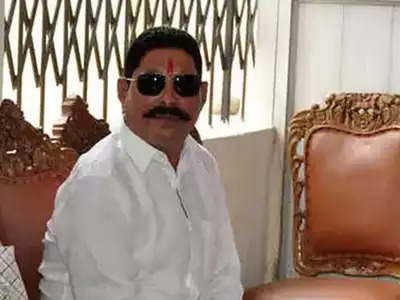

#+TITLE: When Crime Pays: Money And Muscle In Indian Politics
#+OPTIONS: h:6
#+OPTIONS: toc:6
#+OPTIONS: html-style: nil
#+HTML_HEAD: <link rel="stylesheet" href="../../html_export_style.css"> 

* Part 1

** Chapter 1: Lawmakers and Lawbreakers --- The Puzzle of Indian Democracy
- A surprising number of Indian politicians have either been accused or convicted of serious crimes
- Examples:
  - Ateeq Ahmed --- Samajwadi Party, Uttar Pradesh
    - Started out as a petty criminal stealing coal and scrap metal
    - Allegedly had a rival politician, Raju Pal, gunned down in broad daylight for daring to run against his brother, Ashraf
  - Pappu Yadav --- Lok Janshakti Party, Bihar
    - Jailed for the murder of Ajit Sarkar, a rival who had defeated him in the '90s
    - Conviction was thrown out for irregularities in the prosecution's case
    - Was greeted rapturously by supporters upon his release from maximum security prison
  - Mohammed Shahabuddin --- Rashtriya Janata Dal Party, Bihar
    - Had the nickname "Shahabu-AK" for his favorite weapon
    - Was known as the "Saheb of Siwan" for his strongman rule over his home district
- Are these jailed politicians exceptions, or symptoms of a deeper malaise?
- Of the 543 elected members of the Lok Sabha in 2004, nearly a quarter faced criminal charges
- Approximately 12 percent faced charges of a serious nature (i.e. murder, kidnapping, assault, etc)
- Furthermore, the percentage of India's lawmakers accused of crimes has been increasing over time
  - 2004 --- 24% accused of crimes (12% serious)
  - 2009 --- 30% accused of crimes (15% serious)
  - 2014 --- 34% accused of crimes (21% serious)
- Politicians accused of serious crimes are not restricted to any specific part of India --- this is not a regional problem
- Not restricted to national politics --- 31% of state legislators are accused of crimes, 15% of them serious
- In addition to the numbers of politicians accused of crimes, the numbers of crimes themselves is staggering
- Between 2004 and 2013, Indian politicians racked up
  - Over 14,000 discrete charges of a "serious" nature
  - Over 4,000 murder charges alone
  - Over 1,000 accusations of robbery
  - Over 3,000 accusations of counterfeiting and forgery
  - Over 400 cases of crimes against women, including 68 rape allegations
- Candidates accused of crimes seem to do _better_
  - A candidate accused of crimes was 3x as likely to win his or her seat than a candidate without any pending court cases
  - Candidates accused of serious crimes were marginally more likely to win than candidates accused of lesser crimes

*** A Puzzling Coexistence
- Why does Indian democracy seem to reward candidates accused of wrongdoing?
- Five fundamental questions
  - Why do career criminals seem to seek out elected office in India and nowhere else?
    - In other emerging democracies, career criminals are content to shelter behind professional politicians, remaining in the shadows
    - Yet in India, the criminals themselves run for office (/and often win/)
  - Why do political parties select candidates with serious criminal accusations against them?
  - Why do voters continue to vote for politicians with serious criminal records and accusations?
    - Especially, when given a choice between candidates with criminal records and candidates without criminal records, why do voters tend to select the former?
  - What are the public policy options reformers have to reduce the number of politicians with criminal backgrounds that are elected?
  - What are the implications of having a large number of criminal politicians for democracy and accountability, and how applicable is the Indian experience to other democracies?

*** Why India?
- India is _big_ --- home to 1/4 of the world's voters
- Most enduring democracy in the developing world
  - Save a brief period of "emergency" rule under Indira Gandhi, India has had continuous democratic rule since it gained independence
  - Many peaceful transfers of power between governments
- India is low-income and multi-ethnic like many other emerging democracies
- Uniquely among emerging democracies, India has a relatively professionalized Electoral Commission of India (ECI) which compiles rigorous and accurate data about candidates and elections
  - Most notable among the ECI's data is the public disclosures that candidates are required to present about their backgrounds and criminal records
  - Candidates also have to disclose financial assets, which can be another way to assess potential criminal dealings
- India's federal system of governance means that we can subdivide India into its 29 states and 7 union territories
  - Many of these states, if independent, would themselves rank among the most populous countries in the world
  - India's diversity of languages and cultures often invites comparison the EU
  - Yet India is a single unified country with a single, democratically elected federal government
  - This allows for comparison between national and sub-national electoral processes

*** Lessons Beyond India
- Many other countries, including the United States, have politicians which have had run-ins with the law
- Examining India in detail may reveal lessons that can be carried across to other democracies

*** The Marketplace for Criminality
- The model that this book uses is that of a marketplace where politicians, with the aid of political parties, compete for voters' votes
- The market model assumes a two-stage process
  - Candidates make themselves available for office
  - Parties then select suitable candidates to present to voters
  - /This is rather like how, in retail, you have producers that actually make goods, and retailers which select goods and present them to buyers/

**** From Criminals to Candidates
- Why do criminals want to become candidates themselves?
- /In other emerging democracies with significant connections between crime and politics, criminals will sponsor professional politicians who then provide cover for the criminals' activities (e.g. Mexico, Colombia)/
- /Yet in India, the criminals themselves run for office/
- This wasn't always the case
- In the 1970s, while Indian political parties often relied on criminal elements, the political system was much like in other emerging democracies, where professional politicians stood for office and used criminals in order to garner votes
- However, by the 1990s, the tables had turned, and criminals themselves were often being elected
- Factors leading to this outcome include
  - The weakening of the hegemonic Congress Party
  - Organizational decline within political parties more generally in the face of identity politics
  - Collapse of election financing leading political parties to seek individuals capable of self-financing campaigns
- Another factor pushing criminals into politics is the fact that many criminal bosses have accumulated significant amounts of social capital by having functioned as local power brokers
- Going into politics enables these criminals to earn a better return on this capital

**** Welcome to the Party
- As in all democratic systems, political parties in India serve a vital intermediary role in introducing candidates to voters
- Why do political parties in India recruit candidates with criminal records?
- Election costs have increased dramatically in India
- In order to fund ever more expensive campaigns, political parties are looking to candidates who can self-fund
- Candidates with substantial resources of their own can also perhaps help fund campaigns for other candidates who don't have as many resources
- People with ties to crime have access to liquid resources and are willing to deploy those resources in the service of political campaigns

**** Voting With Eyes Open
- Why do voters vote for candidates with criminal records?
- One widely held view is simple ignorance
  - In a country such as India, voters are often poor and not well educated
  - Make decisions on election day with a heavy dose of ignorance about the qualifications (or lack thereof) of the candidates on the ballot
- There are also positive reasons why voters might _prefer_ candidates with criminal backgrounds
  - A criminal record is a costly signal that signifies that the candidate is willing to do anything, legal or illegal, in order to protect the interests of his or her constituency
  - Byproduct of the lack of state capacity
  - Voters have to rely on politicians and patronage networks because the official bureaucracy is unable to provide the services that have been promised to the people

**** Reforming the System
- The key driver of demand for criminal politicians appears to be governance failure, rather than voter ignorance
- Therefore, improving governance should reduce the demand for criminal politicians
- Reformers should take care to ensure that their cures aren't worse than the disease
- Barriers to political participation by criminals can often turn into anti-democratic measures that can be exploited by future authoritarians

**** Implications for Democracy and Accountability
- There is a view that the success of criminal politicians reflects a breakdown in the process of democratic accountability
- This book shows that this is not necessarily the case
- The rise of criminal politicians is not necessarily caused by information asymmetries
- Thus, measures to ease voter ignorance may not actually be effective in stopping the rise of criminal politicians
- Criminality in politics is driven by highly local incentive structures
- While politicians with criminal backgrounds are a significant presence in India, they do not dominate the political system
- Instead "dirty" and "clean" politicians exist in an equilibrium
- This indicates that, in India, there are a number of local incentive structures, only some of which favor criminal politicians

*** Outline of the book
- Part I: Recap of the evolution of India's political economy
- Part II: Examination of the key supply and demand drivers for criminal politicians
  - Why do criminals seek to enter the electoral market
  - Why do parties recruit criminals to run
  - Why do non-ignorant voters select candidates with criminal records
- Part III: What can be done?
  - What are some short term and long term remedies for the crime-politics nexus
  - What lessons does India hold for other emerging democracies

** Chapter 2: The Rise of the Rents Raj --- India's Corruption Ecosystem
- On September 2, 2009, Y. S. Rajashankara Reddy (YSR), the chief minister of Andhra Pradesh, was killed in a helicopter accident
- In response, over 100 people committed suicide
- YSR hailed from the relatively backward Rayalaseema region
- Rayalaseema politics has long been dominated by armed factions whose leaders are a combination of feudal lord and warlord
- The leaders of these factions were known to the British as "Reddys", and today that caste is one of the dominant ones in Andhra Pradesh
- YSR's political fortunes start with his father, Raja Reddy
  - Raja Reddy was the leader of a local faction
  - Hired to manage a barite mine
  - Eventually took ownership of the mine
  - Groomed YSR to go into politics in order to protect the family business
- YSR first contested state level elections in 1978
- Made the jump to national level in 1989
- Won elections with solid majorities --- often over 2/3
- Took over the family business after his father was killed in a bombing, allegedly by the leader of a rival faction
- Turned his faction into an instrument of political and economic control
- YSR became Chief Minister of Andhra Pradesh in 2004, when Congress defeated the incumbent Telugu Desam Party
- After he became Chief Minister, his image softened slightly, but opponents were still physically and financially harassed
- While the national Congress party has never been entirely comfortable with strong local Chief Ministers, YSR delivered so much funding that the national hierarchy put up with him
- The point-man of YSR's corruption operation was his son --- Jagan Mohan Reddy
- Jagan styled himself as an entrepreneur
- YSR arranged a pay-to-play operation in which investors who put money into Jagan's companies were rewarded with favorable land allocations, depriving the treasury of billions in foregone revenue
  - Jagan's disclosed assets in 2004 were ₹919,951 (around $14,000)
  - By 2009, these assets had grown to ₹730,000,000 (around $11,000,000)
  - By 2014, Jagan was worth over ₹4,100,000,000 (around $62,000,000)
- After YSR's death, Jagan attempted to take over the Chief Minister-ship
- When he was denied by the national Congress Party, he led a rebellion, splitting the Congress Party in Andhra Pradesh
- After this occurred, Jagan was hit with corruption charges, which he stated were politically motivated
- Nevertheless, Jagan won the by-election for his father's seat by the largest vote margin recorded thus far
- Although he spent 16 months in jail on corruption charges, he remains a prominent leader in politics
- /And indeed, after this book was published, he did gain the Chief Minister-ship his father had, and remains Chief Minister until today/

*** India's Missing Transformation
- While India's population has grown and its economy has expanded massively, its governing institutions have not kept up
- Unlike European countries, which built a state and then democratized, India built the democracy first, and then set about building a state
- /The US also built a democracy before it built a state, but when the US gained independence, it was a tiny country, and so not much governance was needed/
- /India, by contrast, was already the second largest country in the world when it gained independence/
- The central paradox of the Indian state is that while it often criticized for being overly bureaucratic, it is also very lightly manned, on a per-capita basis
- The gap between legal obligations and the state's ability to carry out those obligations is the space in which corruption grows
- There are three major sources of corruption in India
  - Regulatory
  - Extractive
  - Political
- While political corruption is the focus of this book, all three are interlinked

*** Three Transformations
- Indian society has changed markedly since independence
- 3 major areas of change
  - Politics
  - Economics
  - Social relations

**** Politics
- For the first several decades after independence, Indian politics at both the national and state level was dominated by the Congress Party
  - Huge reservoir of goodwill stemming from its symbolic position as the organization behind the Indian independence movement
  - Divided opposition
  - Congress dominated national politics, even though it never won a majority of the popular vote
  - Congress was not only the dominant political party, but also the major political institution --- was more important than Parliament
- Approximately 20 years after independence, the Congress system began to break down
  - In 1967, Congress suffered a series of defeats at the state level
  - While Congress would continue to dominate national politics, at the state level, politics came to be controlled by a collection of caste-based regional parties
  - The only exception to Congress rule at the national level during this time was a brief period between 1977 and 1979 when an opposition government was elected as a backlash against Indira Gandhi's Emergency rule
- Through the 1970s and 1980s, Congress' power at the national level continued to decline, and by 1989, India had coalition politics even at the national level
  - Coalition politics shifted the balance of power to regional parties
  - States became the key venues of political contestation
- /Now, I would argue that we're in a fourth era --- the Modi Era, where the BJP dominates national politics, but states remain more or less controlled by their regional parties/

**** Economics
- India's economy started with a heavily statist orientation under Jawaharlal Nehru
- Had respectable growth (averaging between 4 and 5 percent) through the '50s and '60s
- However, under Indira Gandhi, the government intervened more and more in the economy, in response to slowing growth and corruption scandals
- Between 1965 and 1981, India's GDP growth rate slowed to just above 3% --- "the Hindu rate of growth"
- This was the era of the "License Raj" --- complex system of bureaucracy and permits that defined when, where, and for how long any business above a certain size could operate
- /This is cited as one of the reasons that businesses in India, even today, are so small and capital light --- the License Raj imposed a hefty penalty on growth/
- In 1980, Indira Gandhi was re-elected as Prime Minister
- Under her second administration and the administration of her son, Rajiv, the Indian government began to experiment with pro-market reforms
- After a balance of payments crisis in 1991, these reforms accelerated
- These reforms accelerated Indian growth, with GDP growth rates often exceeding 10% for the 1990s and the 2000s

**** Society
- Historically, Indian society has been highly stratified, thanks to the caste system
- In the form of the caste system codified by the British, society is organized into four major groups
  - Brahmins (priests)
  - Kshatriyas (warriors/rulers)
  - Vaishyas (merchants)
  - Shudras (backward castes)
- In modern India, caste is recognized as a distinction used for affirmative action
- The government of India recognizes three categories of groups for affirmative actions
  - Scheduled Castes (SCs) --- Dalits (Untouchables) and other castes that have been historically discriminated against
  - Scheduled Tribes (STs) --- representatives of India's tribal communities
  - Other Backward Classes (OBCs) --- A large group of underprivileged people initially defined as not belonging to either scheduled castes or scheduled tribes
- Implicitly, the government thus recognizes Brahmins and other upper castes as a fourth category
- Historically, there has been a correlation between caste and social class, though with a fairly wide degree of regional variation
- However, as India's economic and political system opened up, more opportunities for people from the lower castes became available, and the hierarchy of caste has begun to erode
- Today, caste is more a sign of distinction rather than of hierarchical rank

**** Unfinished Business
- One must be careful not to overstate the amount of change in modern India
- While the worst excesses of the License Raj have been dismantled, India still has a level of bureaucracy that would be considered stifling by Western standards
  - While product markets have been liberalized, there has been much less reform in factor markets (land, labor, capital)
  - Many sectors of the economy are still dominated by state-owned enterprises
- While voters have a greater range of political parties, the parties do little to distinguish themselves ideologically
- Although the salience of caste has diminished, there are still huge disparities in wealth and status

*** Institutional Stagnation
- Compared to the changes in India's economy, politics, and social relations, the governing institutions have remained stagnant
- Need to separate the continuity of India's democracy from its effectiveness
- It is true that India has had continuous democratic rule (except for the brief period of emergency rule under Indira Gandhi)
- However, India's democratic government has not done a very good job of providing for its citizens' basic needs
- This is due to the historical underpinnings of India's government
- Unlike China, India never had a strong central state before being subjugated under British rule
- The British Raj ruled India tyrannically, but used local proxies to enforce its mandates
- India occupies a middle-ground in Asia
  - Not a failed or failing state, like Pakistan (/or Burma/)
  - Not an unambiguous success story like China or Japan
- Instead, India's state is best thought of as a "flailing" state
  - Can conduct elections for 800 million voters, but can't provide sanitation facilities for them
  - Can create unique biometric identifiers for over a billion people, but struggles to enforce basic legal contracts
- The presence of Indian bureaucracy is oppressive in areas where it shouldn't be, but missing entirely in areas where it is necessary
- A related factor is the fact that Indian government has far fewer personnel per-capita than Western bureaucracies
- The result is a government that has a huge number of mandates, but doesn't have the personnel to enforce them consistently or effectively

**** Excessive Procedure
- Despite the proclaimed end to the "License Raj", India still has a huge amount of restrictions and bureaucracy around business activity
- One example is the procedure to get a construction permit in Mumbai --- requires 40 discrete procedures that take 147 days on average, and can cost up to 1/4 of the project's total
- Bureaucrats will often intentionally expand regulation in order to create an environment in which they can extract more bribes
  - In Delhi, this was done with the procedures to obtain driver's licenses
  - As a result many who were qualified to receive licenses were excluded
  - Many who did receive licenses did so as a result of bribes, and could not pass either the written examination or an independent driving test
- At times, the bureaucracy becomes farcical
  - Uttar Pradesh has an Association of Dead People (Mritak Sangh)
  - People who have been ruled deceased by the bureaucracy despite being very much alive
  - The Association helps its members navigate the Indian bureaucracy to prove to the government that they are still alive

**** Insufficient Personnel
- Given this excess of procedure, there is a widely held view that the size of India's bureaucracy must be reduced
- However, India already has one of the lowest rates of public sector employment of any G20 country
- Need to distinguish between excessive procedures and excessive staffing
- The problem of Indian bureaucracy is that it doesn't have nearly enough people to carry out the procedures that are on the books

**** Sovereign Failures
- The combination of excessive procedures and insufficient personnel means that the Indian state struggles to carry out even basic tasks
- For example, it is estimated that just 32 million people pay taxes in India
  - India has one of the most burdensome tax regimes in the world --- ranked 157th in the world in the World Bank's ranking of ease of paying taxes
  - Shortage of over 20,000 tax collectors
- Similar gaps between bureaucratic aspirations and state capacity affect health care and internal security, where the government has made grand promises to e.g. improve health and prevent terrorism, but large shortfalls in personnel prevent the government from carrying out its goals
- This discrepancy is most egregious in the judicial system
  - India has 12 judges per million people
  - Compared with 108 judges per million in the United States
  - Backlog of 31.2 million court cases

*** Governance Deficit
- A large and widening gap has opened between Indian society and its governing institutions
- The situation in India resembles that described by Samuel Huntington's 1968 book /Political Order in Changing Societies/
- Huntington argues that the vast corruption seen in the developing world is the result of political institutions that are unable to keep up with changing economies and societies

**** Weak Institutions and Corruption
- India's institutional stasis is linked to corruption in 3 ways
- Bureaucratic proceduralism has given state actors wide latitude in how they can apply discretionary authorities
  - This makes holding and retaining office very lucrative, incentivizing ever greater spending on political campaigns
- The relative incapacity of the state, due to staffing shortages, has left the state with shortcomings in its oversight functions
  - Limits state's ability to police rent-seeking
  - Allows private actors to provide the state with substandard goods and services with little consequence
- Excessive proceduralism limits the ability of the state to provide services increasingly demanded by a growing, increasingly prosperous and well-connected population
  - Allows private actors to step in and provide services that the government has promised but is unable to deliver
  - Private actors do not act with the general welfare in mind

**** Modernization and Corruption
- Modernization compounds the problems created by weak institutions
- Creates new sources of wealth and power
- "Awakens" the lower rungs of society --- begin pushing for increased government services
- Requires the construction of new infrastructure
- Reorders the values of society, creating a separation between private interests and public roles

**** Modernization and Corruption, Indian-style
- Since the 1980s, there has been substantial wealth-creation in India
  - In the mid-1990s, India had only 2 billionaires, worth a combined $3.2 billion
  - By 2014 India's top 100 richest people were all billionaires, worth a combined $346 billion
  - This burgeoning class of ultra-high net worth individuals have used their personal fortunes and corporate power to shape policy outcomes on a number of topics, such as regulatory policy and the influence of foreign competition
  - Increases in economic well being haven't been limited to the top --- India's share of people living under the poverty line declined from 45.3% (400 million people) to 22% (270 million)
  - This massive increase in wealth has created opportunities for patronage and clientelism, as a way for the richer in society to transfer money to those less well off
  - Increases in wealth among the middle-class and poor have also led to increased expectations of government
  - This, in turn, has led to a willingness on the part of voters to elect representatives that look out for their interests, even if they short-circuit official channels in order to deliver promised policy outcomes
- The rapid increase in India's economic wealth has also created new opportunities for corruption
  - The infrastructure needed to support economic growth typically requires large government contracts, which foster opportunities for corruption
  - Increased literacy and connectivity among people has also created greater opportunities for people to see and report corruption
- The flaw in Huntington's model as it applies to India is that Huntington's model is overly deterministic
  - Suggests that corruption is somehow inevitable as societies modernize
  - However, as we've seen with India, corruption is fundamentally about individual choices
  - /I'm not sure that the two are mutually exclusive/
  - /Individual choices are restricted and influenced by one's environment/
  - Structural factors provide more opportunities for corruption, but the degree to which those opportunities are exploited is the result of individual agency

*** Grand Possibilities for Grand Corruption
- While corruption has always existed to some extent in India, modernization and economic growth has changed the nature of corruption
- Increased opportunity for "grand" corruption, as opposed to "petty" corruption
  - Corruption involving high-level elected officials
  - Resulting in systemic effects on economic and political outcomes
  - Examples:
    - Vested interests paying for large-scale regulatory favors
    - Kickbacks for licenses
    - Exertion of political influence through illicit financing
  - This is contrasted with "petty corruption"
    - Low-level functionaries asking for bribes
    - Taking payments for allowing illegal access to public benefits
- /Vaishnav implies that grand corruption is worse for society than petty corruption, but I'm not sure that's the case/
- /Yes, the monetary impact of grand corruption is much higher, but petty corruption has a much more corrosive effect of governmental legitimacy/
- /The average citizen isn't going to encounter a politician asking for a twenty million dollar kickback in exchange for a telecoms license, but he or she will encounter a police officer asking for a twenty dollar bribe in exchange for not being harassed by a traffic ticket/
- /Furthermore, I think Vaishnav, unlike Huntington, underestimates the influence of culture/
- /A culture of petty corruption is a culture in which grand corruption has much greater space to flourish/

**** Regulatory Rents
- India's economic liberalization was supposed to reduce the influence of corruption, by opening more sectors to market discipline
- Yet, in the wake of liberalization, corruption has increased
- Does this mean that liberalization was a failure?
- No --- the increase in corruption can be ascribed to insufficient, or poorly thought out liberalization
- Corruption in India is concentrated in the sectors which are either still under state control or where the state failed to institute sound regulations following liberalization
- Three main problems resulting from the liberalization push
  - The "commanding heights" of the Indian economy are still state-controlled
    - Ranging from higher education, to power generation to mining
    - State can use its dominant monopoly position in these sectors to extract rents from the rest of the economy
    - Over three quarters of the Indian economy is dominated by either state firms or private firms that were formed prior to 1980 (/implied to be private firms that have implicit state sponsorship/)
  - Regulatory capture
    - State is "captured" by a connected class of entrepreneurs and politicians
    - The evidence of liberalization is that many small firms entered newly opened fields, but most were driven out or found themselves unable to grow
    - Incomplete liberalization created "winner-take-all" dynamics where certain firms were able to use political connections to drive out competitors, foreign and domestic, ensuring their eventual dominance
  - Predatory behavior by the state
    - Incomplete liberalization doesn't get rid of opportunities for patronage, it merely relocates them
    - This often takes the form of embezzlement by government officials
    - This embezzlement is often in the sectors where governmental influence is highest, such as mining and real estate
    - Regulatory capture creates greater opportunities for embezzlement, as political figures find cooperative business figures willing to pay kickbacks in order to avoid regulations themselves and have those same regulations be imposed harshly on their competitors

**** Extractive Rents
- Rents taken from natural resource development or other extractive industries
- Can themselves be subdivided into three categories
  - "Terrestrial" --- rents derived from the allocation of land or above-ground resources
  - "Subterranean" --- rents derived from the allocation of mineral and fossil fuel rights
  - "Ethereal" --- rents derived from the allocation of radio spectrum for telecoms
- Land
  - India's byzantine system of land regulation, with many statutes dating back to the colonial era, provides ample opportunity for malfeasance
  - As the Indian economy grew through the 2000s, there was a huge land rush
  - People sought to acquire lands for private dwellings, commercial real estate, and industrial facilities
  - All of these land deals required intense interaction with the state, which maintains a tight control on land supplies
  - Case study: Adarsh Housing Society
    - Posh apartment block located in South Mumbai
    - Originally was supposed to house widows of soldiers killed in the Kargil War with Pakistan in 1999
    - Instead the apartments were all distributed among the regulators and their cronies
    - The building of the complex flouted a number of zoning and environmental regulations
    - When the scandal came to light, it caused such an uproar that Chief Minister of Maharashtra felt the need to resign
    - Most of the implicated politicians got off scot-free
    - State government initially refused to launch an investigation
    - When mounting public pressure forced their hand, the government investigators put the blame squarely on bureaucrats, absolving their political masters
- Mineral rights
  - India's economic boom in the 2000s, coupled with the continued growth of the Chinese economy during that time period, caused an unprecedented boom in commodity prices
  - Huge interest in expanding mining and quarrying activities
  - The mining industry was left relatively untouched by the reforms of the 1990s
    - Sector was not all that important at the time
    - Policymakers didn't anticipate how important the sector would become as economic growth created a greater need for natural resources
  - "Toxic mix of oppressive regulation, regulatory incapacity and ill-defined rules for allocation"
  - Case study: Mahu Koda
    - Politician hailing from the relatively poor and backwards state of Jharkhand
    - Despite the poverty of its people, Jharkhand holds 40% of India's mineral wealth and 30% of its coal reserves
    - Koda split the BJP in Jharkhand, and out of the resulting scramble, emerged as the Chief Minister
    - Prior to becoming the Chief Minister, Koda had the been the minister in charge of overseeing the mining sector, a portfolio that he retained even after he assumed the Chief Minister's office
    - Within a few years, Koda had reportedly accumulated a fortune worth billions of dollars
      - Kickbacks
      - Hawala transactions
      - Offshore bank accounts
      - Fraudulent shell companies
    - The foundation of Koda's illicit earnings was his ability to grant mining licenses
    - Would invite mining executives over to his home and grant licenses based on the size of the bribes that the executives could promise
    - Koda would take this money, and funnel it (often in the form of literal suitcases full of cash) to Mumbai, where it would be invested in front companies and funneled to offshore bank accounts
- Telecommunications spectrum
  - Telecommunications in general, and mobile telephony in particular witnessed dramatic growth during the early 2000s
  - To facilitate the introduction of 2G cell networks, the government announced that it would award new licenses and spectrum allocation
  - At this time, the Minister of Telecommunications was A. Raja, from the Dravida Munnetra Kazhagam (DMK) party from Tamil Nadu
  - Instead of auctioning off new spectrum, Raja announced a first-come/first-served policy
  - Telecom ministry announced that it would stop accepting new applications on October 1, 2007, with very little warning
  - Then, on January 10, 2008, it retroactively revised the deadline to September 25, 2007
  - On the same day, it announced that if participants in the spectrum allocation wished to continue to be considered, they would need to show up, in person, at the Department of Telecommunications, between 3:30pm and 4:30pm, with bank guarantees worth at least ₹16.5 billion  ($250 million)
  - When the Indian Comptroller and Auditor General (CAG) investigated the spectrum allocation, it found that 85 out of 122 licenses were granted to companies that were ineligible to receive them
  - Licenses were awarded at 2001 prices
  - Many of the license award winners were real estate firms with no telecoms experience, but with access to large amounts of liquid cash
  - In February 2011, A. Raja, along with several other DMK officials was arrested
  - Trial is ongoing at the time of writing
  - /In 2017 A. Raja, as well as several other DMK officials were [[https://indianexpress.com/article/cities/delhi/2g-scam-case-hc-cbi-ed-raja-appeal-against-acquittal-8554706/][acquitted]] by a Central Bureau of Investigation (CBI) court/

**** Political Rents
- Politics is the linchpin that holds India's corruption ecosystem in equilibrium
- Two primary aspects of India's political system encourage corruption
  - The nature of political finance
    - Ineffectual regulation of campaign finance
    - Allows for policies that do not benefit the public domain
    - Props up corruption in other domains
    - Example: land regulation
      - Land in India is heavily regulated by the state
      - Gives politicians a steady source of favors that they can dole out to builders who pay bribes
      - Land favors are especially useful for graft because the construction industry has access to lots of capital and is heavily cash-reliant
      - There is hard evidence of this graft in cement usage statistics
        - Builders are often operating at the limits of their capital
        - During election season, bribes will eat into the capital available for building
        - This should result in a reduction in cement orders during election season
        - This is exactly what Devesh Kapur and Milan Vaishnav found in their study: "Quid Pro Quo: Builders, Politicians, and Election Finance in India"
        - This effect is stronger for state elections, as it is state governments that regulate land
    - Corruption money serves to bankroll politics, and, in turn, part of the appeal of going into politics is the vast amount of black money that one can generate by manipulating political levers to favor certain groups over others
  - The intersection of criminality with the political sphere
    - Politicians acquire status on the basis of their ability to manipulate the political system to deliver services to favored groups, often in contravention of legal norms
    - Example: Raghurap Pratab Singh
      - Won election to the Uttar Pradesh state assembly 5 times
      - Secured no less than 65% of the vote in each of those elections
      - Styles himself as the protector of the Rajput caste
      - Faces numerous criminal indictments
      - Far from discouraging support, these indictments are perceived to show that Singh is willing to go to any lengths to protect his constituents
      - Singh subverts the ability of the official state to undertake its duties in his district, and consolidates those activities in his own office
      - This ability to subvert and substitute the official state gives corrupt politicians the legitimacy to loot state programs with impunity
      - Singh is accused of stealing as much as $14.5 billion from a government program intended to send grain to the poor

**** The Bedrock of Administrative Corruption
- India has long had a culture of routine administrative corruption
- Provides the foundation for higher level malfeasance
- Operates through three channels
  - Officials soliciting bribes to give people government services that they are entitled to
    - Over 75% of people with a Below Poverty Line card in Karnataka reported paying a bribe
    - Another example is driver's licenses in Delhi (see above)
  - Collusion between public and private actors
    - Procurement fraud at government departments and state-owned enterprises
    - Although this need not involve politicians, it often does, as politicians see these contracts as a way to funnel money to favored constituents
    - State bureaucrats are not motivated to stop these corrupt contracts because politicians have ample ways of rewarding compliant bureaucrats and punishing non-compliant ones
    - Example: Ashok Khemka
      - Investigated and canceled corrupt land deals that were tied to Robert Vadra, son in law of the leader of the Congress Party, Sonia Gandhi
      - Although these allegations were later confirmed by the CAG, Khemka was still charged with professional misconduct
      - Has been transferred 46 times in a 22 year career
  - Embezzlement
    - Prime Minister Rajiv Gandhi once said that only 15% of the benefits allocated to the poor actually reach their intended recipients --- the remainder is siphoned off along the way
    - Bureaucrats often collect a salary while shirking official duties
      - In 2006, a study found that 25% of India's schoolteachers were absent during random spot checks
      - In 2014, this rate of absenteeism was still 23% --- hardly any change

*** The Venn Diagram of Grand Corruption
- Corruption in India is overlapping and co-dependent
  - Poor need politicians to help them navigate a government bureaucracy unable to keep up with their demands
  - Politicians need corrupt businesspeople to supply them with funds to disburse to the poor and use for election campaigns
  - Corrupt businesspeople need politicians to get cheap access to natural resources
  - Politicians need poor people's votes, as they are numerous enough to overrule the votes of middle-class Indians who might be more concerned about corruption
- This overlap is demonstrated by the exploits of YSR and Jagan Reddy
  - YSR arose in the muscular politics of Rayalaseema
  - Used access to natural resources to extract "investments" in Jagan Reddy's businesses
  - Enabled Janardhana, Karunakara, and Somasekhara Reddy (no relation) to build a huge illegal mining empire
    - These three hailed from Bellary, a region in Karnataka that borders Andhra Pradesh
    - That area has a lot of iron ore
    - When a combination of relaxed export controls and increased demand from China caused iron ore prices to increase (from $17 per metric ton to $130), these three brothers sought to get in on the action
    - Formed a mining company: Obulapuram Mining Company (OMC), despite having zero experience in mining
    - Convinced YSR to grant them mining licenses on the other side of the border in Andhra Pradesh
    - Used the proceeds from these illegally granted mining licenses to go into Karnataka politics
      - Started supporting the BJP in Karnataka in 1999
      - In 2008, thanks to a series of massive payoffs (roughly $3 million each) to independent MPs to switch their allegiance to the BJP, the three Reddys got the BJP into government
      - This enabled them to get cabinet seats in the new BJP government
      - Used their status in government to muscle their way into the Bellary mining market
        - Extracted bribes from existing miners in the form of profit-sharing payments to OMC
        - Facilitated illicit mining on both the Karnataka and Andhra Pradesh sides of the border
        - Worked with YSR to literally move the Andhra Pradesh border in order to ensure that certain mining claims could be theirs alone
    - When the anti-corruption ombudsman in Karnataka released a report implicating the three brothers, they threatened to bring down the BJP government
    - This led to a press conference in which the Chief Minister of Karnataka tearfully apologized to the brothers
    - YSR's death removed one of the brothers' key patrons, and shortly thereafter, Janardhana was jailed on bribery charges
    - However, as of 2015, Janardhana is out on bail and awaiting trial
    - /In 2023, Janardhana is [[https://economictimes.indiatimes.com/news/politics-and-nation/janardhana-reddy-announces-new-party-to-contest-2023-karnataka-polls/articleshow/96494485.cms][still out on bail and awaiting trial]]/
    - /Has formed a new political party to contest elections, after having severed his ties with the BJP/

* Part II

** Chapter 3: Criminal Enterprise: Why Criminals Joined Politics
- Arun Gawli is a notorious gangster who controlled the Dagdi Chawl, a slum in Mumbai
- The basis of his power in the slum was his ability to obtain government services, such as ration cards and welfare payments, on behalf of petitioners
- As his power grew, he was courted by the Shiv Sena political party
- Brief history of the Shiv Sena
  - Founded in the late 1960s as a nativist party for Maharashtrans
  - Fought for the rights of Maharashtrans over immigrants who'd settled in Mumbai (then Bombay)
  - Founded by Bal Thackeray
  - Quickly grew in popularity
    - "Sons of the soil" propaganda
    - Network of service stations designed to provide aid to destitute locals
- Although Shiv Sena was a political party, it also endorsed an ethos of direct action
- Intentionally sought alliances with gangsters
  - Help with voter turnout
  - Campaign funding
- In turn, the gangsters received political and legal cover from Shiv Sena
- Eventually, Arun Gawli was arrested
- While in jail, in the late '90s, he abruptly split with the Shiv Sena
- Reasons still unclear
- Formed a political party, the Akhil Bharatiya Sena
- In doing so, he broke with tradition, as in the past, Mumbai dons had stayed on the fringes of electoral politics, not seeking the limelight for themselves
- In 2002 Gawli managed to get his daughter, Geeta, elected to the Mumbai city administration
- In 2004 Gawli managed to win an election to the Maharashtra state legislature
- Gawli spent much of his term in jail on murder charges; his wife and campaign manager, Asha, served in his stead
- While Gawli's path into electoral politics reads like an atypical story of a gangster turned politician, it's quite common in India
- 2002 government white paper noted that many MPs had criminal convictions, often for serious charges, such as murder, rape, and dacoity

*** Where Do Criminal Politicians Come From
- This book conceives of elections as a marketplace
- Politicians wish to "sell" themselves to voters
- Voters have at least some level of demand for politicians to represent them
- Why do people with criminal records get involved in politics?
- While the association of criminality with politics is old in India, the phenomenon of the criminals themselves running for office is relatively recent
- Two sets of factors drawing criminals into elected office
  - "Pull factors" creating an environment where criminals can thrive in politics
  - "Push factors" operating directly on the criminals themselves
- Most of the scholarship on criminality in Indian politics has been on pull factors
  - Breakdown of Congress' patronage networks
  - Rising unmet social demands
  - Caste/identity politics
  - Hollowing out of public sector institutions
  - One major pull factor that existing scholarship has overlooked is the collapse of India's campaign financing regime
- These pull factors enable criminals to thrive once they enter politics, but what motivates them to enter in the first place?
- Think about criminals as analogous to private enterprises seeking to vertically integrate their operations

*** Hegemony, Interrupted
- Cursory review of Indian electoral politics
- Yogendra Yadav divides Indian politics into three distinct "electoral systems"
  - 1952 - 1967 --- Congress domination
  - 1967 - 1989 --- Multi-party system with Congress leading
  - 1989 - present --- Coalition politics with states increasing in importance as venues of political contestation
- While most analyses of the intersection of crime and politics focus on the most recent, multi-party phase, the origins of this intersection goes back much further

**** "An Act of Faith"
- India achieved a number of remarkable milestones from independence through the 1950s
  - Incorporation of princely states --- semi-sovereign entities that the British had never directly controlled
  - Drafting and ratification of a constitution
  - First elections in 1951-52
- One overlooked aspect of India's first elections is the role played by the Election Commission of India (ECI)
  - The existence of the ECI is enshrined in Article 327 of the Indian Constitution
  - However, at the time of the first elections in India, the ECI existed only on paper
  - The formation of the ECI and the organization of India's first elections can be credited to Sukumar Sen
  - Was given broad latitude by Jawaharlal Nehru to set up India's elections
  - The definitive account of Sen's arduous task is given by Ramachandra Guha's /India after Gandhi/
  - Another good resource on the enormity of setting up India's first election is the ECI's own report: /Report on the First General Elections in India: 1951-1952/
- The result of this first election was a landslide victory for Congress
  - Won 364 out of 489 parliamentary seats
  - Captured 45% of the popular vote
  - The next highest polling party, the Communist Party of India, won a mere 16 seats
- Although it was a landslide result for Congress, the elections themselves were largely free and fair
- Isolated incidents of voter impersonation, ballot box tampering and voter intimidation did occur, but these accounted for less than 1% of all polling stations

**** The Congress System
- Congress enjoyed widespread legitimacy across social and ethnic groups in the early years of Indian independence
- Sense that, as the party responsible for Indian independence, only Congress could be trusted to run the country
- Was the only party with the infrastructure and organization to reach every part of the country
- The Congress Party in India was not only an exceptionally well-organized and institutionalized party in India, it was one of the best organized and institutionalized parties in the post-colonial world
- To perpetuate its dominance, Congress relied on a top-down system of political control which co-opted local leaders
- These local leaders derived legitimacy from several sources
  - Economic power
  - Social status (deriving from caste or ethnicity)
  - Coercive power, in some cases
- This system of localized leadership combined with the overall goodwill that Congress enjoyed as the party of independence enabled Congress to maintain a heterogeneous coalition
- Congress' source of power initially was not violence, but rather its ability to dispense jobs and economic benefits via patronage networks
- However, as early as 1957, we start to see physical coercion play a role in Indian elections, in the form of "booth capturing"
  - Booth capturing is the process by which local elected officials commandeer polling booths and dictate the vote
  - Starts by politicians contracted with hired thugs and providing legal cover for those thugs to acquire weapons
  - Influence election officials to strategically place polling stations in locations advantageous to the incumbent
  - Then, on election day, "influencers" would mobilize or suppress turnout as needed in order to ensure a particular outcome
- The first recorded instances of booth capturing occurred in Bihar's Begusarai district
  - Bihar was dominated by upper-caste landlords, who had access to a network of thugs that they used to keep their peasant farmers in line
  - This social system was purpose made for electoral manipulation, with landowners working with elected politicians to decide who should win, and then using their preexisting networks of thugs to either drive turnout or suppress it in order to guarantee the result
- Over the next several decades booth capturing grew more sophisticated
  - Ballot stuffing
  - Intimidation of voters
  - Dividing control of polling places among factions which with one wished to build an alliance
- Important to note that booth capturing usually did not involve physical violence at the polling place
  - Voter intimidation
  - Manipulation of voter rolls
  - Use of police at the polling place to ensure that only those that had been chosen to vote could vote
- Criminals cooperated with this system for monetary and non-monetary rewards
  - Direct payments in exchange for helping drive turnout or suppress it as necessary
  - Protection from prosecution
  - Favored for state contracts
- This equilibrium between Congress politicians and criminals was a delicate one, which could be disrupted by political shocks

**** The Congress System Breaks Down
- During the early years of the Congress system, politicians were the dominant force
- Criminals were hired service providers who did not and were not expected to stand for office themselves
- As Congress' own electoral dominance began to break down, criminals started to offer their services to other parties as well
- The mid-1960s were a tumultuous time for Congress
  - Defeat against China in the Sino-Indian War of 1962
  - Death of Nehru in 1964
  - Death of Lal Bahadur Shastri, another Congress Prime Minister, in 1966
- In the wake of Nehru's death, the prime ministership was taken over by Indira Gandhi, Nehru's daughter (/and no relation to Mahatma Gandhi/)
- Although later Indira Gandhi would be seen as an autocratic figure, when she took over, she was seen to be a pliable figurehead who would answer to a group of state-level Congress bosses known as The Syndicate
- Gandhi was supposed to use her personal connection to Nehru, the giant of Indian independence, to win election, and then use her position to advance The Syndicate's interests
- However, Congress suffered a series of electoral setbacks in 1967
  - Lost a large chunk of its majority at the national level --- went from 361 / 494 seats in 1962 to 283 / 520 in 1967
  - Began to lose its majorities entirely in state legislatures, suffering defeats in Kerala, Tamil Nadu, Bihar, Uttar Pradesh, and West Bengal
  - Although South India had never been under strong Congress control, the big shock was defeats for Congress in its heartland states of Bihar and Uttar Pradesh
- These defeats severely weakened the power of Congress' patronage network, with several consequences
  - Large increase in political opportunism, with MPs defecting from Congress to join other parties
    - Of 542 instances of state-level politicians switching parties, 438 instances occurred in 1967 alone
    - 32 state governments fell between 1967 and 1971
    - By 1971, half of all state level legislators had switched political affiliation at least one time
  - Influx of individuals connected to crime into the political arena
    - Partially due to the breakdown of Congress' patronage network
    - However, another factor is the overall breakdown of political party organization in general during this time period
    - Parties of all sorts struggled to mediate citizen demands with their own organizations
    - As a result, they turned to local power brokers or "fixers" to fulfill this need
    - The influx of criminals was reflective of institutional deterioration among Indian political parties

**** Organizational Decline of Parties
- As Congress faced greater electoral challenges, its internal organization began to break down
- Charismatic leaders either passed away or formed challenger parties
- Instead of reforming Congress' internal systems, Indira Gandhi chose to plow ahead, increasingly relying on patronage and intimidation
- Indira Gandhi relied on building a personalist organization, centered around her connection to the masses, rather than a party
- This shortcoming, however, was reflected in many opposition parties as well
- Further hampering Congress' continued power was its perception as a party of the upper castes
- As lower castes gained economic power, through land reforms, they sought political power to match
- Rather than attempt to address the concerns of lower castes, Congress doubled down on identity politics

**** Doubling Down on Criminal Elements
- As Congress' internal organization broke down, it was forced to rely more and more on extralegal means to win elections
- This led to a dynamic where opposition parties felt that they had to resort to the same tactics in order to avoid being overwhelmed by Congress
- This began to be evident at a large scale in 1967
  - ECI report on 1967 election reports many instances of reported violence in the run-up to the elections
  - This led to many polls having to be re-run
- An independent analysis found 474 cases of violence, with 20% of those instances occurring in Bihar alone
- The subsequent state elections in 1968 also had many cases of reported voter intimidation and violence
- As a result, many outside observers point to the late 1960s as an important inflection point in Indian politics

*** Deinstitutionalized Democracy
- The electoral setback of 1967 further deepened the rift between the Syndicate and Indira Gandhi
- This led to a major split in the Congress party in 1969
- /This is covered in greater detail by Robert L. Hardgrave Jr.'s article, "[[https://repositories.lib.utexas.edu/bitstream/handle/2152/34540/congressinindia.pdf?sequence=1][The Congress in India -- Crisis and Split]]"/
- Indira Gandhi managed to maintain her government by allying her Congress faction with other left-wing parties
- Called early elections in 1971 to try to consolidate a new majority
- Purpose of early elections was to break the link between national and state-level polls
- Indira Gandhi's Congress faction won a landslide victory in the 1971 elections
- This allowed her to rebuild Congress' internal structure along more personalist lines
  - State-level officials were now appointed by the center rather than being chosen by state-level party organizations
  - Suspended internal elections
- Gandhi also sought to use the power of the government to further her own political ends
- Repeatedly used "President's Rule", a constitutional provision allowing the Center to suspend state governments and rule the state directly, to shape state-level political outcomes

**** Entrenched Muscle Power
- The 1970s saw the entrenchment of voter intimidation and violence as standard electoral tools
- The 1971 election saw significant violence, with 66 polls having to be rerun because of booth capturing
- Violence was geographically widespread, including Bihar, Orissa, Haryana, Jammu and Kashmir, Nagaland, Uttar Pradesh, and most notably, West Bengal
  - The 1967 state elections in West Bengal brought into power a government led by the Communist Party of India (Marxist) (CPI(M))
  - This government was ousted shortly thereafter by the center
  - In state level elections called again in 1969, the CPI(M) once again won
  - This government was ousted again, with Congress allying with opposition parties and defectors from the ruling coalition
  - In 1971, it was West Bengal that topped the list of states with electoral violence, surpassing even Bihar
- Indira Gandhi's personalist politics were increasingly met with opposition from the populace, as well as the Congress Party
- This deepening social strive created more openings for criminals to enter politics

**** Centralized Powerlessness
- By the 1970s, the Indian government's ability to deliver services to its citizens had badly eroded
- Institutional base was straining to keep up with rapid population growth (/see also the reference to Huntington's thesis above/)
- Making matters worse, Indira Gandhi greatly expanded the services that were promised to the citizenry without investing in the necessary institutional reforms to make delivering those services possible
- Gandhi sought to make both the Congress Party and the Indian government directly answerable to her
- This deinstitutionalization was most evident with regards to the police
  - Politicians had to be able to award protection to favored criminals in order to secure their loyalty
  - To do this, they made the police subordinate to the politicians
  - /This is very much like what Trump attempted to do with the Department of Justice/
- Making matters worse, many state governments mirrored Indira Gandhi's tactics at the center
- This is evidenced by the increasing proportion of state Chief Ministers who appointed themselves as Home Secretary, because that department had control over the police

**** "Mastanocracy"
- The subordination of the police to politicians blurred the line between illegitimate violence and legitimate democratic campaigning
- This led to the growth of parties like the Shiv Sena
  - Shiv Sena originated as a non-political social movement
  - Believed that Maharashtra ought to be reserved for Maharashtrans, not immigrants from other states
  - Over time, however, it became a political organization with state-wide appeal
  - Simultaneously engaged in institutionalized politics, street-level violence, and informal networking and power-brokering
- In other parts of the country caste-based gangs grew, often in opposition to left-wing extremist groups like the Naxalites
- Both sets of factions would have allied political parties that would seek to provide legal and political cover for the criminal elements
- Even in areas of India not normally known for electoral violence, there was a marked increase in thuggery
  - In West Bengal, growing violence led to the creation of a "mastanocracy", rule by mastans, or criminal gangs
  - In Kerala, which is often seen as an exception to India's normally dirty politics, there was open violence between Left parties and those allied with Congress

*** The Dawn of "Black Money"
- The collapse of India's system of campaign finance plays an under-emphasized role in forcing the increasing alignment of criminals and politicians

**** Rise of Corporate Financing
- Congress initially was funded by a combination of membership dues and corporate donations
- Close links between captains of Indian industry (Birla, Tata, etc.) and Congress
- Although there were rules designed to limit how much any one candidate could spend in an election, loopholes made those rules meaningless
- As elections became more competitive in the 1960s, parties began to rely more on corporate donations
- India's first campaign finance regime was codified under the Representation of the People Act, which declared that corporations could contribute as much as they wanted to campaigns, so long as donations were openly disclosed
- Congress was the primary beneficiary of this arrangement, receiving 30x as much corporate funding as the second place party
- Towards the late 1960s, this arrangement came under increasing scrutiny, with the government's Santhanam Committee expressing concerns about the increasingly close ties between business interests and politicians
- Indira Gandhi also supported campaign finance reform, for her own ulterior reasons
  - Although Congress was by far the largest beneficiary of corporate largess, these funds flowed to members of The Syndicate
  - Gandhi had been taking more populist, left-oriented policy stances to win the support of the people; however these moves were often in opposition to corporate interests
  - Cracking down on corporate donations would superficially address concerns regarding corruption while doing little to affect Gandhi's own power base

**** Ban On Corporate Donations
- In 1969, India amended its Companies Act to impose a total ban on corporate donations to political parties
- This was done in conjunction with a broader suite of anti-corporate populist measures
  - Bank nationalization
  - Nationalization of the coal industry
  - Monopolies and Restrictive Trade Practices Act
  - Foreign Exchange Regulation Act
- Indira calculated that the ban on corporate donations would hurt her opponents more than it would hurt her, as she was relying on corporations to find ways to give money covertly to Congress
- A ban on corporate donations without the simultaneous creation of alternate means of campaign finance had the effect of pushing all campaign finance underground
- This led to the era of "briefcase politics"
- The combination of underground campaign finance and increased overt regulation spurred the creation of an alternate economy as business sought to use bribes in order to ensure that new government regulations weren't enforced against them and were enforced against their competitors
- This search for underground finance increasingly drove parties into the arms of criminals who had access to covert stockpiles of cash, and the ability to funnel that cash to political parties without detection

**** Relegalization: Too Little, Too Late
- In 1985, having recognized the folly of his mother's decision, Rajiv Gandhi sought to relegalize corporate campaign finance
- However, corporations had come to appreciate the benefits of covert donations
- Covert donations allowed corporations to keep knowledge of who they were contributing to out of the public eye, ensuring that they wouldn't be punished for donating to a losing candidate
- Furthermore, the opening of India's economy in the late 1980s and early 1990s created a large source of donations, in the form of foreign multinationals

*** Changing of the Guard
- In the 1970s, a qualitative shift occurred in the types of people who were contesting elections
- Prior to the '70s, the people contesting elections were largely professional politicians
- Used criminals as sources of donations and as contractors to intimidate opponents and capture ballot stations
- In the 1970s, this balance of power shifted, with criminals increasingly running for office themselves
- The increasing dependence of politicians on black money was an important "pull" factor drawing criminals into politics
- An under-explored "push" factor is the drive towards "vertical integration" on the part of criminals

**** The Black Box of Existing Explanations
- Many reports, including those commissioned by the government of India, highlight the qualitative shift that occurred in the 1970s
- However, they stop short of offering explanations of why this shift occurred, and why it occurred when it did

**** The Emergency
- One key triggering event was the brief period of Emergency Rule, during which Indira Gandhi governed as a de-facto dictator
- Was declared in 1975 and lasted just under two years
- Suspended the constitution and concentrated power in the office of the Prime Minister and a handful of political and bureaucratic insiders
- Involved curbs on freedom of expression, arbitrary detention and arrest and overt political pressure on the judiciary
- Further politicized the Indian state
- Hollowed out the Congress Party, turning it into a pyramid-like structure where the only thing that was rewarded was loyalty to Indira Gandhi, via her son, Sanjay

**** Vertical Integration
- One way of modeling the choice by criminals to enter politics is by thinking of it as a form of vertical integration
- Vertical integration refers to the choice by firms to manufacture inputs in-house rather than purchasing them from third-party suppliers
- Vertical integration most often occurs in areas where markets are ill-developed and contract enforcement is weak, and firms feel the need to bring production in-house in order to assure adequate supply and quality
- In the early years of Indian politics, Congress was dominant, and thus criminal elements could count on Congress to uphold its end of the bargains they struck to help ensure that Congress retained power
- However, as the dominance of Congress waned, this bargaining structure broke down
- Criminals could not count on Congress to be re-elected, and thus had to make a choice as to which party to support
- As a result, many chose to enter politics themselves, in order to have a greater level of control over the guarantees that they could extract from the state
- By becoming politicians criminals could drastically reduce the uncertainty involved with bargaining with politicians
- A further question remains --- why did these criminal-politicians join existing political parties, rather than contesting elections as independents?
  - Parties are connected to distinct leaders, ethnic groups and castes
  - By joining up with existing parties, criminals have a way to extend their electoral appeal beyond their relatively narrow personal power bases
  - Party symbols hold great weight in a country where a significant portion of the population is illiterate
- Of 4300 MPs elected between 1977 and 2014, only 82 have been independents, unaffiliated with any party

*** Wagging The Dog
- In the post-Emergency period, there was a wholesale conversion of criminals from being agents who served politicians to being politicians themselves
- Suryadeho Singh, from Bihar
  - Was a mafia leader who ran a protection racket in Dhanbad, a major coal mining hub
  - Successfully captured Indian state coal mining operations in the area
  - Won election to the state assembly in 1977
  - Was a close confidant of Chandrashekhar, who went on to become Prime Minister
  - In 1984, Singh stood for election as an MP from Bihar, even though he was facing 17 murder charges
  - In 1988, he was arrested on charges of murder, extortion, and rioting
  - Singh was soon released, and the deputy commissioner who had him arrested was promptly transferred from his post
- At this time, the Shiv Sena was beginning its rise in Mumbai
  - Many of the thugs that Shiv Sena recruited for political intimidation also had criminal backgrounds
  - As a result, many Mumbai mafia dons ran and were elected to the state assembly with Shiv Sena tickets
- In Gujarat, Abdul Latif (better known as Don Latif) was a prominent bootlegger and associate of Chimanbhai Patel, the Congress Chief Minister of Gujarat
  - Latif received political protection from Congress in exchange for the dirty money he earned from illicit alcohol smuggling
  - Provided aid to Muslim victims of communal riots in Ahmadabad, 1985
  - Although he was in jail for inciting riots, Latif contested and won elections in five wards during the 1987 municipal elections
- In Andhra Pradesh, Paritala Ravi was a Naxalite leader who gained power with the Telugu Desam Party
  - Father opposed landed aristocracy and illegally occupied the land of an landlord with Congress Party ties
  - Was hacked to death by goons hired by the landlord
  - Paritala Ravi went underground and joined the Naxalites, soon emerging as powerful self-made leader, as opposed to the landlords in the area, who gained their wealth and power from inheritances
  - Although he had been tried 54 times on serious charges, with 16 cases involving murder, Ravi won elections easily, running under the Telugu Desam Party banner, starting in 1994
  - In 2004, after winning reelection, Ravi was gunned down on the steps of the TDP party office in Anantapur

**** Post-Emergency Fallout
- The conversion of criminals into politicians brought with it a marked increase in electoral violence
- This was readily apparent during the 1980 Lok Sabha elections
- During the two years that Congress was in opposition, Sanjay Gandhi mobilized a corps of pro-Congress "storm troopers and street fighters"
- In the 1980 elections, the most loyal and ruthless of these goons were given electoral candidacies as a way to reward them for their services while Congress was in opposition
- While in 1957 polls had to be rerun in only 65 precincts, by 1989 polls had to be rerun in 1650 precincts
- In 1984, in Uttar Pradesh, there were 35 MLAs with criminal records
- This grew to 50 by 1989, and more than doubled to 133 in 1991
- By 207 MLAs out of a total of 403 had criminal records
- In 1993, Home Minister commissioned a study on the growing overlap between crime and politics
  - Study was never publicly released
  - Leaked summary confirmed that politicians and criminals were increasingly one and the same

**** Adaptation to the Marketplace
- Paradoxically, as the number of criminals in politics increased, the amount of electoral violence and malpractice began to decline
- This was due to the increasing fragmentation of electoral politics
- Diverse parties had a vested interest in allowing "referee" institutions, such as the ECI, to ensure that the elections themselves were conducted freely and fairly
- Another major factor was the leadership of T.N. Seshan, the leader of the ECI during the 1990s
- Seshan, worried that ordinary Indians were losing faith in democracy, started a campaign for clean elections
- Set out a model code of conduct that parties were to follow
- Fostered the enforcement of this code of conduct via a media campaign that sought to shame parties that did not follow the code
- Although fragmentation and the Seshan's moral leadership reduced the amount of violence and booth capturing on election day, it didn't meaningfully reduce the amount of influence that criminal politicians had over elections
- Threats of violence and intimidation occurred before and after elections, rather than on election day
- Greater emphasis on the role of money, with criminals increasingly being sought for their access to liquid assets

**** Three Routes for the Criminalization of Politics
- There actually three pathways by which politics becomes criminalized
- Crime lords gaining notoriety and entering politics, as described above
- Politicians becoming criminals in order to hold political power
- Wholesale conversion of criminal enterprises into political parties
- The third path is by far the rarest --- the only criminal enterprise that has gained widespread success as a political party is the Shiv Sena
- However, there are some smaller organizations that have achieved limited electoral success
  - Ranvir Sena --- Bihar
    - Upper-caste militia formed to battle leftist Naxalites
    - Did not enter into politics as a party of its own right, but its leaders entered into politics as representatives of existing parties with which the Ranvir Sena had formed alliances
    - Ranvir Sena members functioned as subcontractors of the allied parties
  - Quami Ekta Dal (QED)
    - Political party in Uttar Pradesh
    - Founded by Afzal Ansari, a convicted criminal, and his brother Mukhtar Ansari
    - Were affiliated with the Samajwadi Party and the Bahujan Samaj Party in the past
    - However their criminality became so blatant that these two established parties no longer wished to associate with them
    - As a result, the brothers founded their own party, and serve as MLAs in the Utter Pradesh state legislature
- Although these three paths are distinct, they're all influenced by the same factors that draw criminals into politics
  - /Desire for "vertical integration" in order to minimize negotiating costs and the possibility of betrayal/
  - /Need to finance campaigns with large amounts of liquid capital/

*** The Origin Of Supply
- This chapter has outlined the motivations that push criminals to join politics
- While the nexus of crime and politics has deep roots in India, the present equilibrium, where politicians and criminals are the same people, is of a more recent vintage

** Chapter 4: The Costs of Democracy: How Money Fuels Muscle In Elections
- Milan Vaishnav goes on a campaign with an politician, and witnesses firsthand the massive amount of spending necessary to be competitive in an Indian election
  - "Sanjay" is a businessman campaigning for a state assembly seat in Andhra Pradesh
  - Forecasts that he will spend between $1.5 million and $2 million
  - /In contrast, in the US, state legislature elections cost between $10,000 and $100,000, usually/
  - 75% of the campaigns expenditures would occur in the last two days of the election, as Sanjay would distribute "goodies" (usually gifts of liquor) to voters
  - This is distinct from vote buying, as Sanjay, nor anyone else, has a way to enforce who the voters will mark in the privacy of the voting booth
  - However, failing to distribute gifts is a sure path to electoral defeat, as voters will not consider anyone who hasn't given them gifts to be a viable candidate
  - /Very classic Nash Equilibrium dynamics/
    - /The moment one candidate starts handing out gifts, all candidates are forced to match, in order to not fall behind/
    - /No candidate _wants_ to give out gifts, but in the absence of a coordination mechanism (i.e. government) they all have to/
- The massive spending requirements of elections in India influences who is or is not able to become a viable candidate

*** Beyond Winnability
- A desire for vertical integration and the minimization of negotiation costs explains why criminals attempt to enter politics
- But why do parties let them in?
- Both the BJP and Congress nominate a non-trivial fraction (> 10%) of candidates who face serious criminal charges
- The reason parties nominate criminals is simple: criminals win
  - The average political candidate in India has a 6% chance of victory
  - The average political candidate with a criminal record has an 18% chance
- Why do candidates with criminal records win?
  - Candidates with criminal records are much more likely to be self-financing
  - Weakly institutionalized parties, costly elections, and ineffectual campaign finance enforcement means that parties are motivated to seek candidates who can fund their own elections and, ideally, contribute to the elections of others

*** Rents And Recruitment
- In all modern democracies, parties play a vital gatekeeping role
- Oddly, many political science studies treat parties as entirely passive, having no say in who their members are
- As a result, previous studies of corruption in politics treated the presence of criminal politicians as a given, and focused on how parties would best allocate a given "stock" of criminal politicians among electoral districts in order to maximize their results
- Assume that criminal records are a liability, and that parties will seek to allocate candidates with criminal records in a way that minimizes the harm they'll do to the party

**** The Mother's Milk of Politics
- The primary role of any political party in a democracy is to win elections
- One of the primary ways that parties achieve victory is by fundraising
- Candidates that can self-finance provide an economic rent to the party, freeing up funds that can be used for other purposes
- If candidates are sufficiently rich, in addition to providing an implicit subsidy by self-funding their campaigns, they can also be called upon to provide an explicit subsidy, in the form of various charges and fees assessed by the party
- Furthermore, these subsidies can themselves be a form of corruption, as party bosses skim funds from their parties and use them for private ends, rather than for campaigning

**** Supporting Conditions
- A supporting factor in the choice of candidates with criminal background is the lack of intraparty democracy
- Parties are dominated by elites, who are empowered to hand-pick candidates
- This power is enhanced further in emerging democracies, where parties are often distinguished by identity, rather than ideology

*** Financing Elections In India

**** Soaring Election Costs
- Population growth
  - When India gained independence, the average parliamentary constituency held roughly 400,000 voters
  - As of 2014, that had ballooned to 1.6 million
  - Candidates have to spend a lot more money just to reach voters and make them aware of who they are
- Increasing competitiveness of elections
  - In 1952, there were 55 parties contesting the national general election
  - In 2014, there were 464
  - This surge in the number of parties mostly took place during the '80s, when the decline of the Congress system allowed many regional parties to flourish
  - The prevalence of coalition governments during this era allowed parties with relatively small number of seats in the Lok Sabha to wield outsize influence
  - The increase in the number of parties has resulted in elections that are decided by relatively narrow margins
    - The average Lok Sabha election in 2014 was decided by a margin of 9.7%
    - In contrast, in the US Congressional elections of 2012, the average margin of victory was 32%
- More elections to contest
  - The 73rd and 74th Amendments to the Indian Constitution, passed in 1992-93 established a 3-tier system of elected local governance
  - This instantly increased the number of elected positions from 4,500 to 3,000,000
  - Political parties feel that it's necessary to endorse candidates at all levels, even in races that are officially nonpartisan
  - The result of this has been a codependent relationship between local functionaries and state and national politicians
    - State and national politicians are unwilling to concede real power to local level posts
    - Parties view local posts as more of a feeder system for candidates for state and national elections
    - Local officials campaign not to actually carry out the jobs of local elected positions but rather for proximity to state and national level politicians and their associated patronage networks
    - State and national level politicians have to endorse candidate in local races in order to keep local organizers happy and maintain good relations with their grassroots base
- Decoupling of state and national elections
  - This was a deliberate decision by Indira Gandhi in 1971
  - Called early elections to capitalize on her personal popularity
  - However, this has had long-term ramifications by creating two fundraising calendars
- The practice of political parties handing out cash and gifts to voters has led to inflation terms of voter expectations
  - In Bihar, in 2010, a gift of ₹151 was considered standard
  - By 2015 the standard amount had risen to ₹501

**** Ineffectual Regulation
- India's system of election finance regulation is very weak
- Officially
  - Expenditures on national elections are capped at ₹7,000,000 ($106,000 as of 2017)
  - Expenditures on state elections are capped at ₹2,800,000 ($42,000 as of 2017)
  - Expenditures by third parties on behalf of a specific candidate are counted against the expenditures of that candidate
  - However, third parties may spend unlimited amounts on "promoting the party's program"
  - No limits on individual contributions to candidates
  - Corporate donations are capped at 7.5% of average net profits
  - Candidates must disclose campaign expenditures within 30 days of voting, but parties face no such requirement
  - Parties have to disclose all donations above ₹20,000 ($300 as of 2017), but do not have to keep records of donations below that threshold
- Although these regulations seem reasonable, they have perverse outcomes in practice
  - The official limits on expenditures are laughably low compared to the actual cost of contesting elections
  - The fact that parties may spend unlimited amounts on promoting the party's program ensures that such promotions become a back-door way to promote individual candidates
  - As far back as 1962, the ECI acknowledged that the lack of spending limits on parties renders candidate limits moot
  - The fact that donations under ₹20,000 don't even have to be recorded ensures that donors who wish to remain anonymous merely have to split up their contributions into a large number of donations that fall under the threshold
  - Parties don't have to submit audited reports to the ECI, which means that parties are free to fill in whatever donation and spending numbers they want, regardless of whether they actually add up
  - The result of this farce is that while elected officials bemoan the low official limits on individual campaigns, their official campaign finance reports often show them coming in well short of these limits
- /I'm surprised that Vaishnav takes the existence of parties as gatekeepers between candidates as voters as a given, in light of this/
- /It seems to me that the existence of parties as gatekeepers is not an inevitable outcome, but rather one that was contingent upon India's campaign finance laws imposing strict limits on the expenditures of individual candidates while having extremely lax limits on the expenditures of parties/
- /A candidate with the backing of a party, even if the party just consists of him and his brother, like the Quami Ekta Dal, has access to significantly more financial resources than an independent candidate running without party backing/

**** Hollowed-Out Parties
- Most parties in India are not truly mass-membership organizations
- Charge only a nominal fee for membership
- Many don't even keep proper records of who is and is not a member
- Rather, parties are vehicles for money to be funneled to party elites and candidates

**** The "Iron-Law" of Oligarchy
- The German sociologist Robert Michels argued that it was inevitable that political parties would end up the hands of a small elite, due to the exigencies of having to make decisions in a reasonable amount of time
- However, not all parties are oligarchic to the same extent
  - On one end is the United States, where party leadership is constrained by primary elections and intra-party governance structures
  - On the other end is India, where parties are elite-driven outfits, with all control residing with the party leadership
- One consequence of this centralization is the prevalence of nepotism and dynastic politics, where party leaders groom their family members as candidates and future party elites
- Although the Nehru-Gandhi family is the most prominent example of dynastic politics, similar structures exist across a wide range of political parties in India

**** Indifference to Ideas
- Another consequence of the personality-driven natures of Indian parties is the fact that most parties do not have any kind of ideological program
- Since there is no ideological dimension to many parties, politicians can freely move between parties as free agents
- Instead of ideology, parties have organized themselves around questions of honor and identity
  - Caste
  - Religion
  - Region
  - Language
- These questions lead to three broad narratives in Indian politics
  - Secular nationalism
  - Hindu nationalism
  - Caste-based justice
- Congress has traditionally been the party of secular nationalism
- The BJP has traditionally been the party of Hindu nationalism
- Caste-based justice has been pursued by a large collection of mostly regional parties
- However, even these divisions have not been especially effective in preventing candidates from switching parties, or in preventing parties from switching doctrines

*** The Merits of Money
- Given the limits of India's campaign finance system and the ever-growing costs of elections, it's little surprise that parties rely on "black" money
- This illegal financing comes in two forms
  - Corporate donations
    - Although corporate donations to political parties has been legalized, most companies still give under-the-table
    - Unreported donations allow corporations to curry favor with multiple candidates, ensuring that there will be a quid-pro-quo with whoever wins
  - Candidates' personal funds
    - Parties are increasingly looking to candidates who can contribute a significant portion of their own campaign costs
    - The majority of the support a party gives a candidate is not actually funding, but rather publicity
- What is campaign funding used for?
  - Ticket buying
    - Candidates must pay party leaders in order to have their name appear on the party's ticket for a particular seat
    - Candidates must pay mid-level party officials in order to be considered, plus a final payment to the party leader themselves in order to secure the nomination
  - Paying off party workers
    - Candidates have to pay off party "social workers" in various areas
    - These independent contractors function as the candidate's eyes and ears in various key areas
    - Payments are necessary to keep these workers from changing their allegiance to another party
  - General campaign expenses
    - Advertising
    - Paying people to show up at rallies
    - Vehicles to transport campaign workers
  - Illicit inducements to voters
    - Cash payments
    - "Gifts" of liquor or electronics --- candidates have engaged in bidding wars to provide cell-phone minutes to voters
    - Often candidates will sponsor a "wedding", at which thousands of revelers will party all day and leave with a gift, but without a bride or groom
    - M.K. Azhagiri, a powerful MP from the DMK party, put envelopes containing ₹5000 and the DMK voting slip inside voters' newspapers ahead of a crucial by-election
    - Secret ballots and an increased number of candidates in each election means that very few of these vote-buying schemes are actually enforceable
    - However, a candidate often has to provide some inducements in order to even be considered a viable candidate by voters
  - "Dummy candidates" --- parties will often field dummy candidates, who have no intention of winning, in order to siphon votes from their opposition
  - PR and press coverage
    - In addition to traditional advertising, candidates have to budget for social media expenses
    - Furthermore, many candidates often pay off newspapers for favorable coverage
    - Newspapers often will have "rate cards" advertising their ability to generate favorable "news reporting" covering a candidate

*** Where Money Meets Muscle
- The combination of costly elections, insufficient legal means of funding, and oligarchic parties leaves the door open for wealthy candidates who have criminal connections
- While parties claim to be poor, politicians in India are often very rich

**** Comparative Advantage
- Candidates associated with criminal activity have access to liquid cash
- Reputation for violence is an advantage when attempting to secure government benefits
- Criminal candidates are more often likely to be "native sons" --- people deeply enmeshed in a local community
- Have access to a ready and cheap labor force
- Less likely to quibble with party bosses over the party's own illicit activities

**** Campaign Finance As Investment
- In the previous section we saw how criminals entered politics in order to secure protection for themselves
- However, another motivation is the prospective returns of holding office
- Government contracts and permits can be very lucrative, especially in heavily regulated sectors
- As the accusations against Jagan Reddy indicate, a politician can funnel business to a company owned either by him/herself or by a family member, and substantially enrich themselves
- Legislators who won re-election saw their wealth grow by a substantially higher margin than those who lost re-election
- Legislators with criminal records saw their wealth grow by a higher margin than "clean" legislators, indicating that those with criminal records were more inclined to use the power of the state to enrich themselves
- The increasing numbers of criminal politicians can create a path-dependence trap, as honest people increasingly see politics as a dirty business and don't even consider becoming candidates, leaving the space open to yet more candidates with criminal connections

**** Crores and Criminals
- Criminals bring to parties a unique combination of "money power" and "muscle power"
- The illicit funding that many criminals have results from their shakedowns of liquor and gambling dens
- The goons used to conduct these shakedowns can be redirected towards political promotion during campaign seasons
- The money collected from these operations can be used far more freely than money collected from more legitimate sources

*** New Data Sources

**** Window Into A Private World
- In 2003 the ECI passed new regulations to fulfill a 2002 Indian Supreme Court ruling requiring electoral candidates to disclose information about their education, wealth and criminal records
- Milan Vaishnav collated these disclosures into a dataset that covers all candidates standing for national or state-level office between 2003 and 2009
- Also includes more specific data on the national elections of 2004, 2009, and 2014
- Data limitations
  - While the data on criminal cases is probably accurate, the data on finances is probably not, as it is self-reported
  - Criminal case data may be distorted by politically motivated prosecutions
    - The ECI attempts to protect against this by having candidates only disclose charges for which they have been brought before a judge
    - Vaishnav further filters for "serious" charges (i.e. charges not associated with speech, campaigning or assembly)

**** Crunching The Numbers
- Wealthier candidates tend to be more electorally successful
  - A candidate from the bottom wealth quintile had a roughly 1% chance of being elected
  - A candidate from the top wealth quintile had a roughly 23% chance of being elected
- Wealthy candidates also tend to be the ones facing serious criminal charges
  - The median (self-reported) wealth of a "clean" candidate was roughly ₹900,000
  - The median (self-reported) wealth of a candidate facing serious criminal charges was roughly ₹4,100,000
- The relationship between wealth and criminal charges is non-linear --- the most wealthy candidates are disproportionately likely to be the ones facing criminal charges
- Furthermore, criminal charges seem to confer electoral advantage, even after controlling for wealth
- Candidates facing criminal charges were more likely to win than "clean" candidates from the same wealth quintile

*** Moving Beyond Money
- The fact that criminals win elections more often at every wealth level indicates that parties' embrace of criminality is about more than just money
- After all, a cursory glance at India's parliament shows numerous politicians that are wealthy by legitimate means
- To see why, we must look at voters, and why they vote for politicians with criminal records

** Chapter 5: Doing Good By Doing Bad: The Demand For Criminality
- Anant Singh is a politician who is well known for his criminal record
- Yet despite knowledge of his rap sheet, voters consistently re-elect him
- Even more surprising is the fact that his political patron, Nitish Kumar, is well known as an anti-corruption campaigner

*** From Supply To Demand
- We've seen previously that candidates with criminal records have an electoral advantage over "clean" candidates, even after taking into account wealth disparities
- This is a challenge to a key tenet of democratic political theory, which is that voters will use the ballot box to "throw the rascals out"
- The "ignorant voter" hypothesis claims that voters elect criminals because they don't know any better --- voters are ill informed about the personal character of the candidates, and so are deceived into electing criminals
- However, in many cases in India, voters vote for criminal politicians despite having thorough knowledge of the criminal accusations against them
- In contexts where rule of law is weakly enforced, and social divisions run deep, a criminal record can be an asset
- A criminal record can indicate that a candidate will go to any lengths, even extralegal ones, in order to deliver for their constituents
- Thus, the presence of criminal politicians can be an expression of democratic accountability, rather than a subversion of it

*** Information, Democracy and Accountability
- The advantage that democracies have over authoritarian governments is that democracies have a "safety valve" --- elections
- If voters disapprove of their government, they can vote it out
- In the real world, for this accountability mechanic to function, democratic institutions must be strong and voters must have access to information
- This logic has deep roots
- In the 1700s, Jeremy Bentham argued that, given sufficient information, voters will select the best candidates and that political rent-seeking should disappear

**** Ignorant Voters and Bad Politicians
- In more recent years, economists such as Amartya Sen have used Bentham's hypothesis regarding information to explain why democracies endure famine much less frequently than authoritarian countries
- A free press and a free ballot allows voters to hold politicians accountable for disasters and thus incentivizes politicians to act to ameliorate disasters
- The economists Timothy Besley and Robin Burgess found that, even within India, states that had a greater proportion of newspaper readers (a proxy for an informed electorate) did better at addressing food shortages
- In Brazil, voters ejected corrupt politicians after the federal government sponsored municipal audits
- Similarly, in Italy, after greater media scrutiny of corruption, corrupt members of parliament were voted out

**** The Ignorant Voter Hypothesis In India
- Scholars studying the sources of electoral support for criminal politicians make two assumptions, based upon prior results
  - Information about the quality of candidates will influence voter behavior and reduce the level of support for corrupt candidates
  - The election of a significant number of corrupt candidates represents a breakdown of democratic accountability
- At first glance, the ignorant voter hypothesis seems to translate well to an Indian context
  - India has relatively low rates of literacy
  - Although India has a vibrant independent media (/vibrant at the time of writing, less so these days/) a large proportion of voters don't have access to information about candidates from newspapers or the Internet
  - Although candidates have been required to post affidavits regarding their finances and criminal charges, this information is often not disseminated to voters in any kind of formalized way

**** Are Voters In India Truly Ignorant
- However, upon closer examination, the ignorant voter hypothesis merits greater skepticism in an Indian context
- Candidates in India don't seem to hide their criminal reputations; on the contrary, they often burnish them
- Even illiterate voters often know about criminal charges against candidates, thanks to word of mouth
- As voters have become more aware of criminal charges against candidates, the proportion of candidates facing criminal charges has not decreased
- A study conducted by the MIT Poverty Action Lab where voters were provided with "report cards" detailing criminal accusations against municipal candidates in New Delhi found that the report cards had no influence on voting behavior
- This was in contrast to other information about candidates, such as attendance records
- This indicates that the criminal charge report cards weren't telling the voters anything they didn't already know

*** An Affirmative Logic
- If voters do know about the criminality of candidates standing for elections, then why do they vote for these candidates?
- Voters can have an affirmative reason for voting for criminal candidates, when the following conditions are met
  - Social divisions must be salient
    - This isn't always the case
    - Politicians have some influence over whether social divisions are salient by choosing or not choosing to emphasize particular divisions during their campaigns
  - Rule of law is weakly or inconsistently enforced
    - This allows a savvy politician to present himself or herself as the "savior" of a particular group
    - Allows politicians to manipulate the allocation of state resources in order to benefit favored groups
- In settings where both of these conditions hold, accusations of criminality can serve as a signal that politicians are willing to do whatever it takes to help their favored ethnic group
- As a result, information about criminality isn't just well known to voters, but is actually a cause of their voting behavior

**** The Ethnic Cue
- /Why Ethnic Parties Succeed/, by Kanchan Chandra
- Ethnic parties succeed because ethnicity serves as a commitment mechanism
- Voters trust politicians of their own ethnicity more than those of other ethnicities
- This leads to a perception that politicians of the same ethnicity will do more for a community than politicians of other ethnicities
- Note that it is the _perception_ that drives voting behavior --- politicians of a given ethnicity may or may not actually favor their ethnicity when actually elected to office
- In India, although ethnicity is the most relevant social cleavage in many contexts, it is not the only one

**** The Salience of Ethnic Differences
- The salience of ethnic groups is socially constructed
- Whether one's ethnicity is an important part of one's identity has to do with the amount of emphasis society places on ethnicity
- Example: the level of ethnic identification in Africa tends to vary over time, and peaks during election seasons
- This might be due to politicians choosing to emphasize ethnicity or voters choosing to emphasize their ethnicity in order to maximize election benefits from co-ethnic candidates
- Whatever the reason, the important thing to note is that the salience of ethnicity is not constant --- it can vary based on circumstances

**** Contestation Over Local Dominance
- One situation where ethnic differences are most likely to be emphasized is when multiple groups are competing over who gets to exert primary control over the levers of political and economic power in a given area
- In India, these contests dictate who sets the ground rules around social status, labor relations, and access to state patronage
- These contests occur in two cases
  - An existing dominant community is trying to protect preexisting privileges
  - A previously repressed community is trying to consolidate gains
- For example, a situation where lower-caste residents are trying to eliminate discriminatory labor practices or reorder social relations is one which is especially likely to raise the salience of caste as a social cleavage
- Under these conditions, politics becomes a zero-sum game --- any gain by the previously repressed group is perceived to come as the result of a loss to the dominant group

**** Weak Rule of Law and the Abuse of Discretion
- In settings with weak rule of law, law enforcement and the provision of state benefits is often at the discretion of politicians
- The ability to redirect state resources to favored constituencies vastly increases the value of elected office
- The discretionary authority that politicians exercise in these "patronage democracies" allows them to engage in extralegal activity while in office without fearing significant consequences
- Thus weak rule of law allows appeals to ethnicity to be credible --- the politician can credibly promise to funnel disproportionate resources to those of his or her ethnic group
- In the most extreme case, politicians' patronage networks supplant the state entirely --- all benefits flow at the politician's discretion, rather than according to the supposedly impartial rules set out by the state

**** Criminality As Credibility
- In situations where the rule of law is weak, politicians have wide-ranging discretion and ethnic differences are salient, criminal behavior can serve as a way of enhancing the candidate's credibility
  - Shows that the candidate is willing to go to all lengths, legal and extra-legal in order to secure benefits for his or her favored constituency
  - Displays a willingness to use force in order to intimidate and suppress the votes of non-favored constituencies
  - Criminal organizations often serve as de-facto benefit distribution networks in the communities they are enmeshed in, which allows the candidate to leverage them to distribute state aid once they're elected to office
  - /See also: Shiv Sena, above/
- The credibility of criminal politicians who set themselves up as local rulers stands in stark contrast to the haplessness of official state institutions in weak rule of law settings
- When voters cannot trust "official" state institutions to adjudicate disputes in an impartial and timely manner, they will turn to extra-legal institutions
- /See also: how the Taliban conquered Afghanistan/
- /See also: how Mao Zedong conquered China/
- /India is lucky that it is diverse and fragmented enough that none of these local strongmen can effectively expand their base to encompass the entire country/

**** Politics of Dignity
- In addition to providing material benefits, criminal politicians will also often claim to protect the dignity or honor of the community which they represent
- This is often seen as more important than any particular material benefit
- Criminal politicians often frame their crimes in defensive terms --- they were acting to protect the dignity of their community

**** Creating a Feedback Loop
- Criminal politicians seek to create a feedback loop that entrenches them in power
- Portray their own criminal acts as defending their communities
- Deliberately weaken rule of law
- Make themselves "indispensable", by ensuring that they are the dispenser of government benefits and the adjudicator of disputes

**** The Centrality of Information
- In areas with weak rule of law and highly salient ethnic differences, a politician must appear to be a credible defender of his or her community
- One way they can signal this credibility is by engaging in criminal activity that can be portrayed as defending that community
- However, in order for these criminal acts to serve as a signal of credibility, they must be public and well-known
- Thus we have a situation where the ignorant voter hypothesis is flipped on its head
- Voters don't vote for criminal politicians because they're ignorant or have been swindled
- They vote for criminal politicians _because_ of the crimes they commit

*** The Bihar Case
- We can look at Anant Singh's Bihar as a case study in how this dynamic works
- Bihar is well known for electing a large proportion of legislators facing criminal charges, second only to Maharashtra and Jharkhand, which itself was part of Bihar until it was split off in 2000
- The political economy in Bihar has been dominated by two factors since colonial times: land and caste
  - The British established a system by which local landlords, known as _zamindars_, were responsible for collecting revenue
  - In exchange these zamindars got to oversee most aspects of local governance
  - Zamindars were largely upper caste
  - This led to systematic exploitation of lower caste and Muslim residents
- After independence, Congress formally abolished the zamindari system and enacted (limited) land reforms
- This led to many of the lower castes gaining newfound economic wealth as farmers and landowners
- However, this economic wealth did not coincide with greater political representation
- From 1967 to 1989, there was tremendous social and political upheaval in Bihar, but overall there was a gradual increase in the number of seats in the legislative assembly held by lower caste members
- In the late 1980s, the cause of lower caste representation was given a large boost by the central government's Mandal Commission, which recommended that quotas be set up for lower castes in public sector employment and education
- Agitation for these reforms led to the ouster of Congress in Bihar and its replacement by the Janata Dal party, led by Lalu Prasad Yadav
  - Served as chief minister for 10 years
  - Was eventually forced to step aside after he was implicated in a massive scam to embezzle government funds subsidizing livestock feed ("Fodder Scam")
  - After his ouster, his wife, Rabri Devi, assumed his mantle
- Lalu Prasad Yadav's election marked an inflection point
- Although caste and ethnic divisions had always played a role in Bihar's politics, Yadav entrenched them to an unprecedented degree
- Deliberately sought to create informal networks of power that would undermine what he perceived to be an upper-caste dominated bureaucracy
- Created a vacuum through which criminal gang bosses could portray themselves as local strongmen and gain entry into politics
- Lalu Prasad Yadav's rule finally ended in 2005 with the election of Nitish Kumar
  - Was once an ally of Yadav
  - Struck out on his own, forming an alternative party, JD (U)
  - Sought to pursue a development and good governance agenda for Bihar
- Although Kumar did not pursue caste-based identity politics as assiduously as Yadav, he was not above manipulating social divisions in order to build a winning coalition
- Pursued caste-based policies as a subtext rather than making them front-and-center as Yadav had done
- While Yadav emphasized _dignity_, Kumar emphasized _development_
- Although Kumar emphasized a platform of development and good governance, he was not above associating with criminal politicians when it was expedient for him to do so
- In 2005, when Kumar's coalition won the majority, 22% of the legislators in the JD (U) coalition were accused of serious crimes
- In 2010, when Kumar's coalition won re-election, the proportion of legislators facing serious criminal accusations increased to 35%
- /I feel like Vaishnav is being way too harsh towards Nitish Kumar/
- /Is Kumar an angelic paragon of good governance? No. No politician in India is/
- /But is it better to emphasize development and good governance and let caste-based identity politics recede into the background? Yes/
- /Kumar understands that he can't win without accepting some level of criminality/
- /It's better for him to work on making Bihar developed, and then tackling the inevitable corruption that development engenders/

**** Anant Singh's Mokama
- Anant Singh has established a de-facto parallel government in the city of Mokama, in the eastern Patna district of Bihar
- Large parts of the area are submerged by monsoon flooding every year
- Property boundaries are difficult to delineate and even more difficult to enforce
- Omnipresent disputes over land boundaries, combined with weak state presence and ongoing tension regarding the dominance of upper-caste landlords, known as Bhumihars, has made Mokama a prime location for gangsterism and the establishment of parallel authorities
- In Mokama itself, Bhumihars, in addition to being economically dominant, are also numerically dominant --- estimated to be 90,000 out of 220,000 voters
- The main rival to the Bhumihars are the Yadavs, who work primarily as tillers, cultivators, and small-hold farmers
- While the Bhumihars are the dominant caste in the region, they are not united --- factional splits over land and government contracts
- However, at the time of writing, Anant Singh was the dominant Bhumihar politician

**** The Dabangg Mystique
- Anant Singh carefully cultivates a strongman image
- /I mean, look at him/
  
- Singh intentionally drew parallels between himself and the protagonist from _Dabangg_, a Bollywood film about a crooked cop, starring Salman Khan
- The word "dabangg" denotes someone who openly flaunts a criminal background or an association with criminality in the service of a good cause, and has a connotation akin to "Robin Hood"
- Although Mokama is poor and has a low literacy rate, most voters seem well informed about Anant Singh's background
- Voters are especially aware of two incidents
  - Shootout between Singh's men and police commandos when the commandos attempted to raid Singh's compound
  - The abduction and beating of journalists who attempted to probe Singh's influence in Mokama
- No correlation between education levels and level of support for Singh; if anything the two are _anticorrelated_, with more educated voters having a greater level of support
- Interviews with voters back up this statistical data --- voters are universally aware of Singh's criminal reputation, regardless of their education level
- This data reinforces a point made by Thomas Hansen in study of the Shiv Sena --- under certain conditions, it is advantageous for a politician to make it known to voters that he or she is a criminal
- A criminal reputation must be public if it is to be used to build a patronage network

**** The Utility of Criminality
- Anant Singh is regarded as a protector by his fellow Bhumihars
- Singh's reputation rests on four channels by which he supplants the state and represents his community
  - Redistribution
    - As stated above, land is the primary economic resource in the Mokama area
    - The Bhumihars, as the former zamindars of the area, fear land reforms that would allocate land to the Yadavs
    - Feel that only a dabangg MP can forcefully protect their interests
    - Land reform is an especially salient concern because a government body commissioned by Nitish Kumar, the Chief Minister of Bihar, recommended land reform in order to more equitably distribute benefits to former sharecroppers
    - However, most Bhumihar landowners in Mokama were confident that Anant Singh would never allow any land reform to take place in that area
    - Although Nitish Kumar is from a party that nominally represents the Yadavs, he felt he had to bring Anant Singh on board because Singh had so much political influence around Mokama that it would be near-impossible to be successful without his backing
  - Coercion
    - Electronic voting machines, ECI regulations and an enhanced police presence mean that booths can no longer be captured on election day as they used to be
    - However, there are other means of coercion available to criminal politicians
    - Anant Singh conducts regular walking tours through villages in his jurisdiction
    - While the ostensible purpose of these tours is voter outreach, the tours themselves are a demonstration of presence and virility that indicates that there will be consequences if the community does not vote for Singh in the next election
    - However, undermining the logic of coercion is the fact that voters do believe in the sanctity of the secret ballot --- few voters say that politicians can find out who they specifically voted for
  - Social Insurance
    - Another way that criminal politicians consolidate their power base and enmesh themselves in local communities is by doling out aid and jobs
    - One substantial base for Anant Singh is the large number of uneducated, unemployed young men who receive temporary jobs from Singh as fixers and laborers during his election campaigns
    - Another source of support for Singh is the fact that he's willing to loan families the money for wedding dowries
    - /"Loan", of course, is putting it generously; "loan shark" would be a more accurate term/
  - Dispute Resolution
    - India's court system is notoriously slow, and nowhere is it slower than in Bihar
    - As of April 2016, there were as many as 1.4 _million_ active court cases in Bihar
    - 17% of these cases had been outstanding for more than a decade
    - The majority of these cases were for criminal charges, not civil ones
    - In this situation, a local strongman like Anant Singh can use his personal authority to provide the dispute resolution that the state cannot
    - According to a possibly apocryphal story, Singh used his personal bodyguards and goons to fight against Rajput bandits who had kidnapped a local businessman
    - Singh was able to secure the businessman's release, which substantially improved his standing in the community
    - A large part of Singh's work is adjudicating property disputes that arise every year as a result of the periodic inundation caused by the monsoon
    - These floods erase property boundaries, and result in complaints about land grabs
    - In these situations, the rough and ready, but prompt justice provided by Singh is preferable to the slow justice provided by the state

**** Dignity and Defensive Criminality
- Anant Singh's supporters don't really view him as a criminal, because his crimes either take place far away from their day-to-day lives, or are framed as actions taken to support his Bhumihar base
- Singh's supporters draw a distinction between "offensive" and "defensive" crimes
- "Defensive" crimes are those committed in order to retaliate or defend against the crimes of others
- Legally, there is no distinction between the two --- a crime is a crime
- The perception of Anant Singh as either a criminal or a righteous fighter for his constituents is heavily influenced by caste
- Anant Singh's supporters refer to him as a "dabangg" and refuse to call him "apradhi", a word with more straightforward criminal connotations
- His opponents, mostly Yadavs, on the other hand, refer to him readily as an apradhi and refuse to use the word dabangg
- There is a third category, of other lower castes, who refer to Singh as an apradhi, but still express support for him
  - See Singh, as a Bhumihar, to be a more "legitimate" representative for the area than a Yadav
  - In some ways these people prefer to be dominated by traditional upper-caste landowners than the "nouveau riche" lower caste landowners that have taken advantage of land reforms to establish estates for themselves
  - Singh is the lesser of two evils --- at least he promises to abide by and uphold the traditional order in which people knew their place and their responsibilities
  - This base of support highlights the under-emphasized effect of _negative voting_, whereby voters choose candidates based upon whom they oppose the least rather than whom they support the most

*** Bihar Beyond Anant Singh
- Although it's tempting to portray Singh as a colorful one-off, further research indicates that this form of politics is representative of Bihar
- Local communities tolerate strongmen because those strongmen promise to protect the community against the strongmen from the other communities
- For example, interviews conducted by Jeffrey Witsoe among the Rajputs indicate that they tolerate criminal politicians because they're afraid of Bhumihars encroaching onto their land
- /A precise mirror-image of the story of Anant Singh, a Bhumihar, gaining support by rescuing a businessman from Rajput goons/
- Criminality in Bihar's politics cuts across parties, with the supposedly reformist BJP/JD(U) coalition having almost the same proportion of politicians facing criminal charges as the supposedly incorrigible RJD led by Lalu Prasad Yadav
- Beyond aggregate data, there were several other politicians that Vaishnav encountered who had similar strongman credentials to Anant Singh
  - Ramanand Yadav
    - Politician in Lalu Prasad Yadav's RJD, from Fatuha, a town just 25km outside of Patna
    - Had a very similar reputation to Anant Singh
      - Strong base of support, especially among young men
      - Reputation as a "fixer" who could arrange for benefits to be delivered to favored petitioners
      - Noted for being a crucial ally of his party's leader, Lalu Prasad Yadav in this case, and enjoying special privileges as a result
    - Notably, however, Ramanand did not self-consciously adopt the affect of a "don", and few of his supporters referred to him as a don or a dabangg
  - Sunil Pandey
    - Politician in Nitish Kumar's JD(U) party, from Bhojpur
    - Served jail time for a kidnapping charge, but the conviction was overturned later on technical grounds
    - Initially said that he didn't consider himself to be a dabangg, but then later clarified that he can be a dabangg when it comes to defending his caste
    - Fits with the "defensive criminality" justification from above
  - Ritlal Yadav
    - From Danapur, a suburb of Patna
    - Politician with Lalu Prasad Yadav's RJD
    - At the time of the 2010 election, Ritlal was in jail, charged with orchestrating the murder of a JD(U) politician, Satya Narain Sinha
    - Narain's widow, Asha, had gone on to win the seat
    - The 2010 election was thus framed as a contest between Ritlal and Asha
    - Even though he was in jail, many voters still considered Ritlal's criminality to be an asset
    - Although Yadavs were the majority in Danapur, they still saw great uncertainty about their future status under a JD(U) government
    - As a result, they looked to Ritlal as a protector, and even framed the murder of Sinha as an essentially defensive act committed to prevent the domination of the Yadavs by upper castes

# page: 202
