#+TITLE: USS Lexington Museum Review
#+OPTIONS: html-postamble:nil; toc:6; num:nil; html-style:nil;
#+HTML_HEAD: <link rel="stylesheet" type="text/css" href="../html_export_style.css" />

Type: Aircraft carrier \\
Location: Corpus Christi, Texas\\
Rating: 4/5 \\
Price: $18 for adults, $16.50 for seniors, $14.95 with military ID\\

/USS Lexington/ (CV-16) is an /Essex/ class carrier which saw extensive action in the Pacific during World War 2, most notably during the battles of the Philippine Sea and Leyte Gulf. After the war, she received an extensive refit, adding steam catapults, an angled flight deck, and a redesigned island before serving as an attack carrier (CVA-16) from 1955 to 1962. From 1962 onwards, she served as a training carrier, until being relieved by /USS Forrestal/. Decommissioned in 1991, she was the longest serving of the Essex-class carriers.

I found the /Lexington/ to be quite well maintained and enjoyable to explore, though, as with any relatively modern naval vessel, there are quite a lot of ladders, narrow passageways, and bulkhead openings. This wasn't a problem for me (in fact, it made exploring the ship more enjoyable), but it is something to keep in mind if you're planning on bringing along anyone with mobility issues. There are guided tours available, but they're quite expensive ($50/person) and only available on Tuesdays, Thursdays and Saturdays, which meant that I wasn't able to take part when I visited on a Sunday. Still, the self-guided tour was enjoyable enough, and had more than enough things to see to fill up most of an afternoon.

/Lexington's/ self-guided tour starts you off on the hangar deck, which acts as a central hub. All the self-guided tour routes branch out from and return to the hangar deck. On the hangar deck itself, there are some aircraft exhibits, such as a T-6 Texan and a SBD-3 Dauntless. Towards the bow, where the forward elevator used to be, there's a theater, which shows various movies about aircraft carriers and naval aviation. Near the stern, there's a little snack bar, selling (overpriced) chips, soda, and ice cream. There's also a gift shop, but I didn't have a chance to go in as it was closed by the time I made my way off the ship.

#+CAPTION: An SBD-3 on the hangar deck
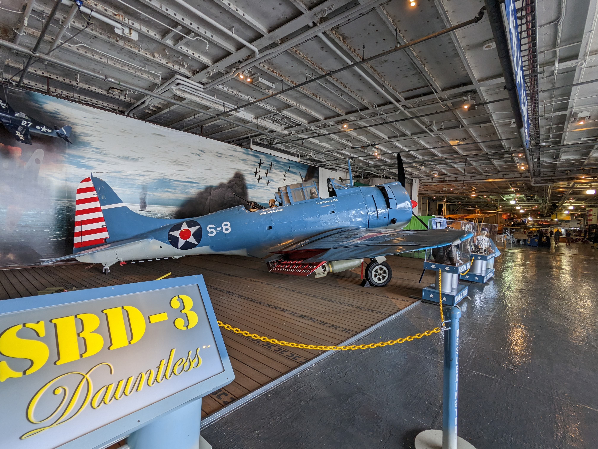

#+CAPTION: A North American T-6 Texan
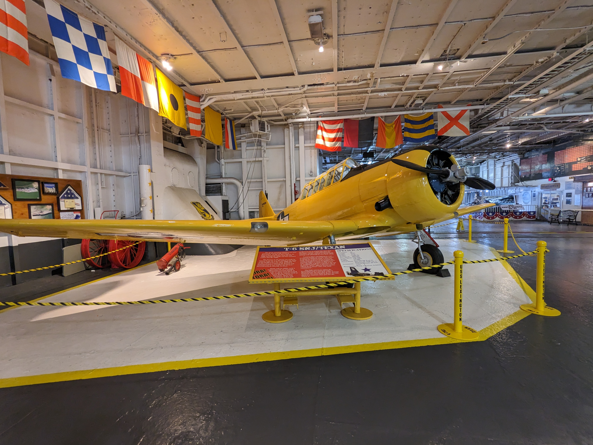

From the hangar deck, one has a choice of four tour routes: flight deck, foc'sle, gallery deck, and lower decks. Given that the only actual ship equipment on display in the foc'sle was the anchors, I chose to skip that tour route, and go on the other three. The flight deck route included the flight deck, island and navigation bridge. Going up onto the flight deck itself, I was expecting to feel the vastness of this ship, but the actual effect was quite the opposite. Comparing the flight deck to the size of the aircraft displayed made the ship feel quite compact, and emphasized the amount of skill and precision required to pull off take-offs and landings at sea.

#+CAPTION: Not a whole lot of room
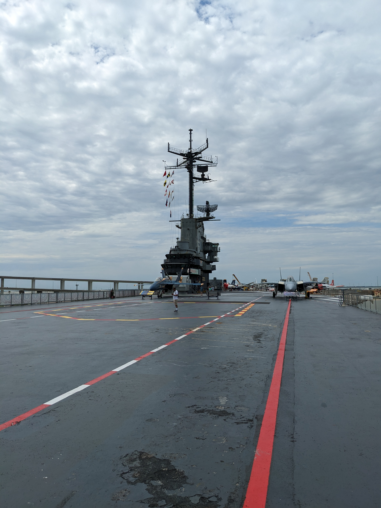

One notable feature on the flight deck is a restored 5"/​38 caliber turret of the same type and in approximately the same location as one of the anti-aircraft turrets on the original version of /Lexington/. This specific turret, however, was salvaged from /Des Moines/. The turret is open to the public, and even with some equipment removed, it's very cramped.

#+CAPTION: The exterior of the turret
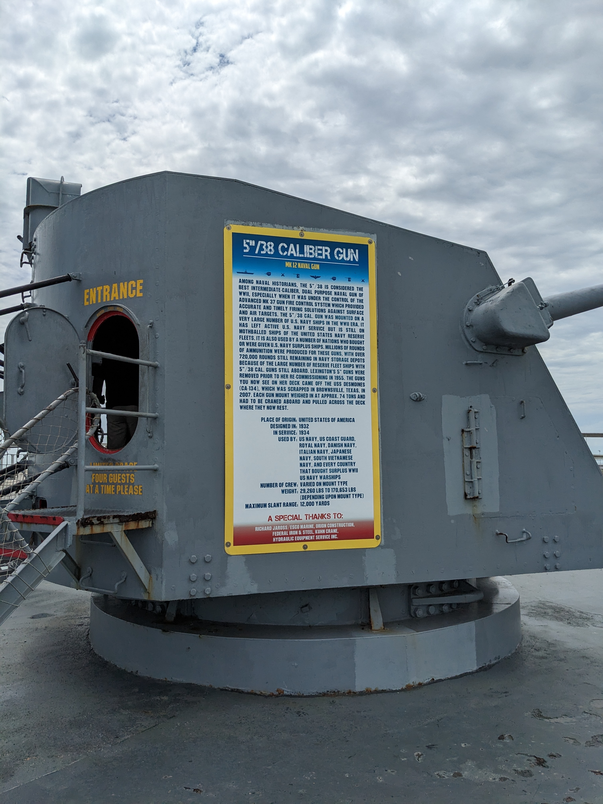

#+CAPTION: Another view of the turret exterior
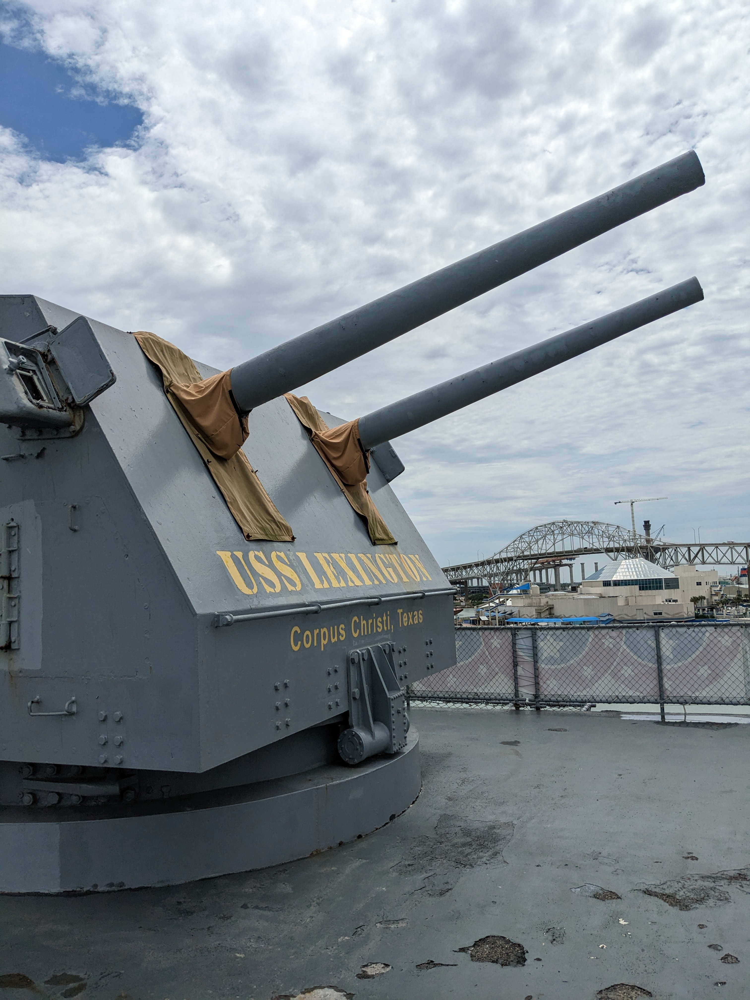

#+CAPTION: The interior of the turret
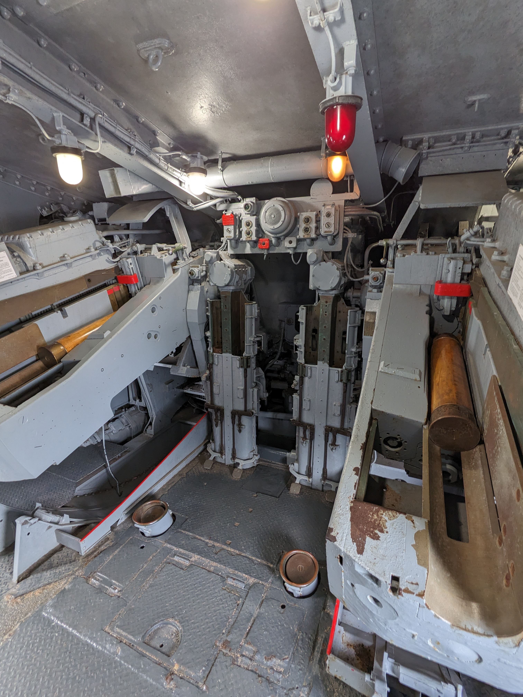

In addition to the turret, the flight deck contained a random assortment of aircraft. In addition to the obligatory F-14 and F-18, there were some other interesting planes, mostly from the Cold War.

#+CAPTION: An A3 Skywarrior (in tanker configuration)
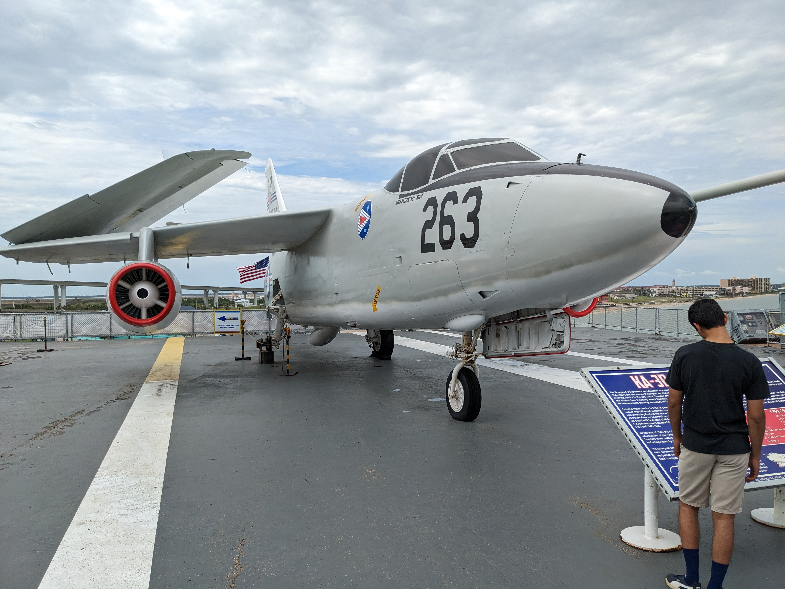

#+CAPTION: Note that this Tomcat was used as a prop in the original Top Gun film, hence the names on the side
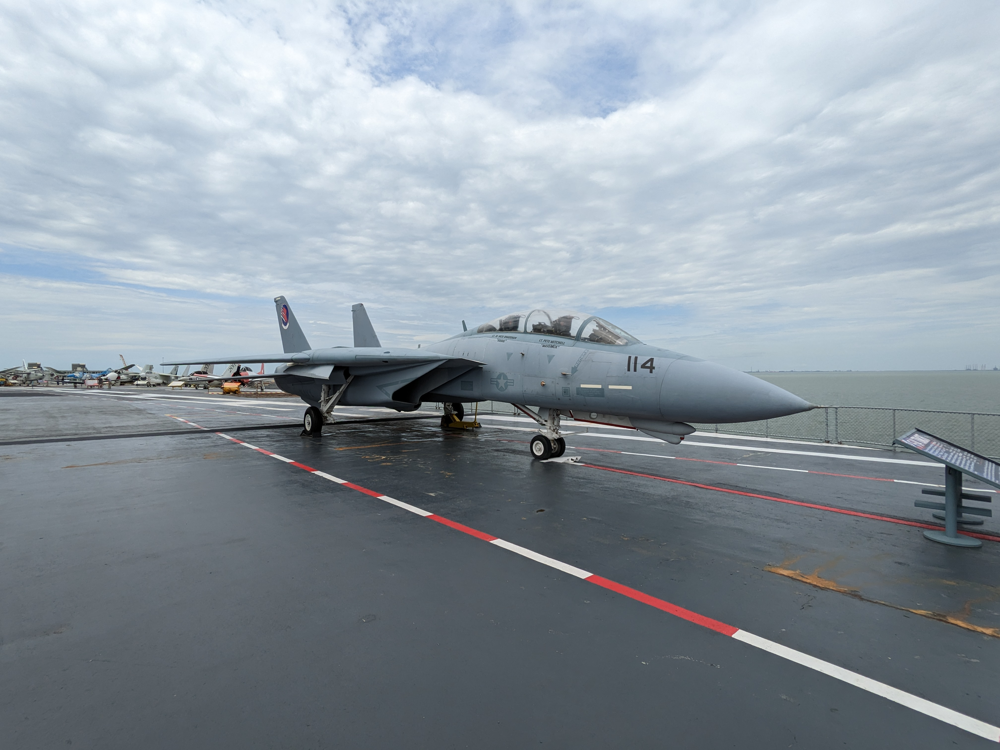

#+CAPTION: What are you doing here, Cobra? This is a Navy ship!
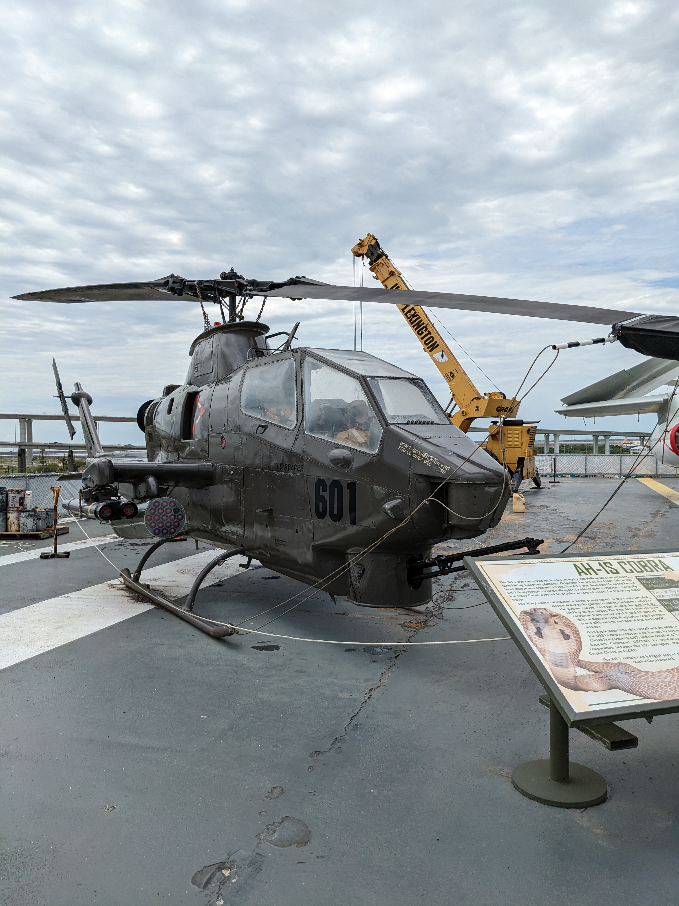

In addition to the planes, some of the equipment for recovering them was visible too, most notably, some of the arrestor cable equipment.

#+CAPTION: Deck sheave for arresting cable
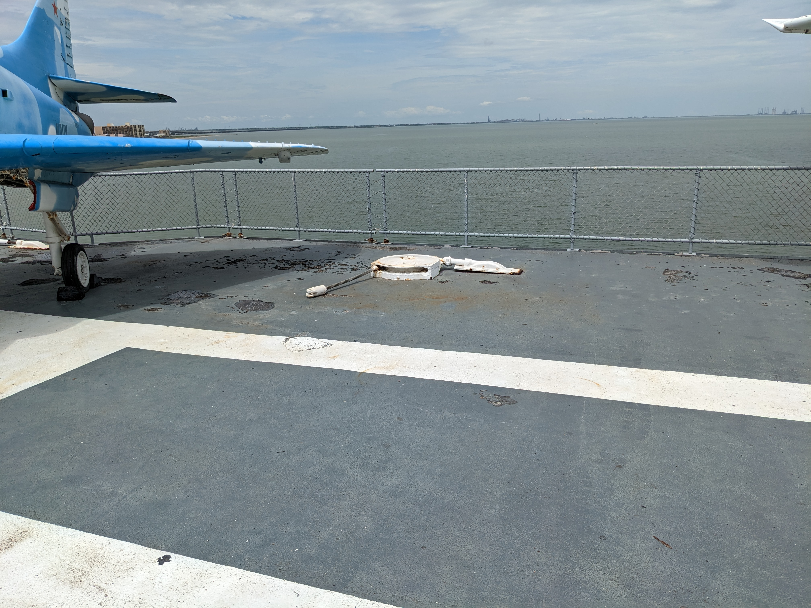

After touring the flight deck, the tour route continues into the island, and onto the navigation bridge. Along the way, I saw this neat sign highlighting /Lexington/'s combat record in World War 2.

#+CAPTION: Lexington saw a lot of action!
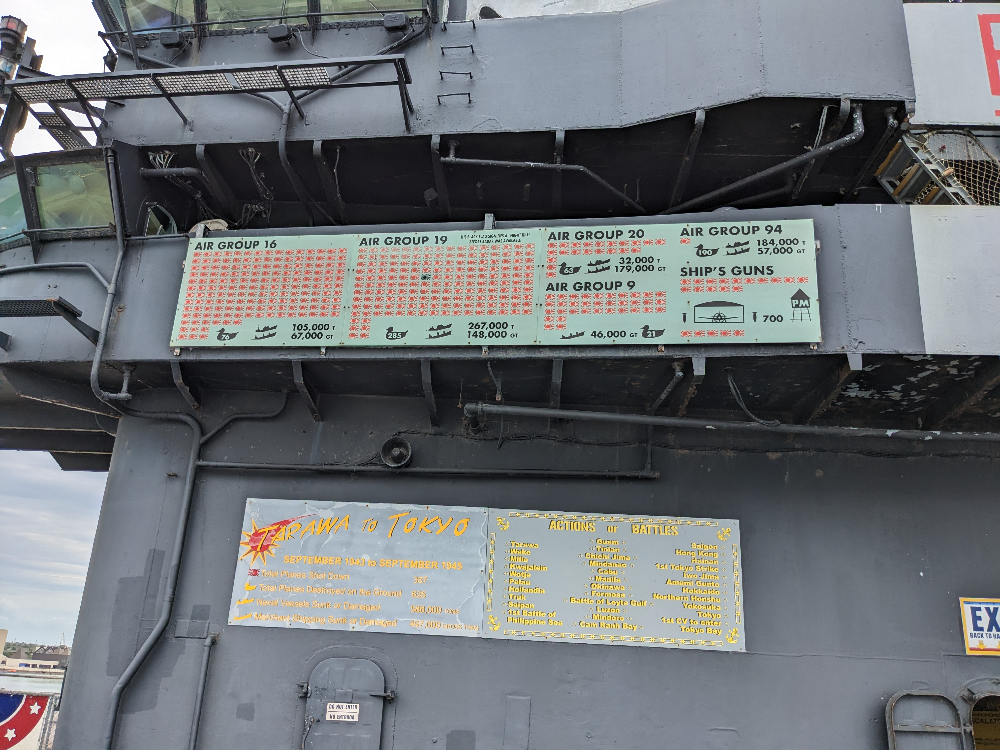

In the island, one passes through the navigation room, past the captain's at-sea cabin, and then onto the bridge itself. Some of these rooms were a bit more spacious than I was expecting, but that's likely because most of the equipment had been removed. 

#+CAPTION: Navigation
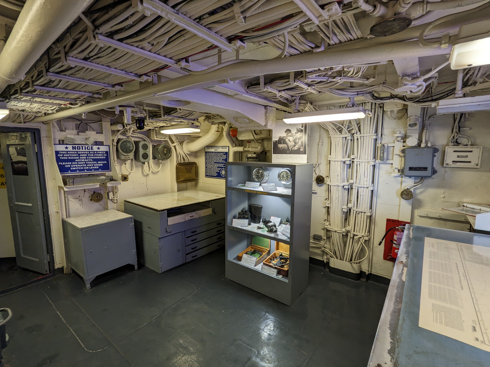
